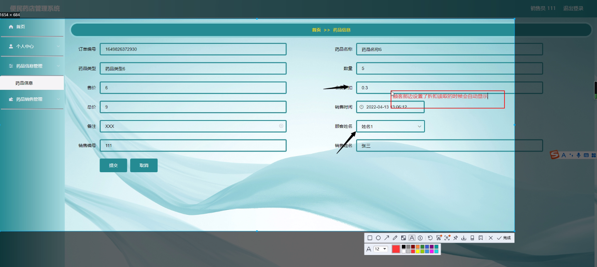

****本项目包含程序+源码+数据库+LW+调试部署环境，文末可获取一份本项目的java源码和数据库参考。****

## ******开题报告******

研究背景：
随着社会的发展和人们生活水平的提高，人们对药品的需求也越来越大。便民药店作为一个重要的医药销售渠道，承担着为顾客提供便捷、快速的药品购买服务的重要角色。然而，传统的便民药店管理方式存在一些问题，如信息不透明、库存管理困难等，这给药店的经营和顾客的购药体验带来了一定的困扰。

研究意义：
因此，开发一套高效、智能的便民药店管理系统具有重要的现实意义。该系统将能够提供全面的药品信息管理、销售管理、库存管理等功能，有效地解决传统药店管理中的痛点问题，提升药店的运营效率和服务质量，满足顾客对药品购买的需求。

研究目的：
本研究旨在设计和开发一套便民药店管理系统，通过优化药品信息管理、销售管理、库存管理等功能，提高药店的运营效率和服务质量，为顾客提供更好的购药体验。同时，通过对系统的研究和实践，总结出一套可行的便民药店管理模式，为药店管理者提供参考和借鉴。

研究内容： 本研究的主要内容包括以下几个方面：

  1. 销售员管理：设计销售员信息录入、工作排班、绩效考核等功能，提高销售员的工作效率和服务质量。

  2. 顾客管理：建立顾客档案，记录顾客购买历史、偏好等信息，实现个性化推荐和精准营销。

  3. 药品信息管理：建立药品数据库，包括药品名称、规格、生产厂家等信息，实现药品信息的快速查询和更新。

  4. 供应商管理：建立供应商档案，记录供应商信息、采购价格等，实现供应商的选择和采购管理。

  5. 药品入库管理：实现药品入库的登记、验收、库存管理等功能，确保药品的安全和有效管理。

  6. 药品销售管理：实现药品销售的下单、支付、发货等流程管理，提高销售效率和订单处理速度。

  7. 药品退货管理：建立退货流程，实现药品退货的登记、审核、退款等功能，保障顾客的权益。

  8. 药品分类管理：对药品进行分类管理，方便顾客查找和购买所需药品。

拟解决的主要问题：
本研究旨在解决传统便民药店管理中存在的信息不透明、库存管理困难等问题。通过设计和开发便民药店管理系统，优化药品信息管理、销售管理、库存管理等功能，提高药店的运营效率和服务质量，满足顾客对药品购买的需求。

研究方案和预期成果：
本研究将采用软件开发方法，结合数据库技术和网络技术，设计和开发一套便民药店管理系统。预期成果包括一个完善的系统架构和各项功能模块的实现，能够满足药店的管理需求，并提升药店的运营效率和服务质量。同时，通过对系统的实践应用和评估，总结出一套可行的便民药店管理模式，为药店管理者提供参考和借鉴。

进度安排：

2022年9月至10月：开题报告编写和提交，完成开题报告的撰写并提交给指导教师进行审核。

2022年11月至2023年1月：系统设计和开发，根据开题报告的要求，进行系统设计和编码工作。

2023年2月至3月：论文撰写和初稿完成，开始撰写论文，并在这个阶段完成论文的初稿。

2023年4月至5月：论文修改和最终定稿，根据指导教师的意见对论文进行修改，并完成最终的定稿。

2023年5月：论文答辩和提交，参加论文答辩并根据答辩结果进行修改，最后将论文提交给学院或学校。

参考文献：

[1]喻佳,吴丹新.基于SpringBoot的Web快速开发框架[J].电脑编程技巧与维护,2021,(09):31-33.

[2]李鹏.基于SpringBoot快速开发平台的实现[J].电子技术与软件工程,2021,(12):36-37.

[3]叶开平,蔡维晟,陈家敏,邓斯妮.基于SpringBoot的综测可视化管理系统的研究与设计[J].电脑知识与技术,2021,(12):100-104.

[4]江健锋,徐振平.Springboot最小系统的设计与实现[J].电脑知识与技术,2021,(04):62-63.

[5]赵炯,司圣杰,周奇才,熊肖磊.通用信息获取系统设计与实现[J].起重运输机械,2020,(16):89-97.

[6]吴英宾.一种内外网数据交互系统的设计与实现[J].软件工程,2020,(08):25-27.

****以上是本项目程序开发之前开题报告内容，最终成品以下面界面为准，大家可以酌情参考使用。要源码参考请在文末进行获取！！****

## ******本项目的界面展示******

