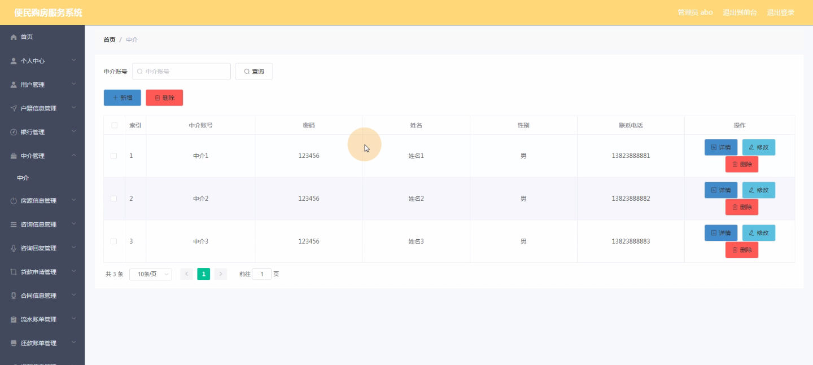
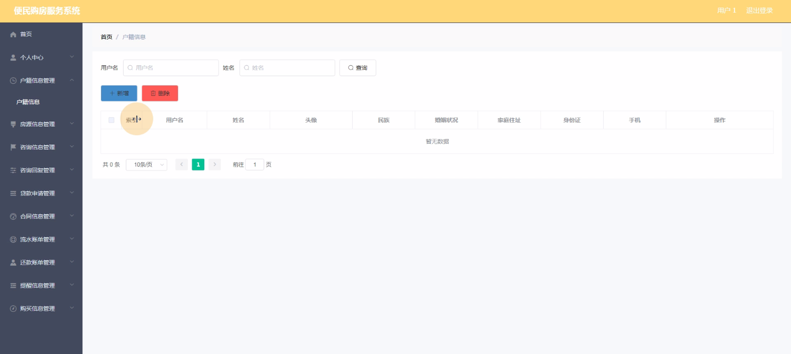
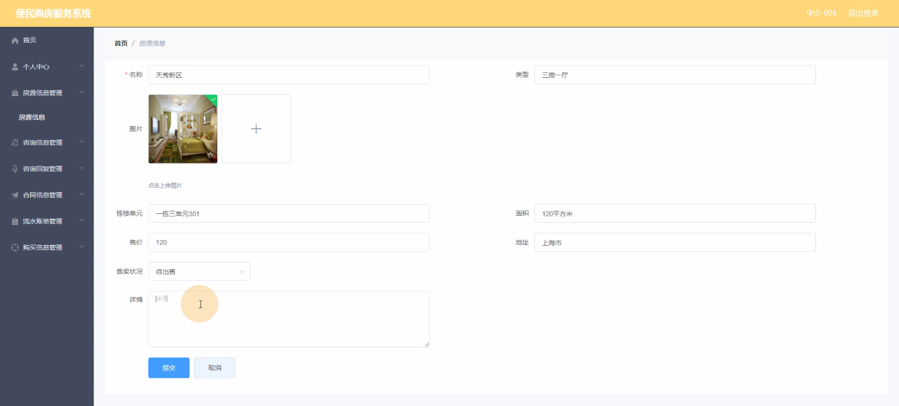
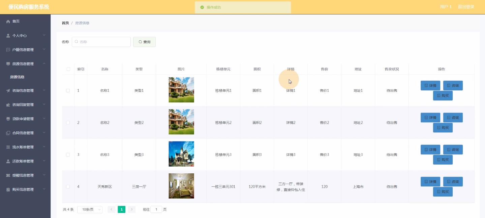
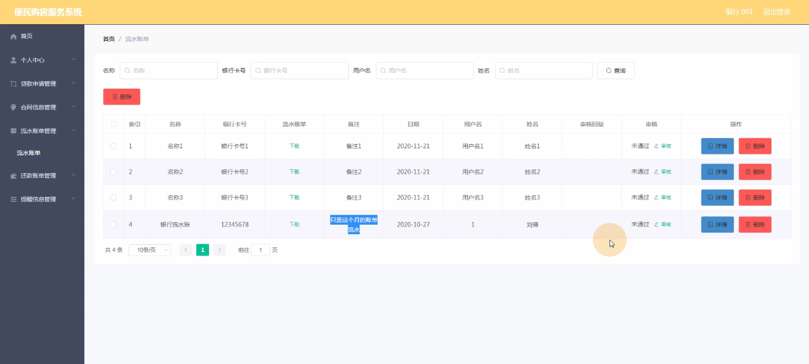
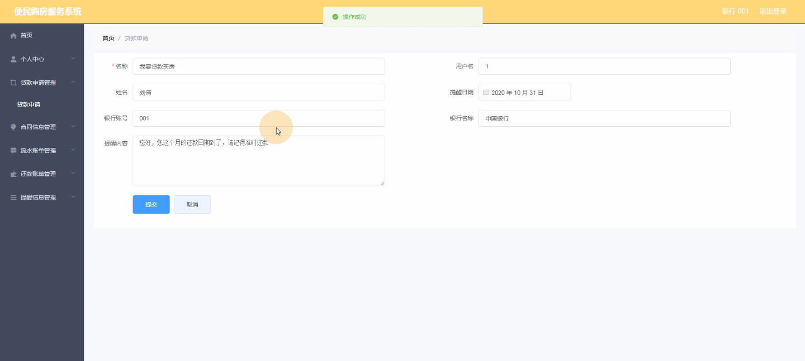

****本项目包含程序+源码+数据库+LW+调试部署环境，文末可获取一份本项目的java源码和数据库参考。****

## ******开题报告******

研究背景：
随着城市化进程的加快和人口的不断增长，购房问题成为了许多人关注的焦点。然而，传统的购房流程繁琐、信息不对称、效率低下等问题给购房者带来了很大的困扰。因此，开发一种便民购房服务系统具有重要的现实意义。

研究意义：
便民购房服务系统的建立可以极大地提高购房者的购房体验，减少购房过程中的时间和精力消耗。同时，该系统还可以提供全面、准确的房源信息，帮助购房者更好地选择适合自己的房屋。此外，通过整合银行、中介、咨询等资源，系统能够提供一站式的购房服务，为购房者提供更加便捷的操作和服务。

研究目的：
本研究旨在开发一种便民购房服务系统，通过应用先进的信息技术手段，为购房者提供高效、便捷的购房服务。具体目标包括：提供全面、准确的房源信息；整合各方资源，提供一站式购房服务；优化购房流程，提高购房效率；增强用户体验，提供个性化的服务。

研究内容： 根据系统功能的描述，本研究的主要内容包括以下方面：

  1. 用户管理：设计用户注册、登录、个人信息管理等功能，确保用户身份的真实性和安全性。

  2. 户籍信息管理：建立户籍信息数据库，为购房者提供便捷的查询和验证功能。

  3. 银行管理：与银行合作，提供贷款申请、流水账单、还款账单等相关服务。

  4. 中介管理：整合中介资源，提供房屋租售信息、咨询回复等服务。

  5. 房源信息管理：建立房源信息数据库，包括房屋位置、面积、价格等详细信息，为购房者提供准确的选择。

  6. 咨询信息管理：提供购房咨询平台，购房者可以向专业人士咨询相关问题，并获得及时回复。

  7. 合同信息管理：存储购房合同信息，确保交易的合法性和安全性。

  8. 提醒信息管理：通过短信、邮件等方式，提醒购房者关于付款、签约、交房等重要事项。

  9. 购买信息管理：记录购房者的购买历史，为购房者提供个性化的推荐和服务。

拟解决的主要问题：
通过开发便民购房服务系统，我们将解决传统购房流程中存在的诸多问题，包括信息不对称、效率低下、操作繁琐等。该系统将提供全面、准确的房源信息，整合各方资源，优化购房流程，提高购房效率，并为购房者提供个性化的服务和便捷的操作。

研究方案和预期成果：
本研究将采用软件工程的方法，结合先进的信息技术手段，设计并开发便民购房服务系统。通过需求分析、系统设计、编码实现、测试验证等步骤，最终完成一个功能完善、稳定可靠的系统。预期成果包括：提供全面、准确的房源信息；整合各方资源，提供一站式购房服务；优化购房流程，提高购房效率；增强用户体验，提供个性化的服务。同时，该系统还将为购房者带来更加便捷、高效的购房体验，提升购房者的满意度和信任度。

进度安排：

2022年9月至10月：需求分析和规划，进行用户需求调研和分析，确定系统功能和目标。

2022年11月至2023年1月：系统设计和开发，完成系统架构设计和技术选型，并开始编写代码。

2023年2月至3月：测试和优化，进行单元测试和集成测试，修复问题并优化系统性能。

2023年4月至5月：文档编写和培训，编写用户手册和系统文档，并进行相关人员的培训。

2023年5月：上线部署和维护，将系统部署到生产环境中，并定期进行维护和升级。

参考文献：

[1]王振华.SpringBoot在教学效果评估系统中的应用[J].电子技术,2023,(05):67-69.

[2]王明泉.基于SpringBoot远程热部署的探索和应用[J].信息与电脑(理论版),2023,(07):1-4.

[3]王亚东,李晓霞,陈强强,剡美娜.基于SpringBoot的需求发布平台设计[J].信息与电脑(理论版),2023,(01):105-107.

[4]陈新府豪.基于SpringBoot和Vue框架的创新方法推理系统的设计与实现[D].导师：黄静.浙江理工大学,2022.

[5]霍福华,韩慧.基于SpringBoot微服务架构下前后端分离的MVVM模型[J].电子技术与软件工程,2022,(01):73-76.

[6]韩策,张娜,王松亭,张凯,何方,袁峰.SpringBoot OPC客户端设计与研究[J].电子世界,2021,(19):25-26.

****以上是本项目程序开发之前开题报告内容，最终成品以下面界面为准，大家可以酌情参考使用。要源码参考请在文末进行获取！！****

## ******本项目的界面展示******

