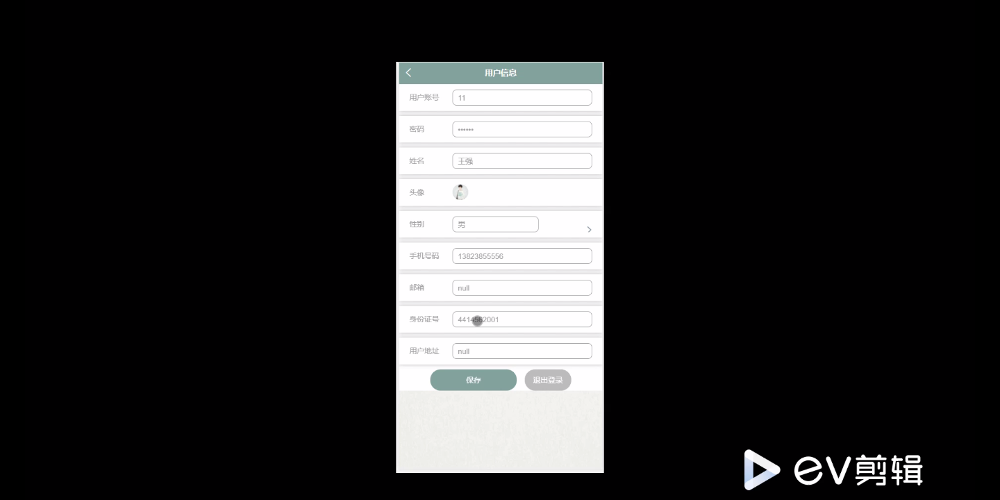
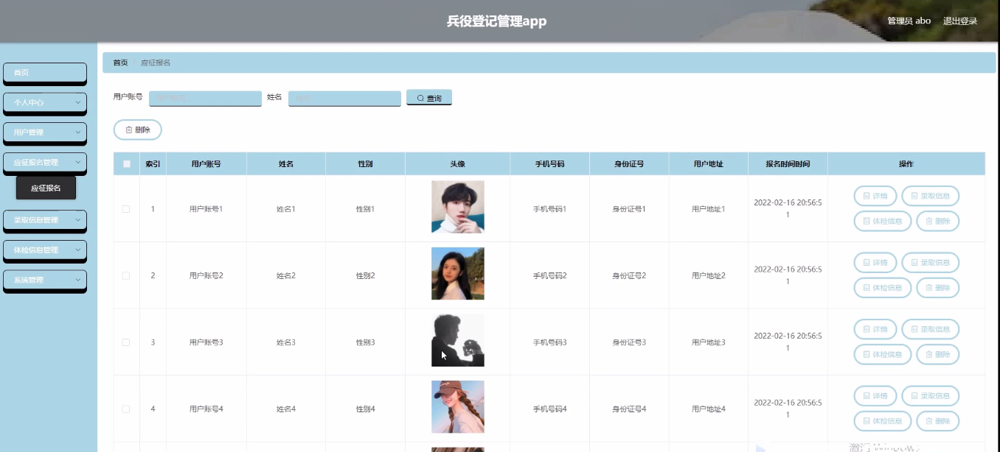
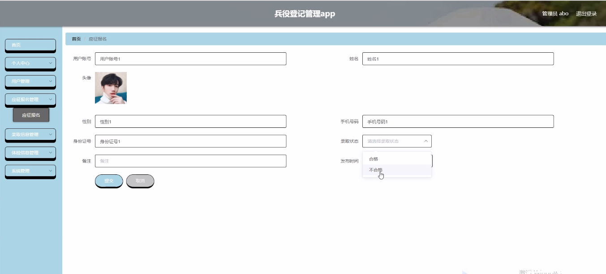
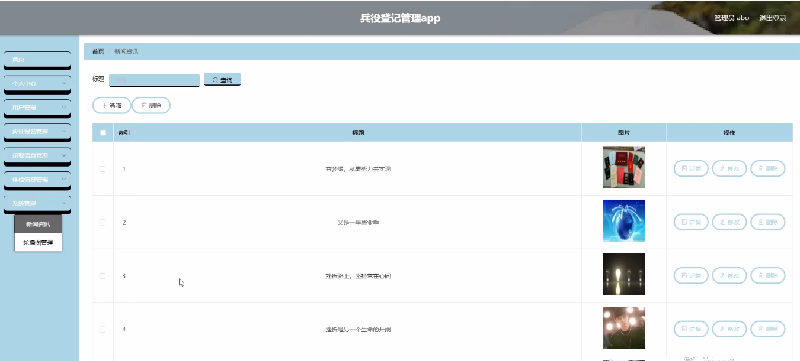

****本项目包含程序+源码+数据库+LW+调试部署环境，文末可获取一份本项目的java源码和数据库参考。****

## ******开题报告******

研究背景：
兵役登记管理是国家对公民兵役资源进行统一管理的重要环节，具有重要的社会意义和实践价值。随着我国经济的快速发展和军事力量的不断壮大，兵役登记管理的重要性日益凸显。然而，在过去的管理中，由于信息化水平相对较低，存在着诸多问题，如信息不准确、流程繁琐等，亟需通过深入研究和改进来提高管理效率和服务质量。

研究意义：
本研究旨在通过对兵役登记管理系统的研究，探索和优化现有的管理模式，提高管理效率和服务质量，为国家兵役资源的合理配置和利用提供支持。通过建立科学、高效、便捷的兵役登记管理系统，可以更好地满足国家安全需求，保障兵员招募工作的顺利进行，同时也能够提升公民参与兵役登记的积极性和主动性，促进国家建设和发展。

研究目的：
本研究的目的是针对兵役登记管理系统中存在的问题，通过系统分析和设计，提出一套完善的管理方案，以实现兵役登记管理的科学化、规范化和信息化。具体目标包括优化用户体验，简化应征报名流程，提高录取信息的准确性，完善体检信息的管理等，从而提高兵役登记管理的效率和质量。

研究内容： 本研究的主要内容基于兵役登记管理系统的功能需求，包括以下几个方面：

  1. 用户管理：设计并建立用户注册、登录、信息修改等功能，确保用户信息的安全和准确性。
  2. 应征报名：优化应征报名流程，提供在线填写报名表格、上传相关证明材料等功能，方便应征者进行报名操作。
  3. 录取信息：建立录取信息管理模块，包括录取条件设定、录取结果发布等功能，确保录取信息的及时性和准确性。
  4. 体检信息：设计体检信息管理模块，包括体检预约、体检结果记录等功能，提供便捷的体检信息查询和管理服务。

拟解决的主要问题： 通过研究和改进兵役登记管理系统，旨在解决以下问题：

  1. 信息不准确：优化数据采集和存储方式，确保信息的准确性和完整性。
  2. 流程繁琐：简化应征报名流程，提高用户体验，减少不必要的环节和手续。
  3. 信息传递不及时：建立实时更新机制，确保录取信息和体检信息的及时发布和更新。
  4. 数据安全问题：加强系统的安全性设计，防止数据泄露和非法访问。

研究方案和预期成果：
本研究将采用文献研究、案例分析、需求调研等方法，结合信息技术和管理理论，进行兵役登记管理系统的设计与优化。预期成果包括建立科学、高效、便捷的兵役登记管理系统，提升管理效率和服务质量，为国家兵役资源的合理配置和利用提供支持，同时也为公民提供更好的兵役登记服务，促进国家建设和发展。

进度安排：

2022年9月至10月：需求分析和规划，明确系统功能和目标，制定项目计划。

2022年11月至2023年1月：系统设计和编码，完成详细的系统设计并开始编写代码。

2023年2月至3月：用户界面开发和数据库开发，开发用户友好的界面和设计数据库结构。

2023年4月至5月：功能测试、文档编写和上线部署，对系统进行全面的功能测试并编写用户手册。

2023年5月：维护和升级，定期对系统进行维护和升级，修复bug和添加新功能。

参考文献：

[1]邱小群,邓丽艳,陈海潮.基于B/S的信息管理系统设计和实现[J].信息与电脑(理论版),2022,(20):146-148.

[2]谢霜.基于Java技术的网络管理体系结构的应用[J].网络安全技术与应用,2022,(10):14-15.

[3]宋锦华.高职院校Java程序设计课程改革研究[J].科技视界,2022,(20):133-135.

[4]曹嵩彭,王鹏宇.浅析Java语言在软件开发中的应用[J].信息记录材料,2022,(03):114-116.

[5]朱澈,余俊达.武汉东湖学院.基于Java的软硬件信息管理系统V1.0[Z].项目立项编号.鉴定单位.鉴定日期:

****以上是本项目程序开发之前开题报告内容，最终成品以下面界面为准，大家可以酌情参考使用。要源码参考请在文末进行获取！！****

## ******本项目的界面展示******

