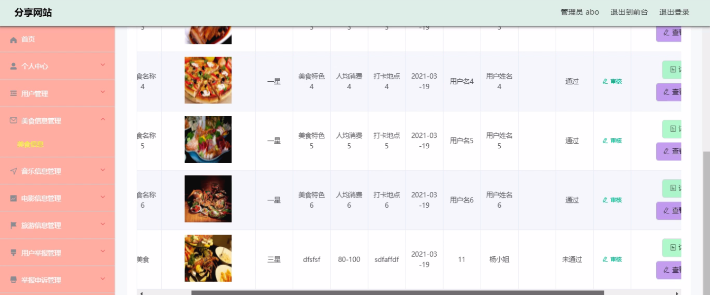
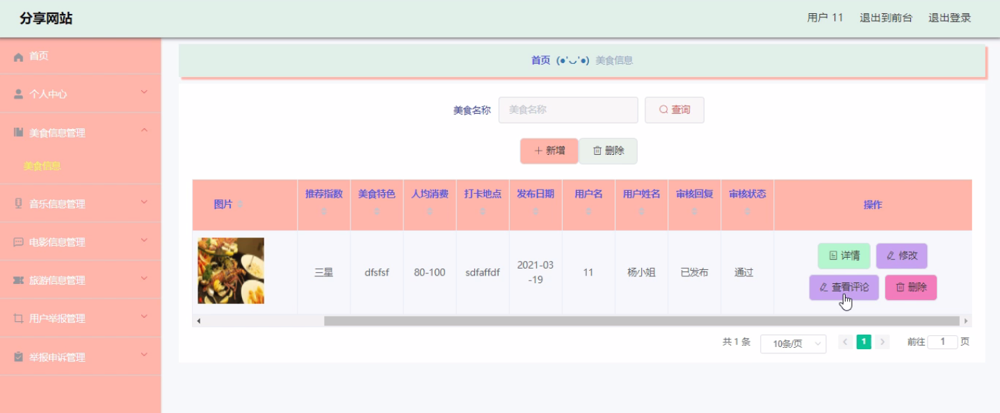
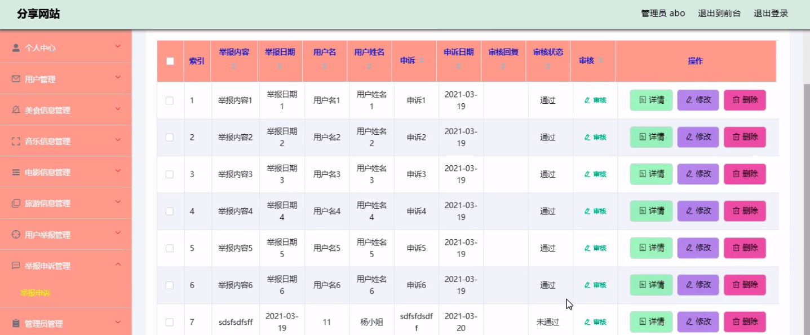
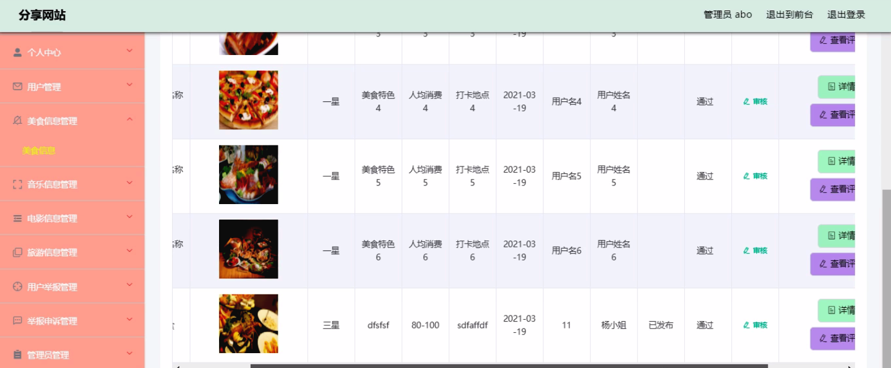
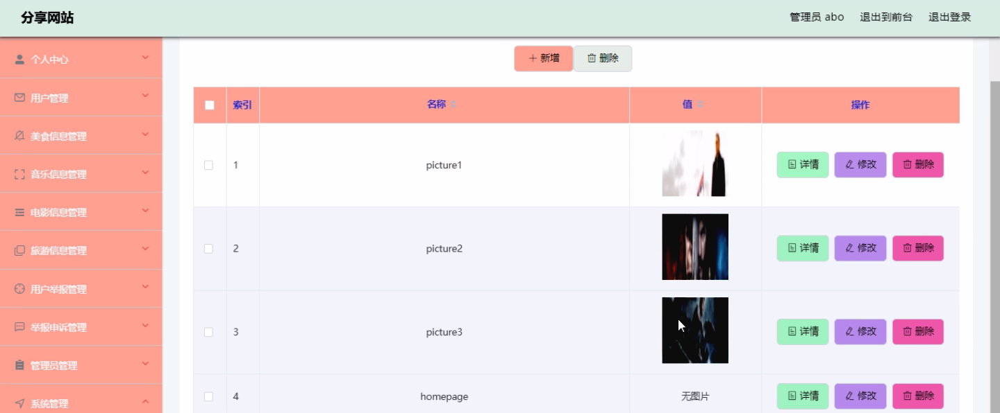

****本项目包含程序+源码+数据库+LW+调试部署环境，文末可获取一份本项目的java源码和数据库参考。****

## ******开题报告******

研究背景：
随着互联网的快速发展和智能手机的普及，人们对于获取各种信息的需求也越来越强烈。在日常生活中，我们经常需要了解美食、音乐、电影、旅游等方面的信息，以满足自己的需求和兴趣。然而，在海量的信息中找到准确、可靠的内容并不容易，这给用户带来了困扰。

研究意义：
因此，建立一个综合性的网站，集合用户、美食信息、音乐信息、电影信息、旅游信息等系统功能，可以为用户提供便捷、准确、全面的信息服务，具有重要的实际意义。这样的网站将为用户提供一个高效的平台，使他们能够轻松地获取所需的各类信息，节省时间和精力。

研究目的：
本研究的目的是设计和开发一个功能完善的网站，以满足用户对于美食、音乐、电影、旅游等方面信息的需求。通过整合各类信息资源和用户反馈，提供个性化推荐和精准搜索功能，使用户能够快速、方便地获取到符合自己需求的内容。同时，通过用户举报和申诉功能，保障网站的内容质量和用户体验。

研究内容：
本研究的主要内容包括以下系统功能：用户管理模块、美食信息模块、音乐信息模块、电影信息模块、旅游信息模块、用户举报模块、举报申诉模块、内容转发模块等。具体而言，用户管理模块用于注册、登录和个人信息管理；美食信息模块提供各类美食的介绍、评价和推荐；音乐信息模块提供音乐资源的搜索、试听和下载；电影信息模块提供电影的相关信息、剧情介绍和观影评价；旅游信息模块提供各地旅游景点的介绍、交通指南和旅行攻略；用户举报模块用于用户对于不良内容的举报；举报申诉模块用于处理用户举报和申诉的问题；内容转发模块用于用户之间的信息分享和传播。

拟解决的主要问题：
本研究旨在解决用户获取各类信息时面临的准确性、全面性和可靠性的问题。通过建立一个集合多种信息资源的网站，并采用个性化推荐和精准搜索的技术手段，提供符合用户需求的内容。同时，通过用户举报和申诉机制，保障网站内容的质量和用户体验。

研究方案和预期成果：
本研究将采用前后端分离的开发模式，利用现有的技术和工具进行系统设计和开发。预计通过对用户需求的深入分析和数据挖掘技术的应用，实现个性化推荐和精准搜索功能。同时，建立用户举报和申诉机制，并配备专业的审核团队，确保网站内容的质量和安全性。预期成果是开发出一个功能完善、用户友好的网站，为用户提供高效、便捷的信息服务。

进度安排：

2022年9月至10月：需求分析和规划，进行用户需求调研和分析，确定系统功能和目标。

2022年11月至2023年1月：系统设计和开发，完成系统架构设计和技术选型，并开始编写代码。

2023年2月至3月：测试和优化，进行单元测试和集成测试，修复问题并优化系统性能。

2023年4月至5月：文档编写和培训，编写用户手册和系统文档，并进行相关人员的培训。

2023年5月：上线部署和维护，将系统部署到生产环境中，并定期进行维护和升级。

参考文献：

[1]王振华.SpringBoot在教学效果评估系统中的应用[J].电子技术,2023,(05):67-69.

[2]王明泉.基于SpringBoot远程热部署的探索和应用[J].信息与电脑(理论版),2023,(07):1-4.

[3]王亚东,李晓霞,陈强强,剡美娜.基于SpringBoot的需求发布平台设计[J].信息与电脑(理论版),2023,(01):105-107.

[4]陈新府豪.基于SpringBoot和Vue框架的创新方法推理系统的设计与实现[D].导师：黄静.浙江理工大学,2022.

[5]霍福华,韩慧.基于SpringBoot微服务架构下前后端分离的MVVM模型[J].电子技术与软件工程,2022,(01):73-76.

[6]韩策,张娜,王松亭,张凯,何方,袁峰.SpringBoot OPC客户端设计与研究[J].电子世界,2021,(19):25-26.

****以上是本项目程序开发之前开题报告内容，最终成品以下面界面为准，大家可以酌情参考使用。要源码参考请在文末进行获取！！****

## ******本项目的界面展示******

