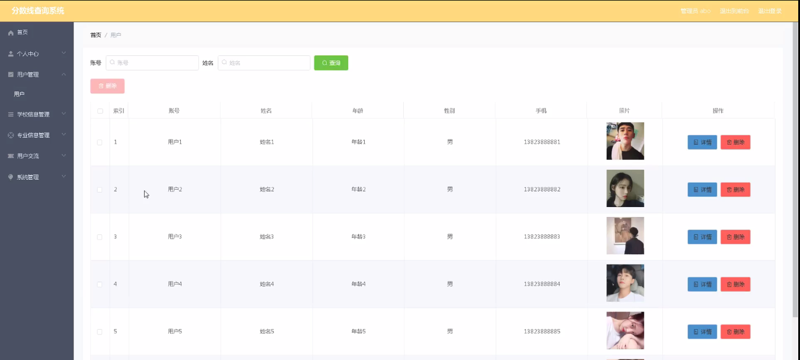
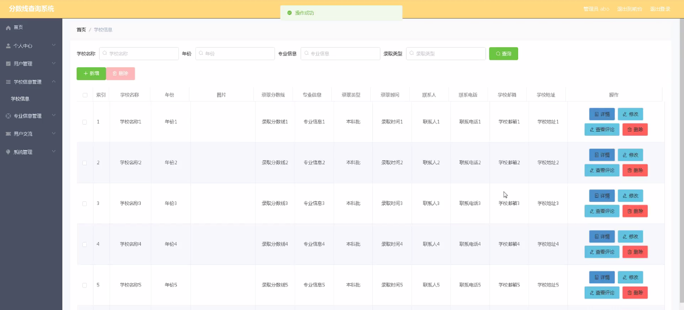
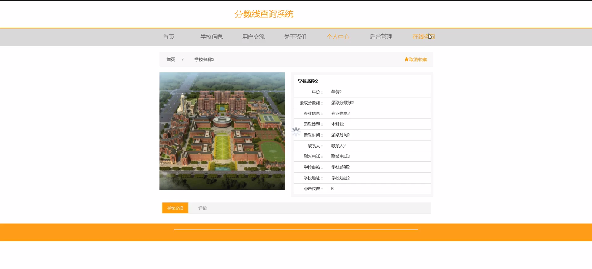

****本项目包含程序+源码+数据库+LW+调试部署环境，文末可获取一份本项目的java源码和数据库参考。****

## ******开题报告******

研究背景：
在当前高等教育竞争日益激烈的背景下，考试成绩一直是衡量学生能力和学业水平的重要指标之一。各个学校和专业都有自己的录取分数线，这些分数线对于学生选择志愿、规划未来发展方向具有重要意义。然而，由于信息不对称和获取困难，学生们往往无法准确了解各个学校和专业的分数线情况，给他们的选择带来了困扰。

研究意义：
建立一个分数线查询系统可以为广大学生提供及时、准确的分数线信息，帮助他们更好地选择适合自己的学校和专业。同时，该系统也可以为学校和专业提供一个公开透明的平台，使他们能够更好地吸引优秀的学生，提升整体教育质量。

研究目的：
本研究旨在设计和开发一个分数线查询系统，通过收集、整理和展示各个学校和专业的录取分数线信息，为学生提供方便快捷的查询服务。同时，通过该系统的建立，也可以促进学校和专业之间的交流与合作，提高招生工作的效率和准确性。

研究内容： 本研究将围绕分数线查询系统的功能展开，主要包括以下内容：

  1. 用户管理：设计用户注册、登录、个人信息管理等功能，保证用户信息的安全和隐私。

  2. 学校信息管理：收集各个学校的基本信息，包括学校名称、所在地区、办学特色等，并建立学校信息数据库。

  3. 专业信息管理：收集各个专业的基本信息，包括专业名称、招生计划、录取要求等，并建立专业信息数据库。

  4. 分数线查询功能：根据用户选择的学校和专业，查询并展示相应的录取分数线信息，包括最低分、平均分、最高分等。

  5. 数据统计与分析：对收集到的分数线数据进行统计和分析，为学生提供参考依据，同时也为学校和专业提供招生策略的参考。

拟解决的主要问题：

  1. 学生获取分数线信息不便利，信息不对称的问题；
  2. 学校和专业宣传和招生工作缺乏一个统一的平台；
  3. 学生选择志愿时缺乏准确的参考依据。

研究方案和预期成果：
本研究将采用软件开发的方法，设计和开发一个分数线查询系统。通过收集学校和专业的信息，建立数据库，并开发相应的用户界面和查询功能，实现学生查询分数线的需求。预期成果包括一个完善的分数线查询系统，能够为学生提供准确、及时的分数线信息，为学校和专业提供一个公开透明的宣传平台，促进高等教育的发展。

进度安排：

2022年9月至10月：需求分析和规划，进行用户需求调研和分析，确定系统功能和目标。

2022年11月至2023年1月：系统设计和开发，完成系统架构设计和技术选型，并开始编写代码。

2023年2月至3月：测试和优化，进行单元测试和集成测试，修复问题并优化系统性能。

2023年4月至5月：文档编写和培训，编写用户手册和系统文档，并进行相关人员的培训。

2023年5月：上线部署和维护，将系统部署到生产环境中，并定期进行维护和升级。

参考文献：

[1]王振华.SpringBoot在教学效果评估系统中的应用[J].电子技术,2023,(05):67-69.

[2]王明泉.基于SpringBoot远程热部署的探索和应用[J].信息与电脑(理论版),2023,(07):1-4.

[3]王亚东,李晓霞,陈强强,剡美娜.基于SpringBoot的需求发布平台设计[J].信息与电脑(理论版),2023,(01):105-107.

[4]陈新府豪.基于SpringBoot和Vue框架的创新方法推理系统的设计与实现[D].导师：黄静.浙江理工大学,2022.

[5]霍福华,韩慧.基于SpringBoot微服务架构下前后端分离的MVVM模型[J].电子技术与软件工程,2022,(01):73-76.

[6]韩策,张娜,王松亭,张凯,何方,袁峰.SpringBoot OPC客户端设计与研究[J].电子世界,2021,(19):25-26.

****以上是本项目程序开发之前开题报告内容，最终成品以下面界面为准，大家可以酌情参考使用。要源码参考请在文末进行获取！！****

## ******本项目的界面展示******

