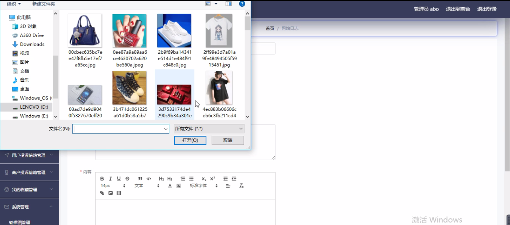
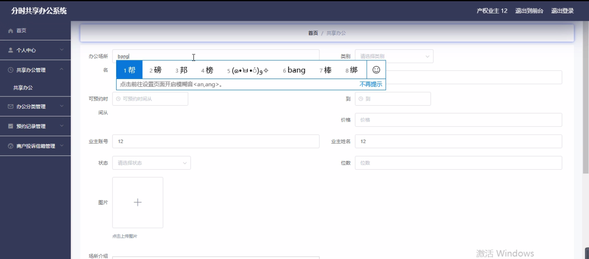
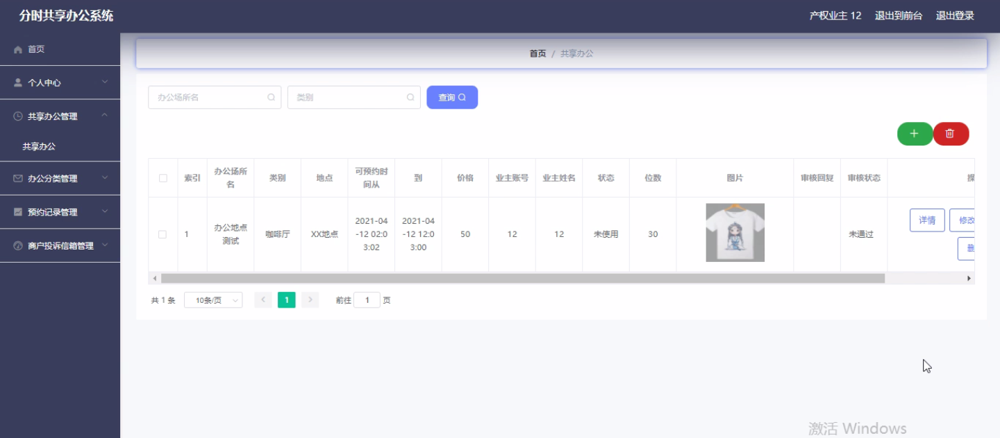
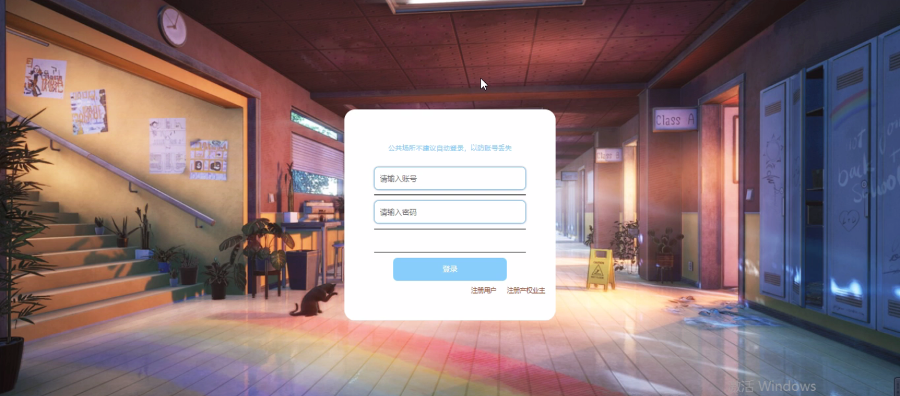
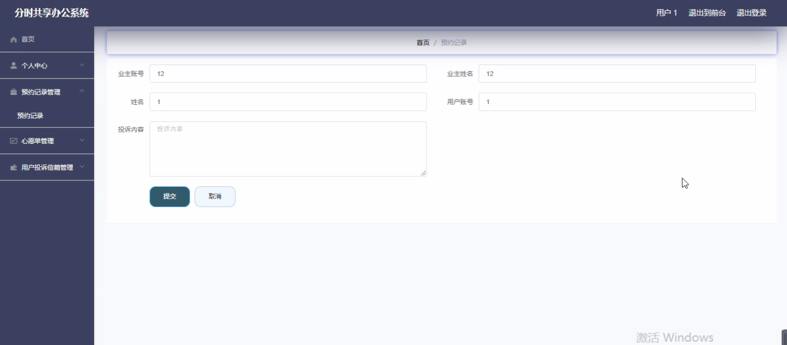

****本项目包含程序+源码+数据库+LW+调试部署环境，文末可获取一份本项目的java源码和数据库参考。****

## ******开题报告******

研究背景：
随着经济的快速发展和城市化进程的加速，办公场所需求不断增长。传统的固定办公模式已经无法满足人们对于灵活、高效办公环境的需求。因此，分时共享办公系统应运而生。该系统通过提供灵活的办公空间共享服务，为用户提供了更加便捷、经济、高效的办公方式。

研究意义：
分时共享办公系统的出现对于推动办公场所的转型具有重要意义。首先，它可以有效利用闲置的办公资源，提高资源利用率，降低企业成本。其次，它能够为创业者、自由职业者和小微企业提供一个灵活的办公环境，促进创新和创业。此外，分时共享办公系统还能够提供丰富的配套服务，如会议室预订、设备租赁等，进一步提升办公效率和用户体验。

研究目的：
本研究旨在深入探讨分时共享办公系统的设计与实施，以满足不同用户群体的需求，并提高办公空间的利用效率。通过研究分析，我们将为相关从业者提供一套科学、可行的分时共享办公系统建设方案，为办公场所的转型升级提供参考和借鉴。

研究内容： 本研究将围绕分时共享办公系统的功能展开研究，主要包括以下几个方面：

  1. 用户管理：研究用户注册、登录、信息管理等功能，以及用户权限管理和身份验证机制。

  2. 产权业主管理：研究产权业主的入驻申请、租赁合同管理、费用结算等功能，以确保产权业主的权益。

  3. 共享办公空间管理：研究共享办公空间的预约、使用规则制定、资源调度等功能，以提高办公空间的利用效率。

  4. 办公分类管理：研究办公场所的分类标准、办公设施配置等功能，以满足不同用户群体的需求。

  5. 预约记录管理：研究预约记录的管理和统计分析功能，以便于系统运营者进行数据分析和决策。

  6. 心愿单管理：研究用户对于办公环境的需求收集和反馈机制，以改进和优化办公空间的服务。

  7. 用户投诉信箱和商户投诉信箱管理：研究用户投诉和商户投诉的处理机制，以维护良好的用户体验和商户合作关系。

拟解决的主要问题：
在分时共享办公系统的设计与实施过程中，存在一些问题需要解决。例如，如何确保用户信息的安全性和隐私保护？如何平衡产权业主和租赁用户的利益？如何提高办公空间的利用效率和资源调度能力？本研究将针对这些问题进行深入分析，并提出相应的解决方案。

研究方案和预期成果：
本研究将采用文献研究、案例分析和实证研究等方法，结合相关理论和技术手段，设计并实施一套完整的分时共享办公系统。预期通过研究，可以为相关从业者提供一套科学、可行的系统建设方案，促进办公场所的转型升级，提高办公效率和用户体验。

进度安排：

2022年9月至10月：需求分析和规划，明确系统功能和目标，制定项目计划。

2022年11月至2023年1月：系统设计和编码，完成详细的系统设计并开始编写代码。

2023年2月至3月：用户界面开发和数据库开发，开发用户友好的界面和设计数据库结构。

2023年4月至5月：功能测试、文档编写和上线部署，对系统进行全面的功能测试并编写用户手册。

2023年5月：维护和升级，定期对系统进行维护和升级，修复bug和添加新功能。

参考文献：

[1]邱小群,邓丽艳,陈海潮.基于B/S的信息管理系统设计和实现[J].信息与电脑(理论版),2022,(20):146-148.

[2]谢霜.基于Java技术的网络管理体系结构的应用[J].网络安全技术与应用,2022,(10):14-15.

[3]宋锦华.高职院校Java程序设计课程改革研究[J].科技视界,2022,(20):133-135.

[4]曹嵩彭,王鹏宇.浅析Java语言在软件开发中的应用[J].信息记录材料,2022,(03):114-116.

[5]朱澈,余俊达.武汉东湖学院.基于Java的软硬件信息管理系统V1.0[Z].项目立项编号.鉴定单位.鉴定日期:

****以上是本项目程序开发之前开题报告内容，最终成品以下面界面为准，大家可以酌情参考使用。要源码参考请在文末进行获取！！****

## ******本项目的界面展示******

