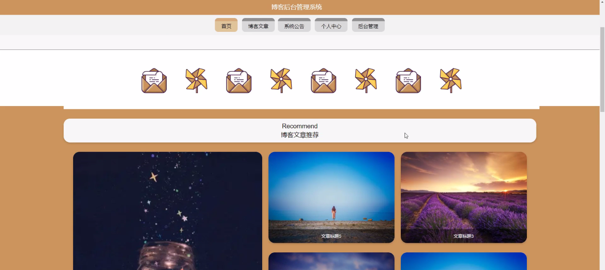
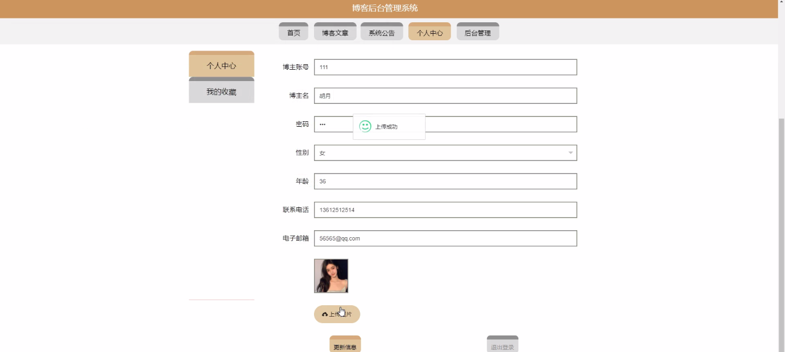
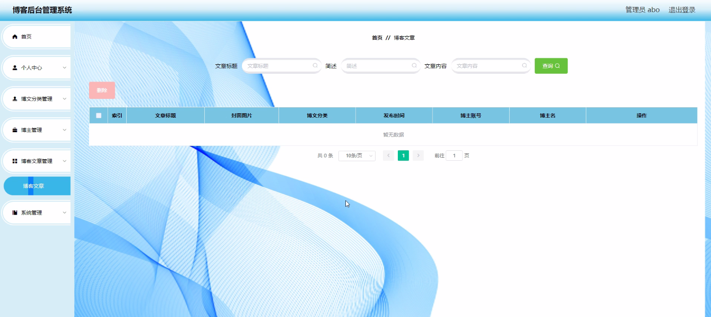
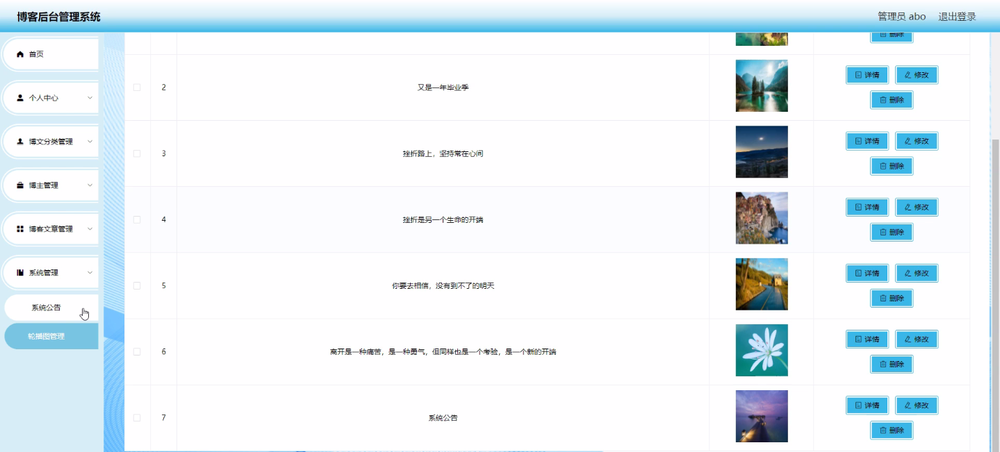

****本项目包含程序+源码+数据库+LW+调试部署环境，文末可获取一份本项目的java源码和数据库参考。****

## ******开题报告******

研究背景、意义和目的：

随着互联网的快速发展，博客已经成为了人们分享知识、表达观点和交流想法的重要平台。越来越多的个人和组织选择搭建自己的博客网站，以展示自己的专业能力和思考深度。然而，随之而来的问题是，如何高效地管理博客后台系统，提供更好的用户体验和功能支持。

本研究旨在探索博客后台管理系统的设计与实现，通过分析和解决现有博客后台管理系统存在的问题，提出一种全新的系统方案，以提升博客管理的效率和用户体验。具体目标包括以下几个方面：

  1. 研究并分析当前博客后台管理系统的现状和存在的问题，了解用户需求和期望；
  2. 设计并实现一个功能完善、易用性强的博客后台管理系统，满足用户的各类需求；
  3. 提供灵活的博文分类功能，使用户可以根据自己的需要对博客文章进行分类管理；
  4. 优化博主功能，提供便捷的博客编辑、发布和修改功能，增加博客内容的质量和数量；
  5. 研究并实现用户权限管理功能，确保博客后台系统的安全性和稳定性。

研究内容：

本研究的主要内容将围绕博客后台管理系统的设计与实现展开，具体包括以下几个方面：

  1. 博主功能：设计并实现一个直观、易用的博主界面，使博主可以方便地编辑、发布和管理自己的博客文章；
  2. 博客文章功能：提供丰富的编辑工具和格式选项，使博主能够以更多样化的方式呈现文章内容；
  3. 博文分类功能：设计并实现一个灵活的分类管理系统，使博主可以根据不同的主题或标签对博客文章进行分类；
  4. 用户权限管理：研究并实现一个完善的用户权限管理系统，确保只有授权用户才能访问和操作博客后台系统；
  5. 系统性能优化：通过技术手段和算法优化，提高博客后台管理系统的运行效率和响应速度。

预期成果：

通过本研究，我们期望能够设计并实现一个功能完善、易用性强的博客后台管理系统，为博主提供更好的用户体验和功能支持。具体预期成果包括：

  1. 设计出一套符合用户需求的博客后台管理系统界面和功能模块；
  2. 实现一个稳定、高效的博客后台管理系统，能够支持大量用户同时访问和操作；
  3. 提供灵活的博文分类功能，使博主可以方便地对博客文章进行分类管理；
  4. 设计并实现用户权限管理系统，确保博客后台系统的安全性和稳定性；
  5. 通过技术手段和算法优化，提高博客后台管理系统的运行效率和响应速度。

以上是本研究的研究背景、意义、目的、研究内容、拟解决的主要问题、研究方案和预期成果等内容说明。

进度安排：

2022年9月至10月：需求分析和规划，明确系统功能和目标，制定项目计划。

2022年11月至2023年1月：系统设计和编码，完成详细的系统设计并开始编写代码。

2023年2月至3月：用户界面开发和数据库开发，开发用户友好的界面和设计数据库结构。

2023年4月至5月：功能测试、文档编写和上线部署，对系统进行全面的功能测试并编写用户手册。

2023年5月：维护和升级，定期对系统进行维护和升级，修复bug和添加新功能。

参考文献：

[1]邱小群,邓丽艳,陈海潮.基于B/S的信息管理系统设计和实现[J].信息与电脑(理论版),2022,(20):146-148.

[2]谢霜.基于Java技术的网络管理体系结构的应用[J].网络安全技术与应用,2022,(10):14-15.

[3]宋锦华.高职院校Java程序设计课程改革研究[J].科技视界,2022,(20):133-135.

[4]曹嵩彭,王鹏宇.浅析Java语言在软件开发中的应用[J].信息记录材料,2022,(03):114-116.

[5]朱澈,余俊达.武汉东湖学院.基于Java的软硬件信息管理系统V1.0[Z].项目立项编号.鉴定单位.鉴定日期:

****以上是本项目程序开发之前开题报告内容，最终成品以下面界面为准，大家可以酌情参考使用。要源码参考请在文末进行获取！！****

## ******本项目的界面展示******

