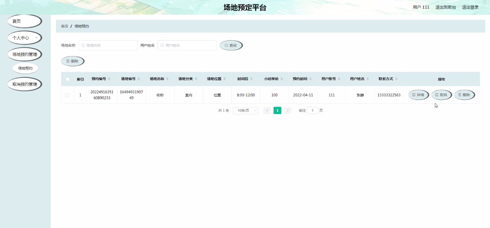

****本项目包含程序+源码+数据库+LW+调试部署环境，文末可获取一份本项目的java源码和数据库参考。****

## ******开题报告******

研究背景：
在现代社会中，人们对于场地预定的需求日益增加。无论是企业组织举办会议、培训，还是个人安排聚会、活动，都需要找到合适的场地进行预定。然而，传统的场地预定方式存在一些问题，如信息不透明、预定流程繁琐等，给用户带来了不便。因此，开发一个高效、便捷的场地预定平台具有重要的现实意义。

研究意义：
场地预定平台的建立和应用，可以为用户提供一个方便快捷的场地预定渠道，解决传统预定方式的种种问题。通过平台的功能设计和优化，可以提升用户体验，节省用户的时间和精力，同时也能够提高场地资源的利用率，促进经济发展。因此，研究场地预定平台的意义在于满足用户需求，提升社会效益。

研究目的：
本研究旨在开发一款基于场地预定的平台，以解决传统预定方式存在的问题，并提供更好的用户体验。具体目标包括：提供全面、准确的场地信息；简化预定流程，降低用户的预定成本；增加用户与场地提供方之间的互动和沟通渠道；提高场地资源的利用效率。通过实现这些目标，期望能够打造一个便捷、高效的场地预定平台，满足用户的多样化需求。

研究内容： 本研究的主要内容围绕场地预定平台的系统功能展开。根据系统功能的分类，研究内容包括以下几个方面：

  1. 用户管理：设计用户注册、登录、信息修改等功能，确保用户身份的合法性和安全性。

  2. 场地类型管理：建立场地分类体系，对不同类型的场地进行分类管理，方便用户选择和查询。

  3. 场地信息管理：收集、整理并展示各个场地的详细信息，包括场地位置、设施设备、容纳人数等，以便用户进行准确的预定。

  4. 场地预约管理：设计预定流程，包括时间选择、费用计算、支付方式等，使用户能够快速、便捷地完成预定操作。

  5. 取消预约管理：提供取消预约的功能，允许用户在一定时间范围内取消已预定的场地，避免不必要的损失。

研究方案：
本研究将采用软件开发的方法，结合用户需求和技术实现，设计并实现一个场地预定平台。研究方案包括需求分析、系统设计、系统开发、系统测试等阶段，通过迭代开发的方式逐步完善平台功能。

预期成果：
本研究的预期成果是开发出一款功能完善、用户友好的场地预定平台。该平台将提供准确、全面的场地信息，简化预定流程，提高用户体验。同时，通过优化资源利用效率，推动场地资源的合理配置。预计该平台能够满足用户的多样化需求，提升场地预定行业的发展水平。

进度安排：

2022年9月至10月：开题报告编写和提交，完成开题报告的撰写并提交给指导教师进行审核。

2022年11月至2023年1月：系统设计和开发，根据开题报告的要求，进行系统设计和编码工作。

2023年2月至3月：论文撰写和初稿完成，开始撰写论文，并在这个阶段完成论文的初稿。

2023年4月至5月：论文修改和最终定稿，根据指导教师的意见对论文进行修改，并完成最终的定稿。

2023年5月：论文答辩和提交，参加论文答辩并根据答辩结果进行修改，最后将论文提交给学院或学校。

参考文献：

[1]喻佳,吴丹新.基于SpringBoot的Web快速开发框架[J].电脑编程技巧与维护,2021,(09):31-33.

[2]李鹏.基于SpringBoot快速开发平台的实现[J].电子技术与软件工程,2021,(12):36-37.

[3]叶开平,蔡维晟,陈家敏,邓斯妮.基于SpringBoot的综测可视化管理系统的研究与设计[J].电脑知识与技术,2021,(12):100-104.

[4]江健锋,徐振平.Springboot最小系统的设计与实现[J].电脑知识与技术,2021,(04):62-63.

[5]赵炯,司圣杰,周奇才,熊肖磊.通用信息获取系统设计与实现[J].起重运输机械,2020,(16):89-97.

[6]吴英宾.一种内外网数据交互系统的设计与实现[J].软件工程,2020,(08):25-27.

****以上是本项目程序开发之前开题报告内容，最终成品以下面界面为准，大家可以酌情参考使用。要源码参考请在文末进行获取！！****

## ******本项目的界面展示******

