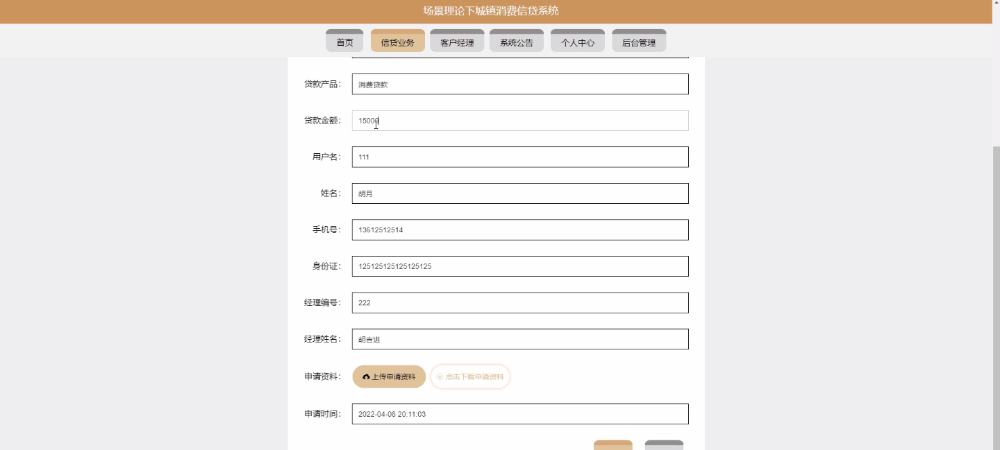
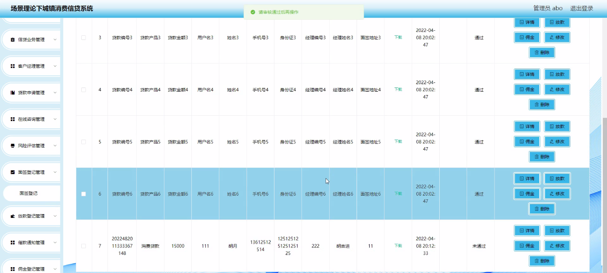

****本项目包含程序+源码+数据库+LW+调试部署环境，文末可获取一份本项目的java源码和数据库参考。****

## ******开题报告******

研究背景：
随着城镇化进程的不断推进，消费信贷在城镇居民生活中扮演着越来越重要的角色。消费信贷系统作为支持城镇消费信贷发展的关键工具，对于提高金融服务效率、促进经济增长具有重要意义。然而，在当前的消费信贷系统中，仍存在一些问题和挑战，如信息不对称、风险控制不完善等，这些问题制约了消费信贷市场的健康发展。

研究意义：
通过对城镇消费信贷系统进行深入研究，可以帮助我们更好地理解消费信贷市场的运行机制和影响因素，为相关政策的制定和实施提供科学依据。同时，优化和改进消费信贷系统，可以提高金融机构的风险管理能力，减少不良贷款风险，为广大消费者提供更加便捷、安全的信贷服务。

研究目的：
本研究旨在深入分析城镇消费信贷系统的运行机制和存在的问题，探索有效的解决方案，以提升消费信贷市场的发展水平和金融服务质量。具体目标包括：优化系统功能，提高用户体验；完善风险评估模型，降低信贷风险；加强信息披露和监管，提升市场透明度；推动消费信贷市场的健康发展。

研究内容： 本研究将围绕城镇消费信贷系统的各项功能展开深入研究，主要包括以下方面内容：

  1. 客户经理功能：分析客户经理在信贷申请过程中的作用和职责，探讨如何提高客户经理的专业素养和服务水平，以更好地满足客户需求。

  2. 贷款申请功能：研究贷款申请流程的优化，包括简化申请材料、提高审批效率等，以提升用户体验和减少办理时间。

  3. 用户功能：探索如何加强对用户的信用评估和风险控制，建立健全的用户信息管理机制，提高信贷资金的使用效率和回收率。

  4. 信贷业务功能：研究信贷产品创新和定价策略，提出合理的利率和还款方式，以满足不同用户的需求，并确保金融机构的盈利能力。

  5. 在线咨询功能：分析在线咨询服务的效果和问题，探讨如何提高咨询质量和响应速度，为用户提供更加便捷和准确的咨询服务。

拟解决的主要问题：
本研究旨在解决城镇消费信贷系统中存在的问题，包括信息不对称、风险控制不完善、服务体验不佳等。通过优化系统功能、完善风险评估模型、加强信息披露和监管等手段，提升消费信贷市场的发展水平和金融服务质量。

研究方案和预期成果：
本研究将采用综合性的研究方法，包括文献调研、实证分析、案例研究等，以全面了解城镇消费信贷系统的运行情况和问题所在。预期成果包括提出一系列针对性的政策建议和改进方案，以推动消费信贷市场的健康发展，提高金融服务效率和用户满意度。

进度安排：

2022年9月至10月：需求分析和规划，明确系统功能和目标，制定项目计划。

2022年11月至2023年1月：系统设计和编码，完成详细的系统设计并开始编写代码。

2023年2月至3月：用户界面开发和数据库开发，开发用户友好的界面和设计数据库结构。

2023年4月至5月：功能测试、文档编写和上线部署，对系统进行全面的功能测试并编写用户手册。

2023年5月：维护和升级，定期对系统进行维护和升级，修复bug和添加新功能。

参考文献：

[1]邱小群,邓丽艳,陈海潮.基于B/S的信息管理系统设计和实现[J].信息与电脑(理论版),2022,(20):146-148.

[2]谢霜.基于Java技术的网络管理体系结构的应用[J].网络安全技术与应用,2022,(10):14-15.

[3]宋锦华.高职院校Java程序设计课程改革研究[J].科技视界,2022,(20):133-135.

[4]曹嵩彭,王鹏宇.浅析Java语言在软件开发中的应用[J].信息记录材料,2022,(03):114-116.

[5]朱澈,余俊达.武汉东湖学院.基于Java的软硬件信息管理系统V1.0[Z].项目立项编号.鉴定单位.鉴定日期:

****以上是本项目程序开发之前开题报告内容，最终成品以下面界面为准，大家可以酌情参考使用。要源码参考请在文末进行获取！！****

## ******本项目的界面展示******

