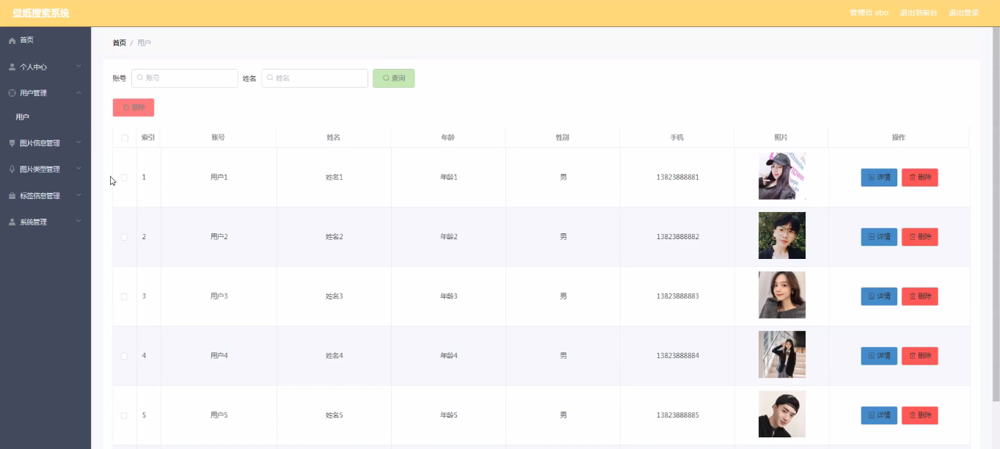
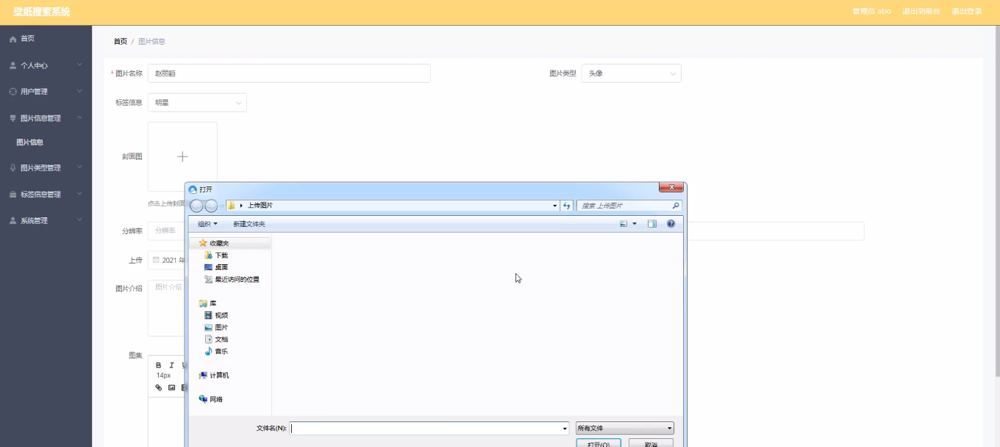
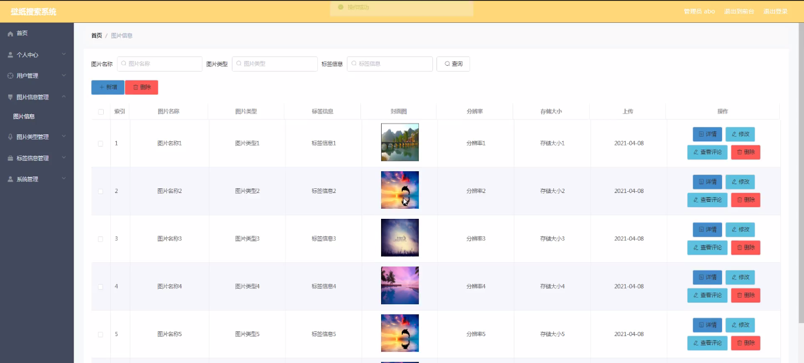
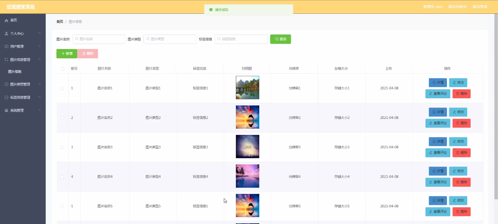
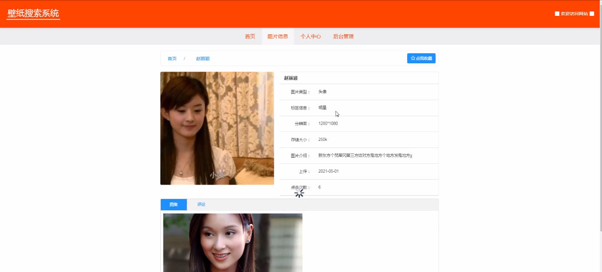

****本项目包含程序+源码+数据库+LW+调试部署环境，文末可获取一份本项目的java源码和数据库参考。****

## ******开题报告******

研究背景：
在当今社会，壁纸已经成为人们日常生活中不可或缺的一部分。无论是个人手机、电脑还是公共场所的显示屏，壁纸都扮演着重要的角色。然而，随着互联网和移动设备的普及，用户对于壁纸的需求越来越多样化和个性化。传统的壁纸搜索系统往往只提供基本的分类和关键词搜索功能，无法满足用户的深层次需求。因此，设计一个高效、准确的壁纸搜索系统具有重要的研究意义和实际应用价值。

研究意义：
壁纸搜索系统的研究对于提升用户体验、满足用户需求具有重要意义。通过深入挖掘用户对于壁纸的喜好和偏好，系统可以根据用户的兴趣推荐个性化的壁纸，从而提高用户的满意度和粘性。此外，壁纸搜索系统还可以为广告商提供更加精准的广告投放平台，实现商业价值最大化。因此，研究如何构建一个高效、准确的壁纸搜索系统对于改进用户体验、推动产业发展具有重要的意义。

研究目的：
本研究旨在设计并实现一个基于用户需求的壁纸搜索系统，通过深度学习和图像处理技术，提供更加准确、个性化的壁纸搜索服务。具体目标包括：1）分析用户对于壁纸的喜好和偏好，挖掘用户需求；2）构建高效的图片信息存储和检索机制，提高搜索效率；3）利用标签信息和图片类型等元数据，为用户提供多样化的搜索方式；4）优化算法和模型，提高搜索结果的准确性和相关性。通过实现以上目标，本研究旨在提升壁纸搜索系统的用户体验和搜索效果，满足用户个性化需求。

研究内容： 本研究将围绕壁纸搜索系统的功能进行深入研究和开发。主要包括以下内容：

  1. 用户需求分析：通过调查问卷、用户行为分析等方法，深入了解用户对于壁纸的喜好和偏好，挖掘用户需求。

  2. 图片信息存储和检索机制：设计高效的图片信息存储和索引机制，提高图片的存储和检索效率。

  3. 标签信息和图片类型的应用：利用标签信息和图片类型等元数据，为用户提供多样化的搜索方式，提高搜索结果的准确性和相关性。

  4. 算法优化和模型设计：通过深度学习、图像处理等技术，优化算法和模型，提高搜索结果的准确性和个性化程度。

预期成果： 本研究预期实现一个高效、准确、个性化的壁纸搜索系统。具体成果包括：

  1. 基于用户需求的推荐系统：根据用户的喜好和偏好，推荐个性化的壁纸，提高用户满意度。

  2. 高效的图片存储和检索机制：设计并实现一种高效的图片信息存储和检索机制，提高搜索效率。

  3. 多样化的搜索方式：利用标签信息和图片类型等元数据，为用户提供多样化的搜索方式，满足不同用户的需求。

  4. 优化的算法和模型：通过算法优化和模型设计，提高搜索结果的准确性和相关性。

以上是对壁纸搜索系统研究背景、意义、目的、研究内容、拟解决的主要问题、研究方案和预期成果的说明。

进度安排：

2022年9月至10月：需求分析和规划，进行用户需求调研和分析，确定系统功能和目标。

2022年11月至2023年1月：系统设计和开发，完成系统架构设计和技术选型，并开始编写代码。

2023年2月至3月：测试和优化，进行单元测试和集成测试，修复问题并优化系统性能。

2023年4月至5月：文档编写和培训，编写用户手册和系统文档，并进行相关人员的培训。

2023年5月：上线部署和维护，将系统部署到生产环境中，并定期进行维护和升级。

参考文献：

[1]王振华.SpringBoot在教学效果评估系统中的应用[J].电子技术,2023,(05):67-69.

[2]王明泉.基于SpringBoot远程热部署的探索和应用[J].信息与电脑(理论版),2023,(07):1-4.

[3]王亚东,李晓霞,陈强强,剡美娜.基于SpringBoot的需求发布平台设计[J].信息与电脑(理论版),2023,(01):105-107.

[4]陈新府豪.基于SpringBoot和Vue框架的创新方法推理系统的设计与实现[D].导师：黄静.浙江理工大学,2022.

[5]霍福华,韩慧.基于SpringBoot微服务架构下前后端分离的MVVM模型[J].电子技术与软件工程,2022,(01):73-76.

[6]韩策,张娜,王松亭,张凯,何方,袁峰.SpringBoot OPC客户端设计与研究[J].电子世界,2021,(19):25-26.

****以上是本项目程序开发之前开题报告内容，最终成品以下面界面为准，大家可以酌情参考使用。要源码参考请在文末进行获取！！****

## ******本项目的界面展示******

