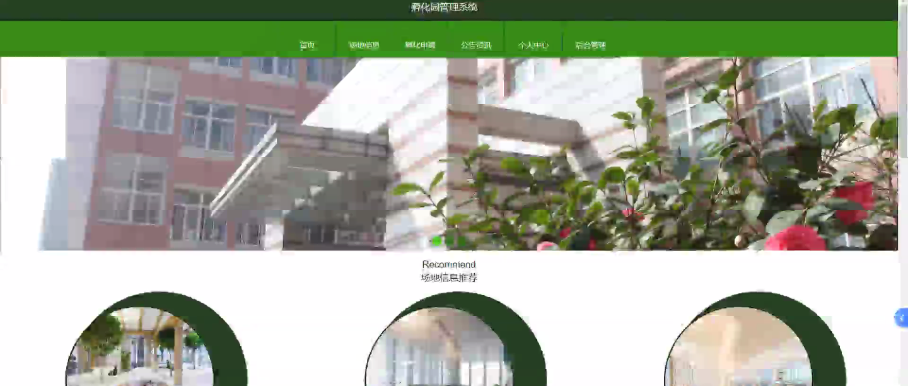
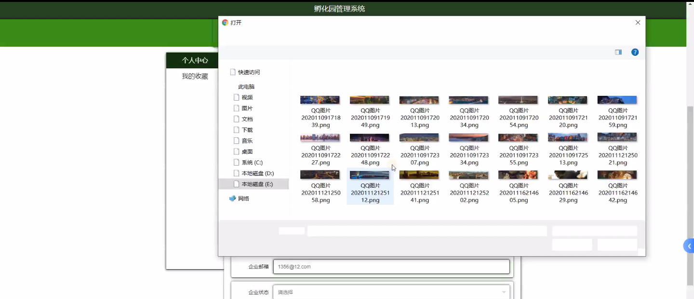
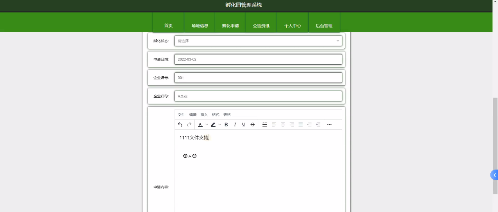
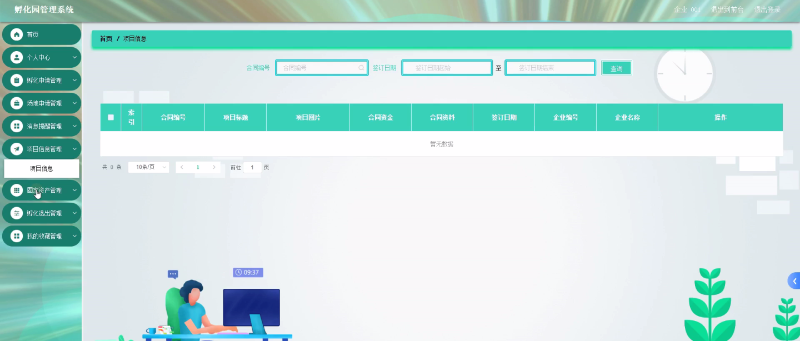
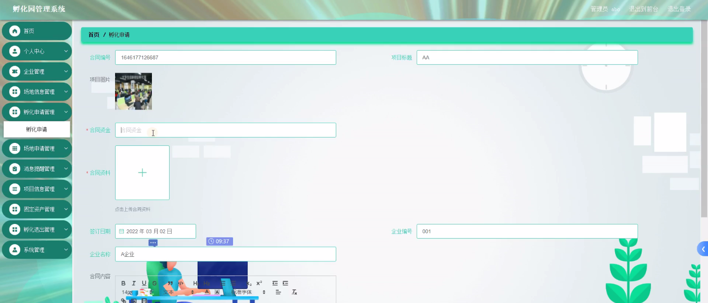
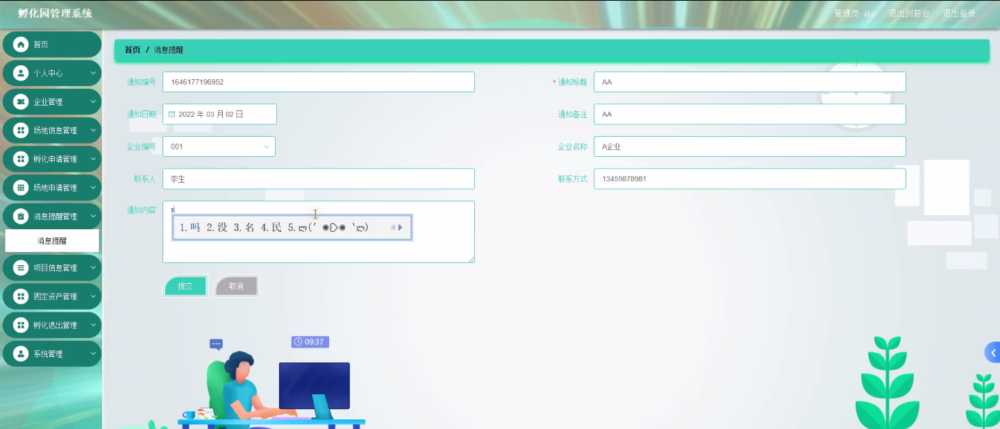
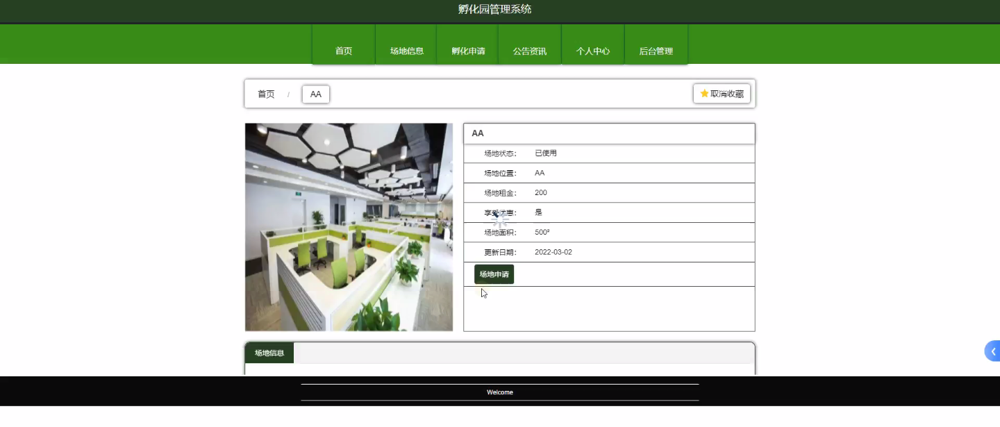
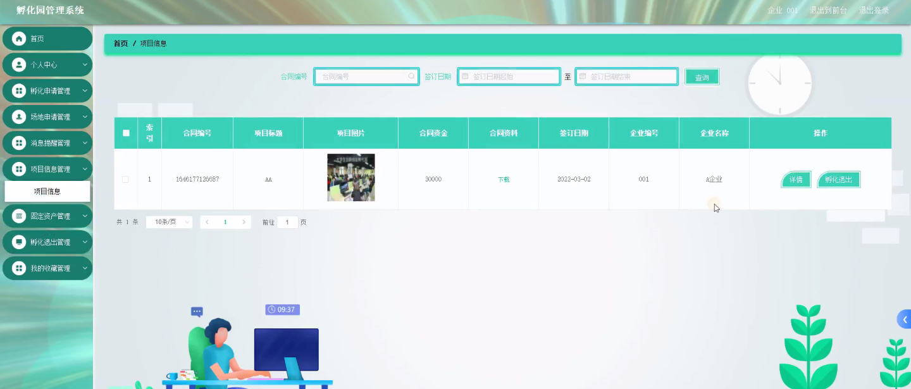

****本项目包含程序+源码+数据库+LW+调试部署环境，文末可获取一份本项目的java源码和数据库参考。****

## ******开题报告******

研究背景：
随着科技的不断发展和社会经济的进步，孵化园作为一种创新创业服务平台，已经在许多地方得到了广泛应用。孵化园为初创企业提供了场地、资源、资金等支持，帮助他们快速成长并成功创业。然而，目前存在着孵化园管理效率低下、信息不透明、协同配合困难等问题，这些问题严重制约了孵化园的发展和创业者的成长。

研究意义：
针对孵化园管理系统的研究具有重要的现实意义。通过建立一个高效、智能的孵化园管理系统，可以提高孵化园的管理效率，加强资源的共享与协同，促进创业项目的顺利进行。同时，该系统还可以提供数据支持和决策参考，帮助管理者更好地把握孵化园的发展方向，推动创新创业生态的良性循环。

研究目的：
本研究旨在设计和开发一套全面、高效的孵化园管理系统，以解决目前孵化园管理中存在的问题。通过系统化的信息管理和协同配合，提高孵化园的运营效率和服务质量，为创业者提供更好的创新创业环境，推动创业项目的成功发展。

研究内容： 本研究将围绕孵化园管理系统的功能进行设计和开发。具体而言，研究内容包括但不限于以下几个方面：

  1. 企业信息管理：建立完善的企业信息数据库，包括企业基本信息、项目进展、融资情况等，实现对企业信息的统一管理和查询。

  2. 场地信息管理：建立场地信息数据库，包括场地规模、设施设备、租赁情况等，实现对场地资源的有效利用和管理。

  3. 孵化申请管理：设计孵化申请流程，包括申请提交、审核、审批等环节，实现对孵化项目的全程管理。

  4. 场地申请管理：设计场地申请流程，包括场地需求提交、场地分配、使用记录等，实现对场地资源的合理配置和使用。

  5. 消息提醒管理：建立消息提醒机制，及时向创业者和管理者发送重要通知和提醒，提高沟通效率和工作效率。

  6. 项目信息管理：建立项目信息数据库，包括项目进展、成果展示、合作伙伴等，实现对创业项目的全面管理和展示。

  7. 固定资产管理：建立固定资产台账，包括设备、办公用品等，实现对固定资产的登记、维护和报废管理。

  8. 孵化退出管理：设计孵化退出流程，包括项目评估、孵化结束等环节，实现对孵化项目的退出管理和评估。

拟解决的主要问题： 通过上述研究内容的实施，本研究旨在解决以下主要问题：

  1. 孵化园管理效率低下的问题，提高孵化园的运营效率和服务质量。

  2. 信息不透明的问题，实现孵化园内外信息的共享和传递。

  3. 协同配合困难的问题，促进孵化园内外各方资源的协同利用和合作发展。

研究方案和预期成果：
本研究将采用需求分析、系统设计、开发实施等方法，结合孵化园管理的实际需求，设计和开发一套全面、高效的孵化园管理系统。预期成果包括但不限于以下几个方面：

  1. 设计和开发出一套功能完善、操作简便的孵化园管理系统。

  2. 提高孵化园的管理效率和服务质量，加强资源的共享与协同。

  3. 实现孵化园内外信息的共享和传递，提高信息的透明度和可靠性。

  4. 促进孵化园内外各方资源的协同利用和合作发展，推动创新创业生态的良性循环。

  5. 为创业者提供更好的创新创业环境，推动创业项目的成功发展。

进度安排：

2022年9月至10月：需求分析和规划，明确系统功能和目标，制定项目计划。

2022年11月至2023年1月：系统设计和编码，完成详细的系统设计并开始编写代码。

2023年2月至3月：用户界面开发和数据库开发，开发用户友好的界面和设计数据库结构。

2023年4月至5月：功能测试、文档编写和上线部署，对系统进行全面的功能测试并编写用户手册。

2023年5月：维护和升级，定期对系统进行维护和升级，修复bug和添加新功能。

参考文献：

[1]邱小群,邓丽艳,陈海潮.基于B/S的信息管理系统设计和实现[J].信息与电脑(理论版),2022,(20):146-148.

[2]谢霜.基于Java技术的网络管理体系结构的应用[J].网络安全技术与应用,2022,(10):14-15.

[3]宋锦华.高职院校Java程序设计课程改革研究[J].科技视界,2022,(20):133-135.

[4]曹嵩彭,王鹏宇.浅析Java语言在软件开发中的应用[J].信息记录材料,2022,(03):114-116.

[5]朱澈,余俊达.武汉东湖学院.基于Java的软硬件信息管理系统V1.0[Z].项目立项编号.鉴定单位.鉴定日期:

****以上是本项目程序开发之前开题报告内容，最终成品以下面界面为准，大家可以酌情参考使用。要源码参考请在文末进行获取！！****

## ******本项目的界面展示******

