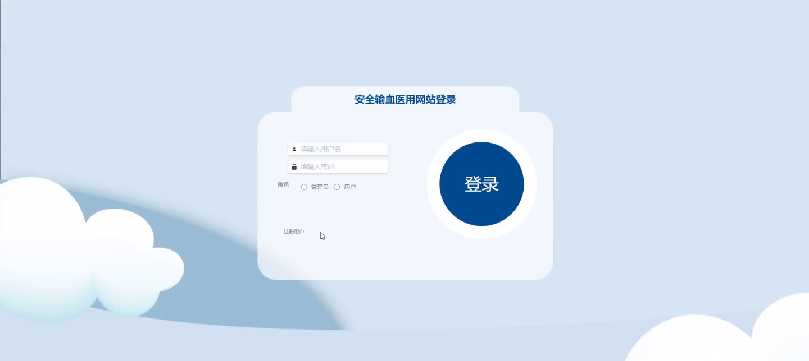
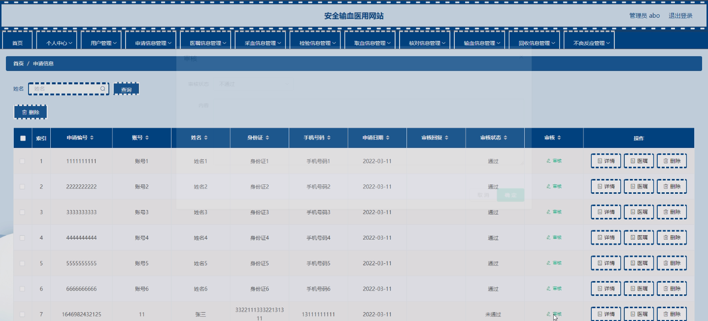
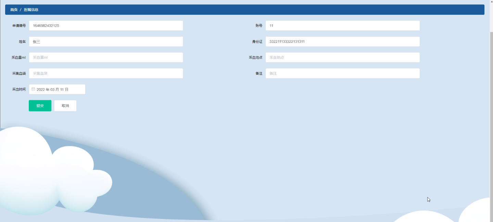
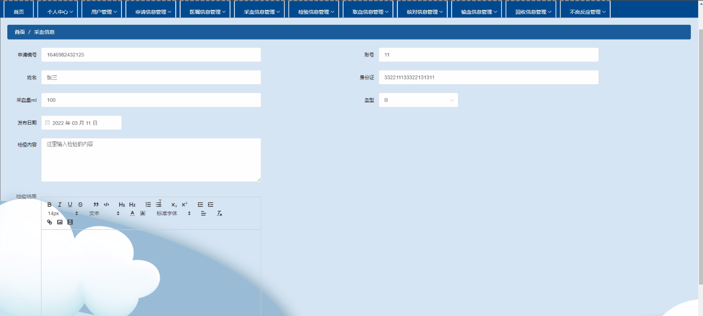
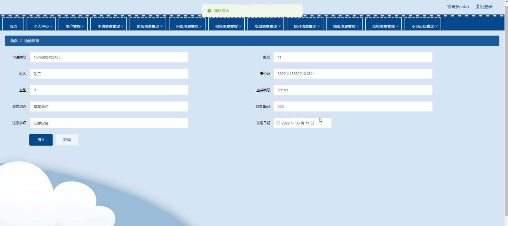
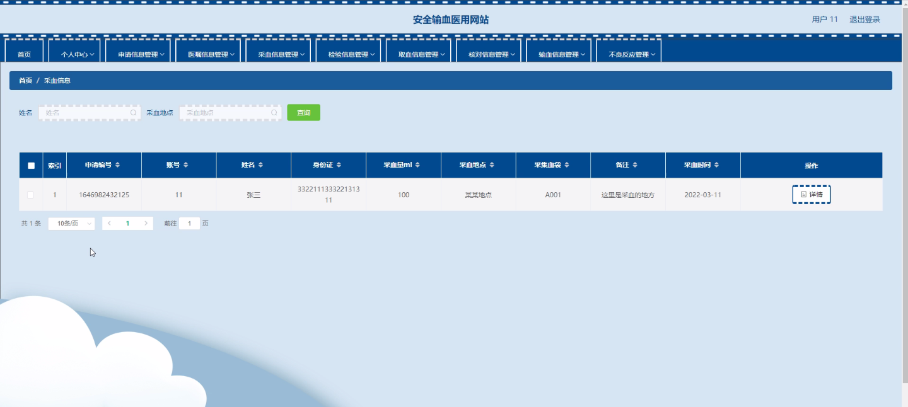
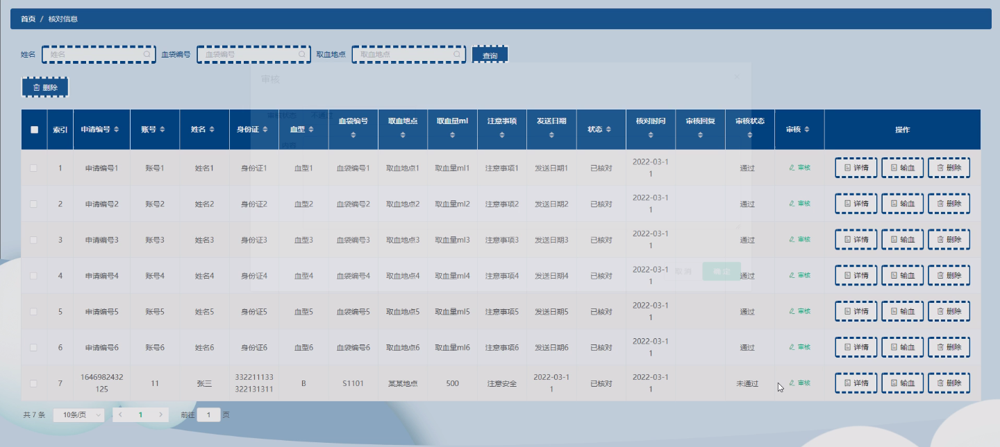
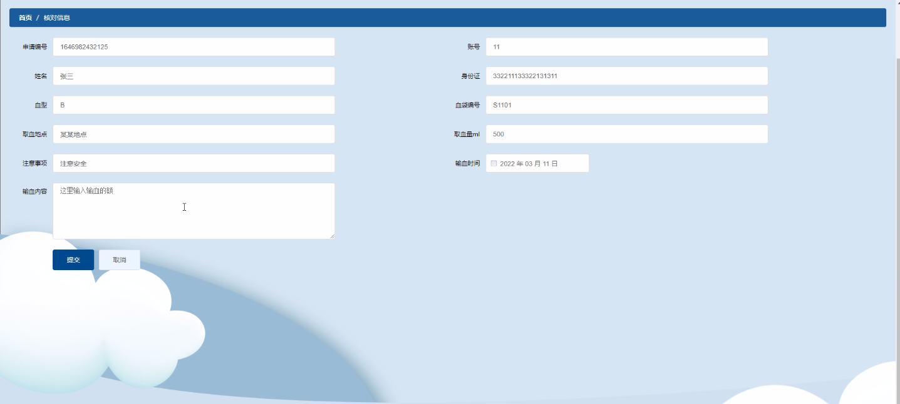

****本项目包含程序+源码+数据库+LW+调试部署环境，文末可获取一份本项目的java源码和数据库参考。****

## ******开题报告******

研究背景：
输血是一项常见且重要的医疗技术，广泛应用于手术、创伤、贫血等疾病治疗过程中。然而，输血过程中存在着一定的风险，如输血反应、传染病传播等问题，给患者的生命安全带来了潜在威胁。因此，为了提高输血过程的安全性和有效性，建立一个安全输血的医用网站具有重要的意义。

研究意义：
安全输血的医用网站可以为医务人员提供全面、准确的信息，帮助他们更好地进行输血操作，降低输血相关风险。同时，该网站还可以提供实时的数据监控和管理功能，方便医院管理人员对输血过程进行追踪和评估，从而提高整体的医疗质量和安全水平。

研究目的：
本研究旨在设计和开发一个安全输血的医用网站，通过集成多个系统功能，实现对输血过程的全面监控和管理。具体目的包括：提供用户注册和登录功能，方便医务人员使用网站；收集和管理申请信息、医嘱信息、采血信息、检验信息、取血信息、核对信息、输血信息、回收信息等数据，确保数据的准确性和完整性；提供实时的数据监控和报警功能，及时发现和处理异常情况；提供知识库和培训资源，帮助医务人员提高输血操作的技能和意识。

研究内容： 根据系统功能的要求，本研究的主要内容包括以下方面：

  1. 用户管理：设计用户注册和登录功能，确保只有授权人员可以访问和使用网站。

  2. 申请信息管理：建立申请信息数据库，记录患者的输血需求、相关病史和医嘱信息。

  3. 医嘱信息管理：记录医生的输血医嘱，包括输血类型、输血量、输血速度等信息。

  4. 采血信息管理：记录采血过程中的相关信息，如采血时间、采血部位、采血人员等。

  5. 检验信息管理：记录输血前后的检验结果，确保患者适宜接受输血。

  6. 取血信息管理：记录取血过程中的相关信息，如取血时间、取血人员等。

  7. 核对信息管理：记录输血过程中的核对环节，确保输血的准确性和安全性。

  8. 输血信息管理：记录输血过程中的详细信息，如输血时间、输血量、输血速度等。

  9. 回收信息管理：记录输血后的回收情况，包括输血袋的处理和废弃物的处置。

  10. 不良反应管理：记录输血过程中出现的不良反应情况，并及时采取相应的处理措施。

拟解决的主要问题：
本研究旨在解决传统输血过程中存在的一些问题，如数据管理不规范、信息传递不及时、操作风险较高等。通过设计和开发安全输血的医用网站，可以实现数据的集中管理和实时监控，提高整体的输血安全性和效率。

研究方案和预期成果：
本研究将采用软件工程的方法，结合需求分析、系统设计、编码实现和测试验证等步骤，逐步完成安全输血的医用网站的开发工作。预期成果包括一个功能完善、稳定可靠的医用网站，能够满足医务人员对输血过程的全面管理需求，提高输血操作的安全性和效率。

进度安排：

2022年9月至10月：需求分析和规划，明确系统功能和目标，制定项目计划。

2022年11月至2023年1月：系统设计和编码，完成详细的系统设计并开始编写代码。

2023年2月至3月：用户界面开发和数据库开发，开发用户友好的界面和设计数据库结构。

2023年4月至5月：功能测试、文档编写和上线部署，对系统进行全面的功能测试并编写用户手册。

2023年5月：维护和升级，定期对系统进行维护和升级，修复bug和添加新功能。

参考文献：

[1]邱小群,邓丽艳,陈海潮.基于B/S的信息管理系统设计和实现[J].信息与电脑(理论版),2022,(20):146-148.

[2]谢霜.基于Java技术的网络管理体系结构的应用[J].网络安全技术与应用,2022,(10):14-15.

[3]宋锦华.高职院校Java程序设计课程改革研究[J].科技视界,2022,(20):133-135.

[4]曹嵩彭,王鹏宇.浅析Java语言在软件开发中的应用[J].信息记录材料,2022,(03):114-116.

[5]朱澈,余俊达.武汉东湖学院.基于Java的软硬件信息管理系统V1.0[Z].项目立项编号.鉴定单位.鉴定日期:

****以上是本项目程序开发之前开题报告内容，最终成品以下面界面为准，大家可以酌情参考使用。要源码参考请在文末进行获取！！****

## ******本项目的界面展示******

