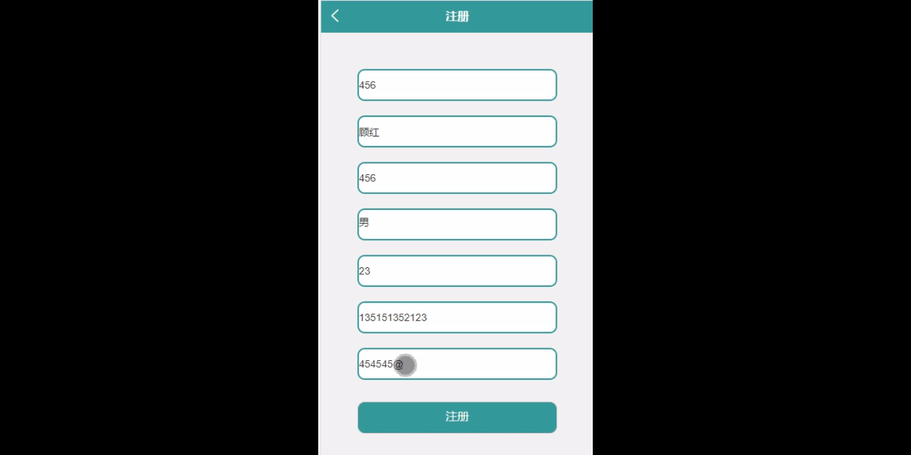
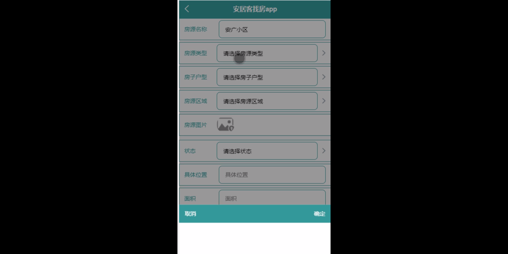
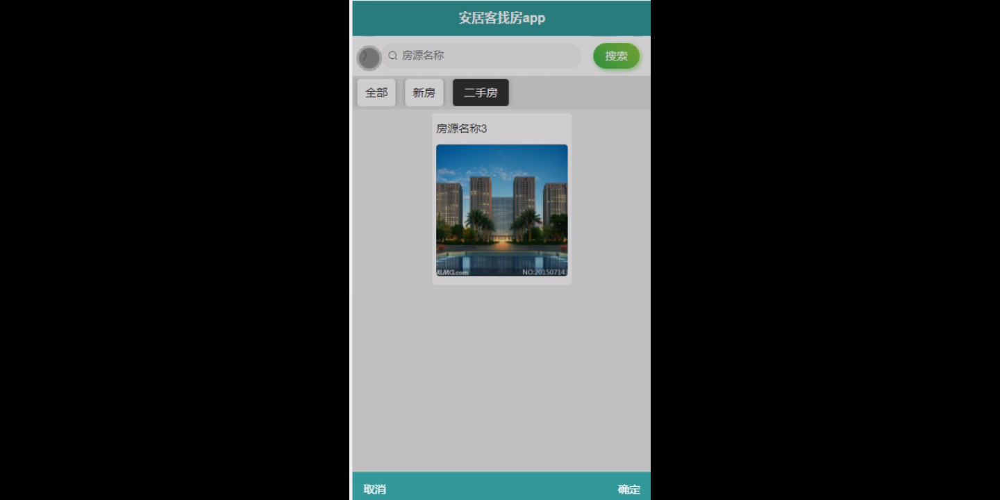
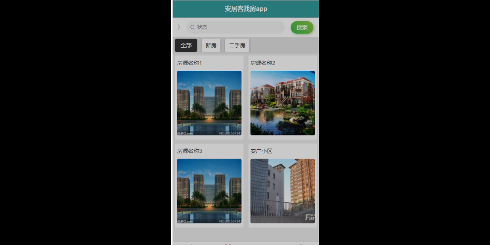
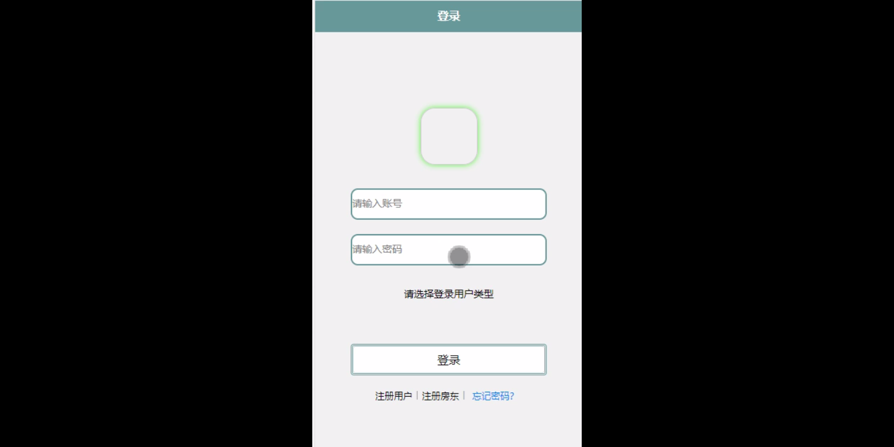

****本项目包含程序+源码+数据库+LW+调试部署环境，文末可获取一份本项目的java源码和数据库参考。****

## ******开题报告******

研究背景：
随着城市化进程的加快和人们生活水平的提高，房地产市场逐渐成为经济发展的重要支柱之一。在这个过程中，房屋租售需求不断增长，而寻找合适的房源成为了许多人面临的难题。传统的房屋租售方式存在信息不对称、效率低下等问题，给用户带来了很大的困扰。因此，开发一个能够满足用户需求、提供准确信息的房屋租售平台具有重要意义。

研究意义：
安居客找房作为一家知名的房屋租售平台，致力于为用户提供便捷、高效的房屋租售服务。通过对该平台进行深入研究，可以更好地理解用户需求、挖掘潜在问题，并提出相应的改进方案，从而进一步提升用户体验，推动房屋租售行业的发展。

研究目的：
本研究旨在通过对安居客找房平台的研究，深入分析其系统功能以及用户需求，探索如何优化房屋租售服务，提高用户满意度。具体目标包括：1.了解安居客找房平台的特点和运营模式；2.分析用户、房东、房子户型、房源区域、房源类型、房源信息、租房信息、售房订单、租房订单等系统功能，并探索其在实际应用中的问题和改进空间；3.提出相应的研究方案和改进建议，以期优化房屋租售服务。

研究内容： 本研究将主要围绕安居客找房平台展开，具体研究内容包括但不限于以下几个方面：

  1. 用户需求分析：通过调查问卷、访谈等方式，深入了解用户对房屋租售服务的需求，包括价格、地理位置、房屋质量等方面的考虑因素，为后续优化工作提供依据。

  2. 系统功能分析：对安居客找房平台的用户、房东、房子户型、房源区域、房源类型、房源信息、租房信息、售房订单、租房订单等系统功能进行详细分析，了解其功能设计是否满足用户需求，是否存在效率低下、信息不准确等问题。

  3. 问题挖掘与解决：针对系统功能中存在的问题，结合用户需求分析结果，提出相应的改进方案和解决措施，以提高房屋租售服务的质量和效率。

研究方案：
本研究将采用综合性的研究方法，包括文献调研、实地调查、数据分析等。具体步骤包括：1.收集相关文献，了解国内外房屋租售平台的发展现状和趋势；2.通过问卷调查、访谈等方式，获取用户需求和反馈意见；3.对安居客找房平台进行功能分析，识别问题点；4.制定改进方案，并进行实验验证；5.根据实验结果，总结研究成果并提出进一步改进的建议。

预期成果：
通过本研究，预期可以深入了解安居客找房平台的特点和运营模式，分析其系统功能及存在的问题，并提出相应的改进方案。预期成果包括但不限于：1.优化房屋租售服务流程，提高用户满意度；2.提供更准确、全面的房屋信息，降低信息不对称的问题；3.改进系统功能，提高操作效率和用户体验；4.为房屋租售行业的发展提供参考和借鉴。以上成果将有助于推动安居客找房平台及整个房屋租售行业的发展。

进度安排：

2022年9月至10月：开题报告编写和提交，完成开题报告的撰写并提交给指导教师进行审核。

2022年11月至2023年1月：系统设计和开发，根据开题报告的要求，进行系统设计和编码工作。

2023年2月至3月：论文撰写和初稿完成，开始撰写论文，并在这个阶段完成论文的初稿。

2023年4月至5月：论文修改和最终定稿，根据指导教师的意见对论文进行修改，并完成最终的定稿。

2023年5月：论文答辩和提交，参加论文答辩并根据答辩结果进行修改，最后将论文提交给学院或学校。

参考文献：

[1]喻佳,吴丹新.基于SpringBoot的Web快速开发框架[J].电脑编程技巧与维护,2021,(09):31-33.

[2]李鹏.基于SpringBoot快速开发平台的实现[J].电子技术与软件工程,2021,(12):36-37.

[3]叶开平,蔡维晟,陈家敏,邓斯妮.基于SpringBoot的综测可视化管理系统的研究与设计[J].电脑知识与技术,2021,(12):100-104.

[4]江健锋,徐振平.Springboot最小系统的设计与实现[J].电脑知识与技术,2021,(04):62-63.

[5]赵炯,司圣杰,周奇才,熊肖磊.通用信息获取系统设计与实现[J].起重运输机械,2020,(16):89-97.

[6]吴英宾.一种内外网数据交互系统的设计与实现[J].软件工程,2020,(08):25-27.

****以上是本项目程序开发之前开题报告内容，最终成品以下面界面为准，大家可以酌情参考使用。要源码参考请在文末进行获取！！****

## ******本项目的界面展示******

