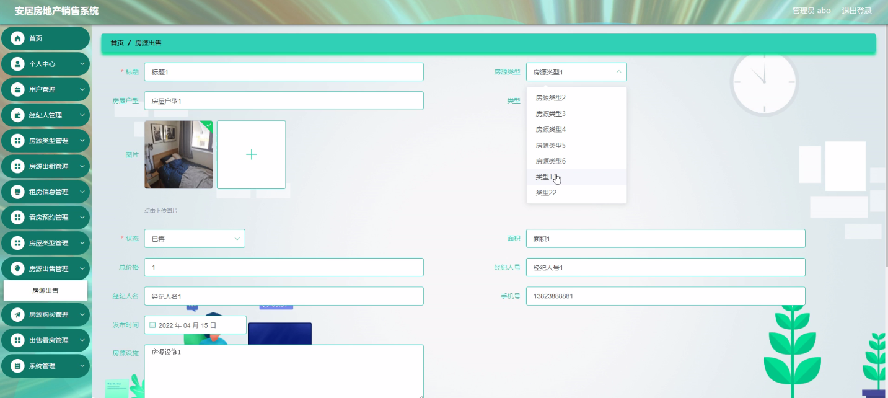
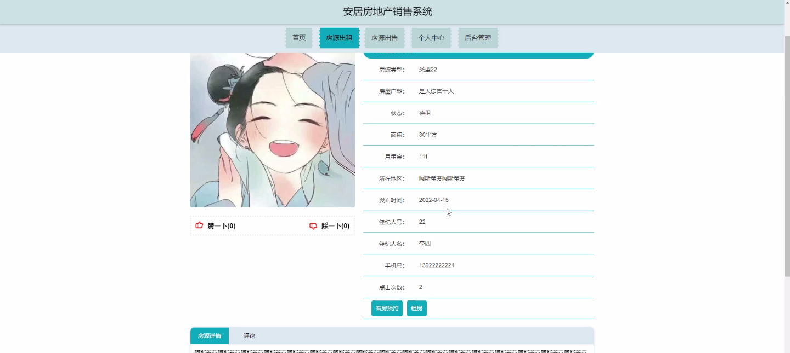
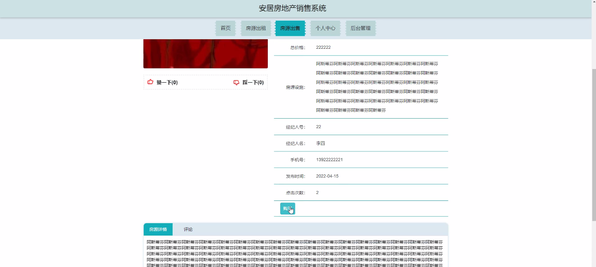

****本项目包含程序+源码+数据库+LW+调试部署环境，文末可获取一份本项目的java源码和数据库参考。****

## ******开题报告******

研究背景：
随着社会经济的快速发展和人民生活水平的提高，房地产市场作为国民经济的重要组成部分，扮演着举足轻重的角色。然而，在房地产销售领域，仍存在一些问题和挑战。传统的销售方式往往效率低下、信息不对称，导致了购房者和开发商之间的信息不对等和信任缺失。因此，建立一个高效、透明、公正的房地产销售系统变得尤为重要。

研究意义：
安居房地产销售系统的建立旨在解决当前房地产销售过程中存在的问题，并提供更好的服务和体验给购房者和开发商。通过引入先进的信息技术和管理方法，可以实现销售流程的规范化、透明化和高效化，从而提升整个行业的竞争力和可持续发展能力。同时，这也有助于促进房地产市场的健康发展，推动城市经济的稳定增长。

研究目的：
本研究旨在探索并设计一种符合现代化要求的安居房地产销售系统，通过整合信息技术、管理方法和市场需求，提升房地产销售的效率和质量。具体目标包括但不限于：优化销售流程，提高销售效率；提供全面、准确的房源信息，满足购房者的个性化需求；建立信任机制，增强购房者和开发商之间的互信关系；促进房地产市场的健康发展。

研究内容： 本研究将围绕安居房地产销售系统展开深入研究，主要包括以下几个方面的内容：

  1. 销售流程优化：通过分析现有销售流程中存在的问题和瓶颈，提出改进建议，并设计一套更加高效、规范的销售流程。

  2. 房源信息管理：建立完善的房源信息管理系统，包括房屋基本信息、价格、户型图等，以满足购房者对房源信息的准确、全面的需求。

  3. 个性化服务：根据购房者的不同需求和偏好，提供个性化的服务，包括选房咨询、贷款指导、法律咨询等，以提升购房者的满意度和体验感。

  4. 信任机制建立：通过引入第三方评价、信用认证等机制，建立购房者和开发商之间的信任关系，提高交易的安全性和可靠性。

研究方案：
本研究将采用文献综述、实地调研、数据分析等方法，结合信息技术和管理理论，设计和开发安居房地产销售系统。同时，还将与相关领域的专家、开发商和购房者进行深入交流和讨论，获取宝贵的经验和反馈。

预期成果： 通过本研究，预期可以实现以下几个方面的成果：

  1. 设计并开发出一套符合现代化要求的安居房地产销售系统，能够满足购房者和开发商的需求，并提升整个行业的竞争力。

  2. 提供全面、准确的房源信息，帮助购房者做出明智的购房决策，促进市场的透明化和规范化。

  3. 建立有效的信任机制，增强购房者和开发商之间的互信关系，提高交易的安全性和可靠性。

  4. 推动房地产市场的健康发展，促进城市经济的稳定增长。

进度安排：

2022年9月至10月：开题报告编写和提交，完成开题报告的撰写并提交给指导教师进行审核。

2022年11月至2023年1月：系统设计和开发，根据开题报告的要求，进行系统设计和编码工作。

2023年2月至3月：论文撰写和初稿完成，开始撰写论文，并在这个阶段完成论文的初稿。

2023年4月至5月：论文修改和最终定稿，根据指导教师的意见对论文进行修改，并完成最终的定稿。

2023年5月：论文答辩和提交，参加论文答辩并根据答辩结果进行修改，最后将论文提交给学院或学校。

参考文献：

[1]喻佳,吴丹新.基于SpringBoot的Web快速开发框架[J].电脑编程技巧与维护,2021,(09):31-33.

[2]李鹏.基于SpringBoot快速开发平台的实现[J].电子技术与软件工程,2021,(12):36-37.

[3]叶开平,蔡维晟,陈家敏,邓斯妮.基于SpringBoot的综测可视化管理系统的研究与设计[J].电脑知识与技术,2021,(12):100-104.

[4]江健锋,徐振平.Springboot最小系统的设计与实现[J].电脑知识与技术,2021,(04):62-63.

[5]赵炯,司圣杰,周奇才,熊肖磊.通用信息获取系统设计与实现[J].起重运输机械,2020,(16):89-97.

[6]吴英宾.一种内外网数据交互系统的设计与实现[J].软件工程,2020,(08):25-27.

****以上是本项目程序开发之前开题报告内容，最终成品以下面界面为准，大家可以酌情参考使用。要源码参考请在文末进行获取！！****

## ******本项目的界面展示******

