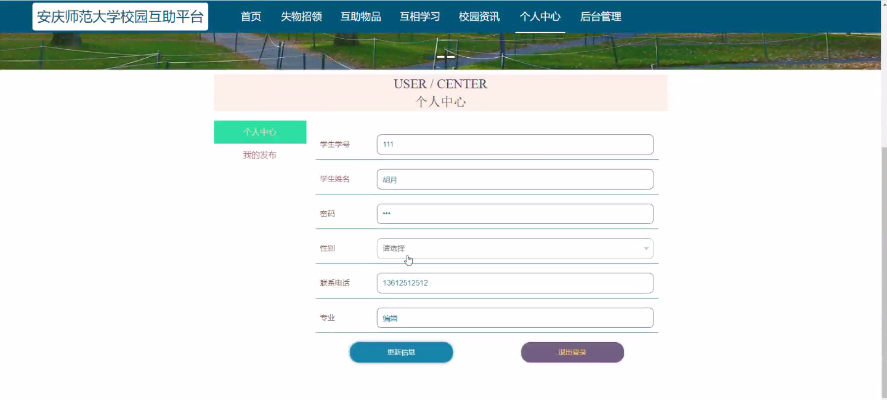
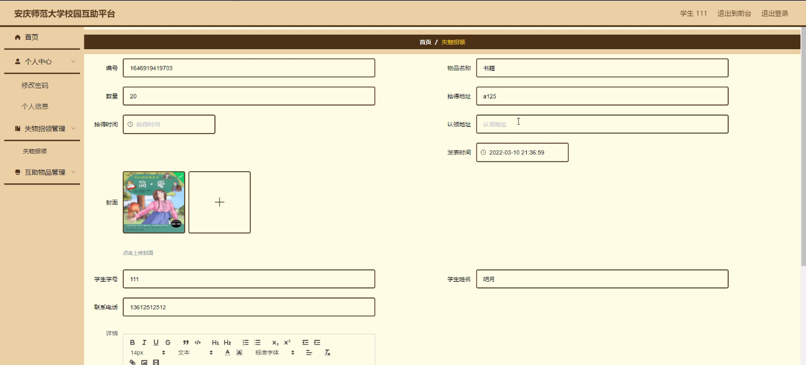
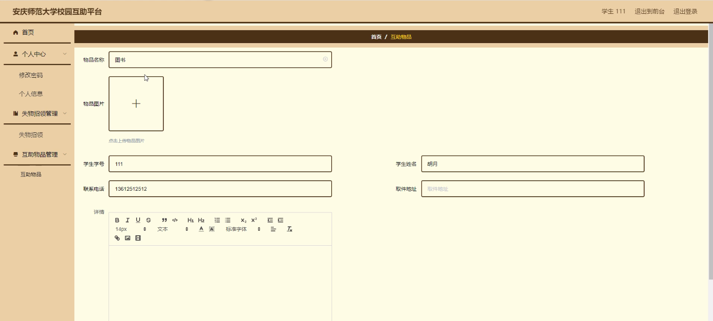
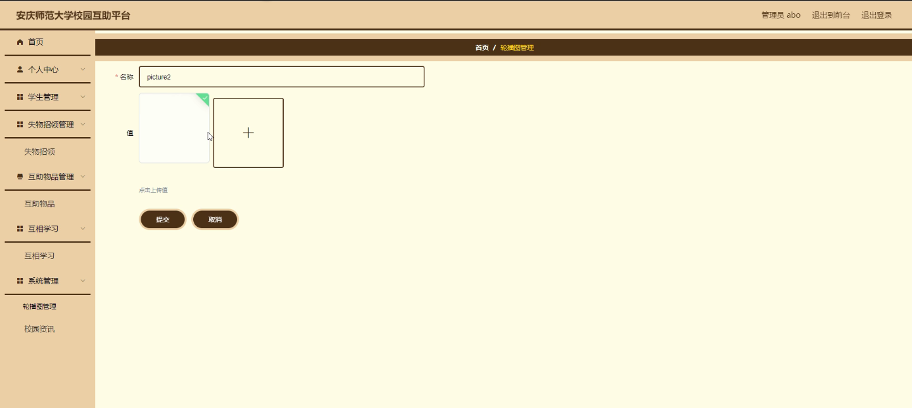
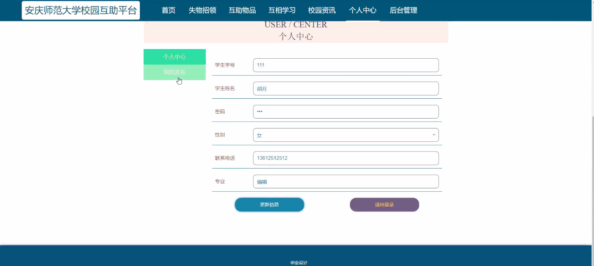

****本项目包含程序+源码+数据库+LW+调试部署环境，文末可获取一份本项目的java源码和数据库参考。****

## ******开题报告******

研究背景：
随着社会的发展和科技的进步，校园互助平台作为一种新型的社交网络应用逐渐兴起。安庆师范大学作为一所具有较高知名度和规模的高等院校，也面临着日益增长的校园生活压力和各类问题。因此，开发一个校园互助平台来解决学生在校园生活中遇到的各种困难和问题，具有重要的现实意义。

研究意义：
校园互助平台的建立将为学生提供一个便捷、高效的信息交流和资源共享平台，促进校园内的互助与合作。通过该平台，学生可以方便地寻找失物、分享学习资料、求助解答问题等，提高了学生的生活质量和学习效果。同时，校园互助平台也有助于培养学生的团队合作精神和社会责任感，促进校园文化的建设。

研究目的：
本研究旨在开发一款针对安庆师范大学学生的校园互助平台，以满足学生在校园生活中的各类需求。通过该平台，学生可以更加便捷地获取校园资源和信息，解决生活中遇到的问题，提高学习效果和生活质量。同时，研究还旨在促进学生之间的互助与合作，营造积极向上的校园氛围。

研究内容：
本研究将开发一款基于安庆师范大学的校园互助平台，主要包括学生、失物招领、互助物品等系统功能。其中，学生功能模块将提供学生信息查询、课程表查询、成绩查询等服务；失物招领功能模块将提供失物发布、招领信息查询等服务；互助物品功能模块将提供物品借用、分享等服务。通过这些功能模块的设计和实现，学生可以方便地获取所需信息和资源，解决生活中的问题。

拟解决的主要问题：

  1. 学生信息不便查询：学生需要查询自己的个人信息、课程表、成绩等，但目前缺乏一个统一的查询平台。
  2. 失物招领不畅：学生在校园中遗失物品时，往往难以找到失主或发布招领信息，导致失物难以归还。
  3. 物品共享不便：学生在校园中需要借用或分享物品时，缺乏一个便捷的平台来满足这种需求。

研究方案：
本研究将采用软件开发的方法，利用现有的技术和工具，设计并实现一款安庆师范大学校园互助平台。通过需求分析、系统设计、编码实现等步骤，构建一个功能完善、用户友好的平台。同时，将进行用户调研和测试，不断改进和优化平台的功能和性能。

预期成果：
通过本研究，预期可以开发出一款适用于安庆师范大学学生的校园互助平台，为学生提供便捷、高效的服务。该平台将解决学生在校园生活中遇到的各类问题，提高学生的生活质量和学习效果。同时，通过促进学生之间的互助与合作，营造积极向上的校园氛围，推动校园文化的建设。

进度安排：

2022年9月至10月：需求分析和规划，进行用户需求调研和分析，确定系统功能和目标。

2022年11月至2023年1月：系统设计和开发，完成系统架构设计和技术选型，并开始编写代码。

2023年2月至3月：测试和优化，进行单元测试和集成测试，修复问题并优化系统性能。

2023年4月至5月：文档编写和培训，编写用户手册和系统文档，并进行相关人员的培训。

2023年5月：上线部署和维护，将系统部署到生产环境中，并定期进行维护和升级。

参考文献：

[1]王振华.SpringBoot在教学效果评估系统中的应用[J].电子技术,2023,(05):67-69.

[2]王明泉.基于SpringBoot远程热部署的探索和应用[J].信息与电脑(理论版),2023,(07):1-4.

[3]王亚东,李晓霞,陈强强,剡美娜.基于SpringBoot的需求发布平台设计[J].信息与电脑(理论版),2023,(01):105-107.

[4]陈新府豪.基于SpringBoot和Vue框架的创新方法推理系统的设计与实现[D].导师：黄静.浙江理工大学,2022.

[5]霍福华,韩慧.基于SpringBoot微服务架构下前后端分离的MVVM模型[J].电子技术与软件工程,2022,(01):73-76.

[6]韩策,张娜,王松亭,张凯,何方,袁峰.SpringBoot OPC客户端设计与研究[J].电子世界,2021,(19):25-26.

****以上是本项目程序开发之前开题报告内容，最终成品以下面界面为准，大家可以酌情参考使用。要源码参考请在文末进行获取！！****

## ******本项目的界面展示******

