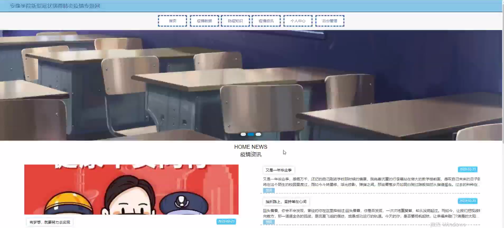
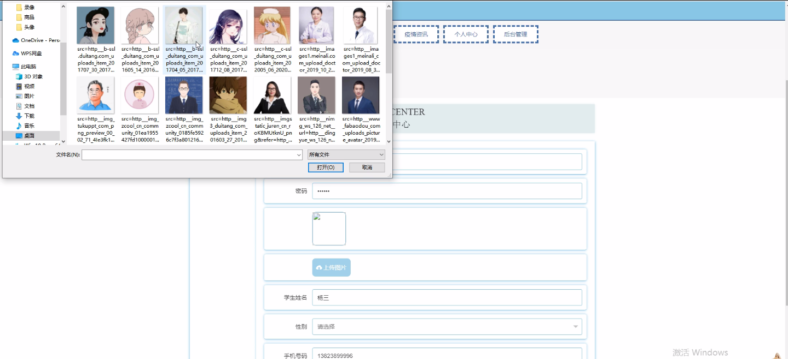
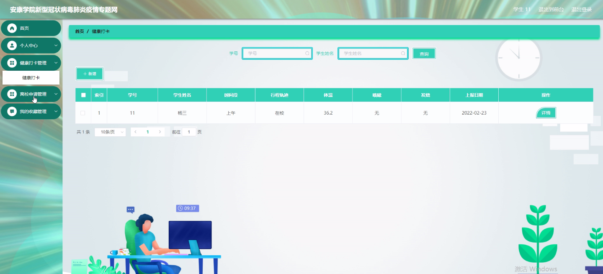
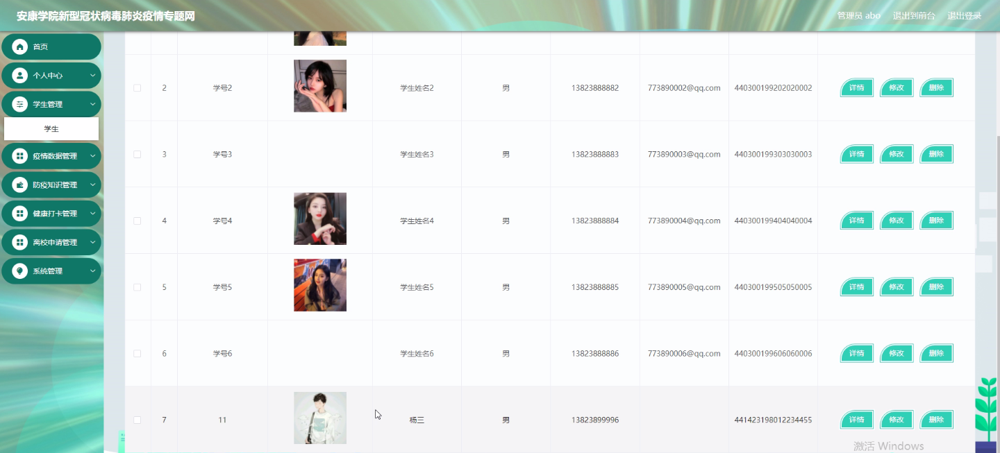
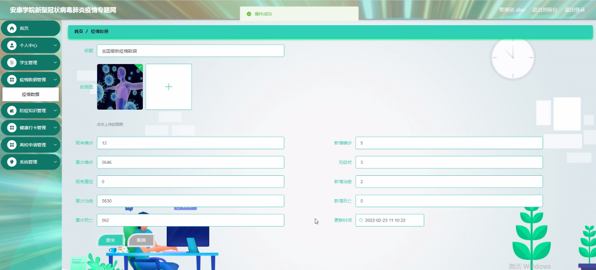
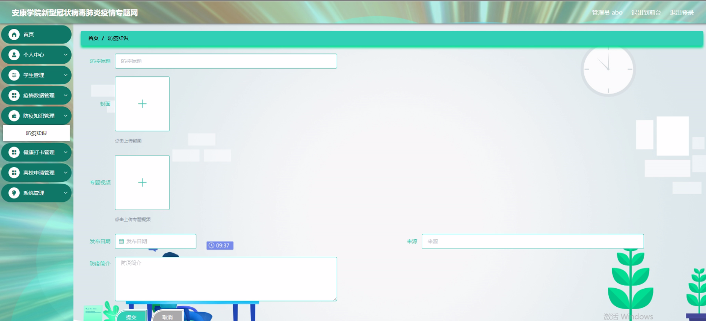
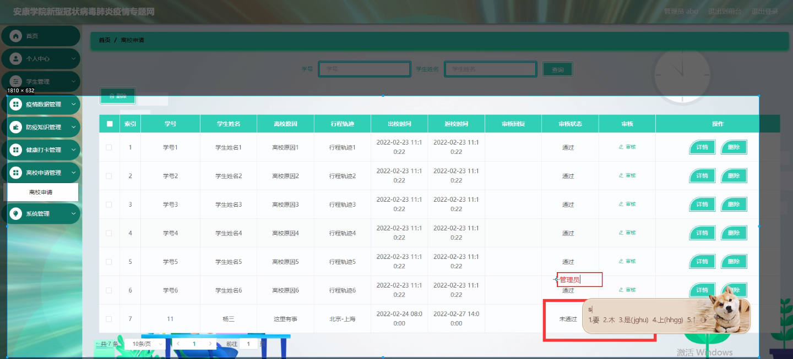

****本项目包含程序+源码+数据库+LW+调试部署环境，文末可获取一份本项目的java源码和数据库参考。****

## ******开题报告******

研究背景：
新型冠状病毒肺炎（COVID-19）是当前全球范围内面临的一项重大公共卫生挑战。自疫情爆发以来，各国纷纷采取了一系列措施来应对疫情，包括限制人员流动、加强防控措施等。在高校教育领域，为了保障学生和教职工的健康安全，许多学校都开展了相关的疫情防控工作。安康学院作为一所高等学府，也积极响应国家政策，致力于建立一套完善的新型冠状病毒肺炎疫情防控系统。

研究意义：
建立一个专门针对新型冠状病毒肺炎疫情的学院系统，具有重要的现实意义。首先，该系统可以帮助学校及时掌握疫情动态，提供科学依据，为学校决策提供参考。其次，通过该系统，学生、教职工和辅导员等相关人员可以方便地获取疫情数据和防疫知识，增强自我防护意识，减少感染风险。此外，该系统还可以提供学生健康打卡、离校申请、返校申请等功能，为学校管理和疫情防控工作提供支持。

研究目的：
本研究旨在构建一个全面、高效、可靠的新型冠状病毒肺炎疫情防控系统，以满足安康学院在疫情期间的管理和防控需求。具体目标包括：（1）实时监测和报告疫情数据，为学校决策提供科学依据；（2）提供丰富的防疫知识和宣传材料，加强师生员工的防护意识；（3）建立学生健康打卡、离校申请、返校申请等功能，方便学校管理和疫情防控工作。

研究内容： 根据系统功能，本研究将包括以下内容：

  1. 学生系统功能：设计并开发学生端应用程序，包括学生健康打卡、离校申请、返校申请等功能。

  2. 疫情数据功能：建立疫情数据收集和分析系统，实时监测和报告疫情数据。

  3. 防疫知识功能：整理并提供丰富的防疫知识和宣传材料，包括预防措施、症状识别等内容。

  4. 辅导员系统功能：设计并开发辅导员端应用程序，包括辅导员健康打卡、学生返校申请审核等功能。

  5. 教师系统功能：设计并开发教师端应用程序，包括教师健康打卡等功能。

拟解决的主要问题：
本研究旨在解决以下主要问题：（1）如何及时准确地收集和报告疫情数据；（2）如何提供全面、科学的防疫知识和宣传材料；（3）如何方便学生和教职工进行健康打卡和申请离返校等操作；（4）如何保证系统的安全性和可靠性。

研究方案和预期成果：
本研究将采用软件开发和数据分析等方法，设计并开发新型冠状病毒肺炎疫情防控系统。预期成果包括：（1）一个全面、高效、可靠的系统，能够满足学校在疫情期间的管理和防控需求；（2）丰富的防疫知识和宣传材料，提高师生员工的防护意识；（3）方便学生和教职工进行健康打卡和申请离返校等操作的应用程序；（4）系统安全性和可靠性得到保障。

进度安排：

2022年9月至10月：需求分析和规划，明确系统功能和目标，制定项目计划。

2022年11月至2023年1月：系统设计和编码，完成详细的系统设计并开始编写代码。

2023年2月至3月：用户界面开发和数据库开发，开发用户友好的界面和设计数据库结构。

2023年4月至5月：功能测试、文档编写和上线部署，对系统进行全面的功能测试并编写用户手册。

2023年5月：维护和升级，定期对系统进行维护和升级，修复bug和添加新功能。

参考文献：

[1]邱小群,邓丽艳,陈海潮.基于B/S的信息管理系统设计和实现[J].信息与电脑(理论版),2022,(20):146-148.

[2]谢霜.基于Java技术的网络管理体系结构的应用[J].网络安全技术与应用,2022,(10):14-15.

[3]宋锦华.高职院校Java程序设计课程改革研究[J].科技视界,2022,(20):133-135.

[4]曹嵩彭,王鹏宇.浅析Java语言在软件开发中的应用[J].信息记录材料,2022,(03):114-116.

[5]朱澈,余俊达.武汉东湖学院.基于Java的软硬件信息管理系统V1.0[Z].项目立项编号.鉴定单位.鉴定日期:

****以上是本项目程序开发之前开题报告内容，最终成品以下面界面为准，大家可以酌情参考使用。要源码参考请在文末进行获取！！****

## ******本项目的界面展示******

