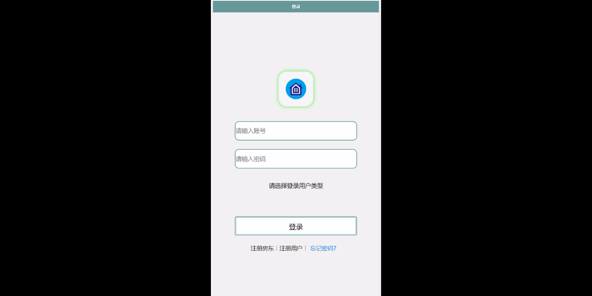
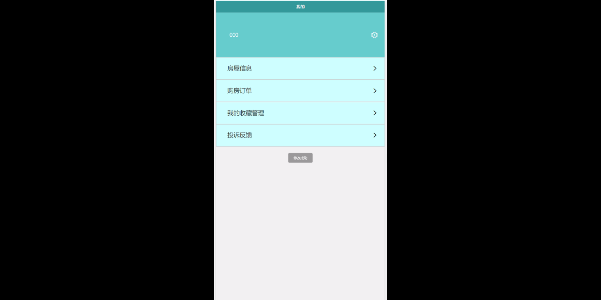
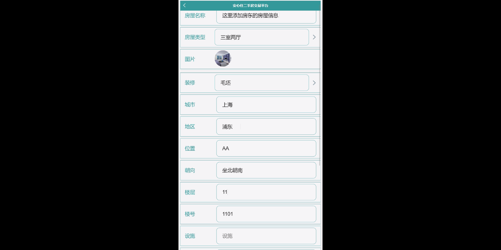
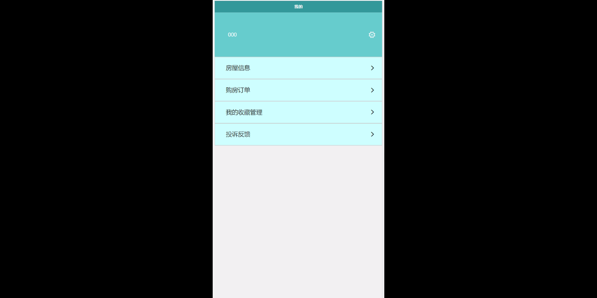
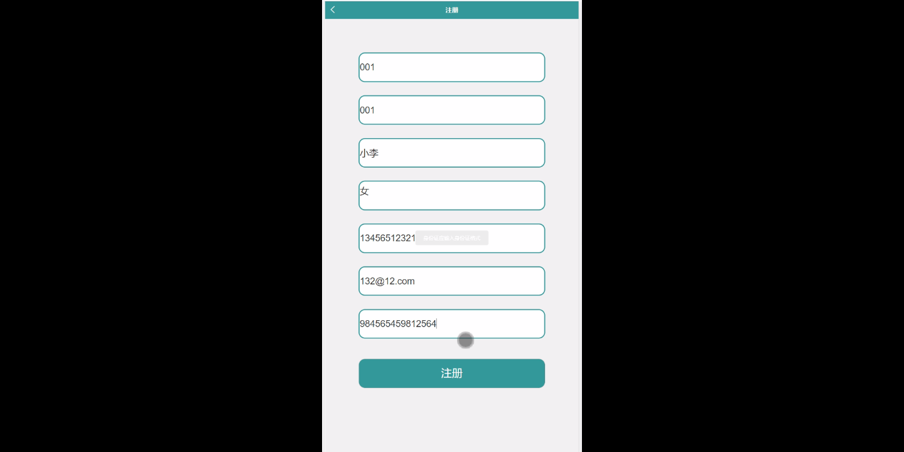
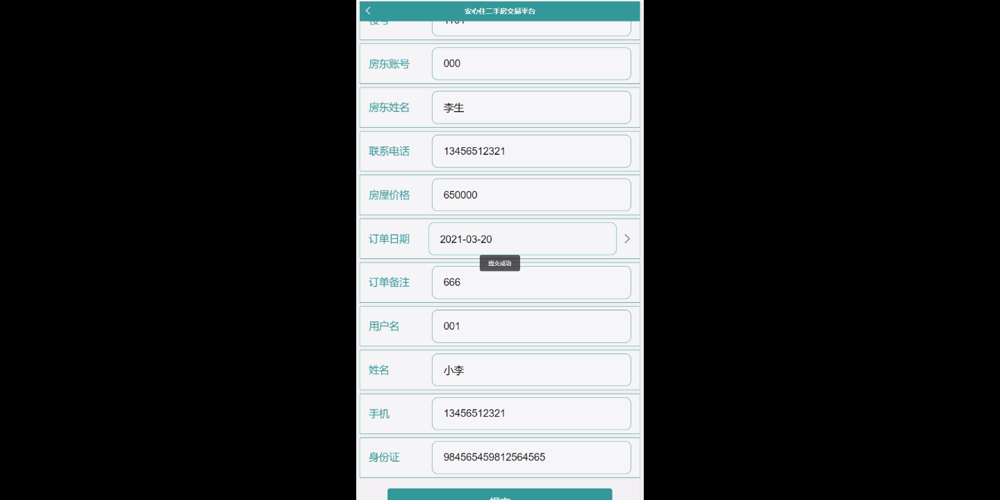
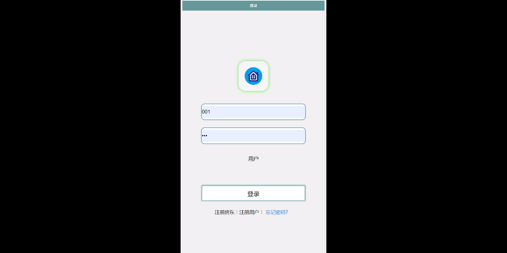
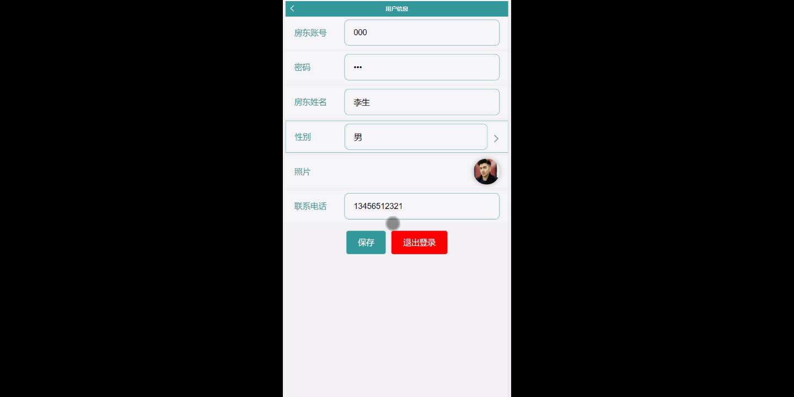

****本项目包含程序+源码+数据库+LW+调试部署环境，文末可获取一份本项目的java源码和数据库参考。****

## ******开题报告******

研究背景：
随着经济的发展和人民生活水平的提高，二手房交易市场逐渐兴起。然而，当前存在的问题是，由于信息不对称、交易流程繁琐等原因，买卖双方在二手房交易过程中面临许多困扰和风险。为了解决这些问题，安心住二手房交易平台应运而生。

研究意义：
安心住二手房交易平台作为一个专业的交易平台，旨在提供便捷、安全、可靠的二手房交易服务。通过引入房东、用户、房屋类型、房屋信息、购房订单等系统功能，该平台可以有效地促进二手房交易的顺利进行，保护买卖双方的权益，提高交易效率。

研究目的：
本研究的目的是通过对安心住二手房交易平台的深入研究，探索其在解决二手房交易问题上的作用和价值。具体来说，我们将重点关注平台的功能设计、交易流程优化、信息披露机制等方面，以期提出一套完善的解决方案，为二手房交易市场的发展和规范化提供有力支持。

研究内容： 本研究将围绕安心住二手房交易平台的系统功能展开，主要包括以下几个方面：

  1. 房东功能：研究如何为房东提供便捷的房屋发布、信息管理和交易管理功能，以及如何确保房东的合法权益得到保护。

  2. 用户功能：研究如何为用户提供个性化的搜索、筛选和比较功能，以及如何提高用户体验和满意度。

  3. 房屋类型功能：研究如何建立全面的房屋分类体系，使用户能够快速找到符合自己需求的房源。

  4. 房屋信息功能：研究如何确保房屋信息的真实性和准确性，并提供详尽的房屋描述、图片和视频等信息，以帮助用户做出明智的购房决策。

  5. 购房订单功能：研究如何简化购房流程，提供安全的在线支付和交易保障机制，以保证买卖双方的利益。

拟解决的主要问题： 在研究过程中，我们将重点解决以下问题：

  1. 如何提高二手房交易的透明度和公正性，减少信息不对称带来的风险？

  2. 如何保护买卖双方的合法权益，防止欺诈行为的发生？

  3. 如何提高用户对平台的信任度，增加用户的使用和推荐？

  4. 如何优化交易流程，简化操作步骤，提高交易效率？

  5. 如何建立完善的客户服务体系，及时解决用户的问题和投诉？

研究方案和预期成果：
本研究将采用综合性的研究方法，包括文献调研、案例分析、实地调查等，以深入了解安心住二手房交易平台的运作机制和存在的问题。通过对现有平台的功能设计进行改进和优化，我们期望能够提出一套切实可行的解决方案，并验证其在实际应用中的效果。

预期成果包括但不限于：优化的系统功能设计方案、改进的交易流程模型、完善的信息披露机制等。这些成果将为二手房交易市场的规范化发展提供参考和借鉴，同时也为相关研究提供理论和实践基础。

进度安排：

2022年9月至10月：开题报告编写和提交，完成开题报告的撰写并提交给指导教师进行审核。

2022年11月至2023年1月：系统设计和开发，根据开题报告的要求，进行系统设计和编码工作。

2023年2月至3月：论文撰写和初稿完成，开始撰写论文，并在这个阶段完成论文的初稿。

2023年4月至5月：论文修改和最终定稿，根据指导教师的意见对论文进行修改，并完成最终的定稿。

2023年5月：论文答辩和提交，参加论文答辩并根据答辩结果进行修改，最后将论文提交给学院或学校。

参考文献：

[1]喻佳,吴丹新.基于SpringBoot的Web快速开发框架[J].电脑编程技巧与维护,2021,(09):31-33.

[2]李鹏.基于SpringBoot快速开发平台的实现[J].电子技术与软件工程,2021,(12):36-37.

[3]叶开平,蔡维晟,陈家敏,邓斯妮.基于SpringBoot的综测可视化管理系统的研究与设计[J].电脑知识与技术,2021,(12):100-104.

[4]江健锋,徐振平.Springboot最小系统的设计与实现[J].电脑知识与技术,2021,(04):62-63.

[5]赵炯,司圣杰,周奇才,熊肖磊.通用信息获取系统设计与实现[J].起重运输机械,2020,(16):89-97.

[6]吴英宾.一种内外网数据交互系统的设计与实现[J].软件工程,2020,(08):25-27.

****以上是本项目程序开发之前开题报告内容，最终成品以下面界面为准，大家可以酌情参考使用。要源码参考请在文末进行获取！！****

## ******本项目的界面展示******

