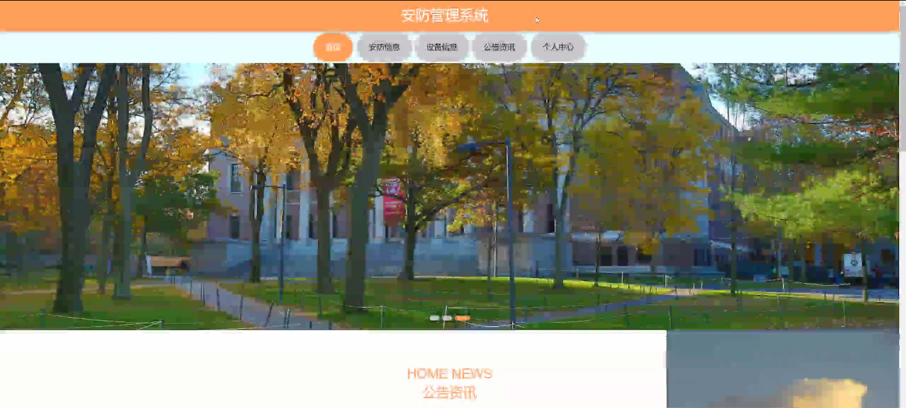
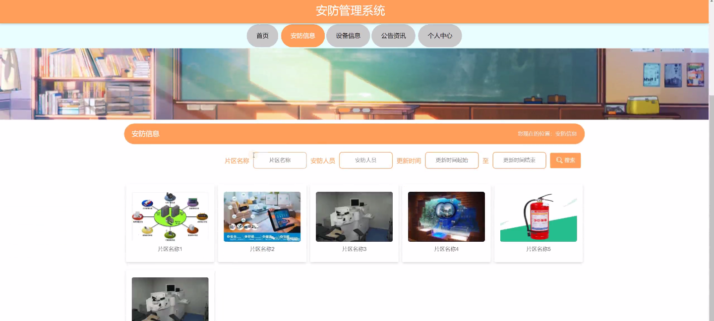
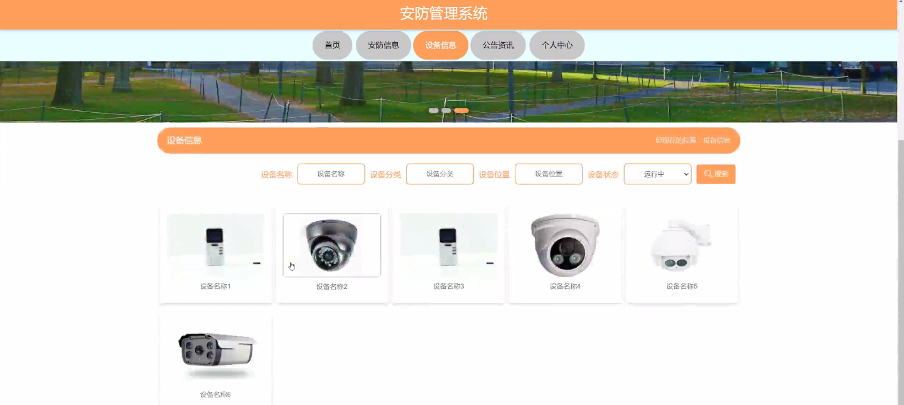
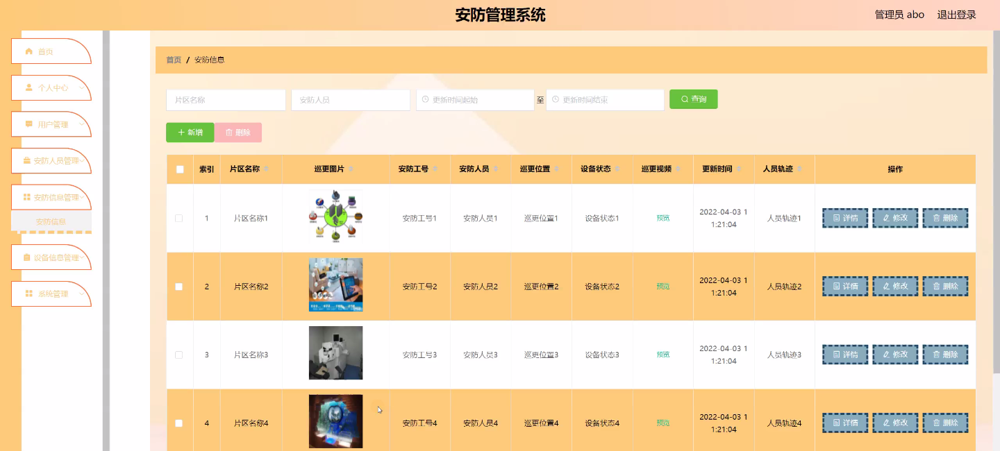
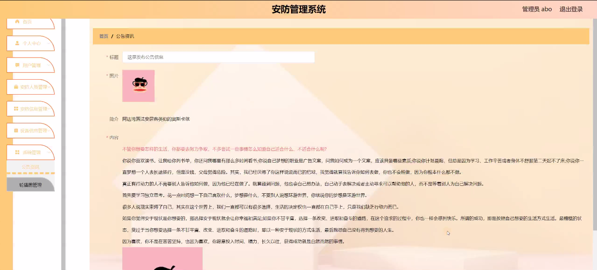

****本项目包含程序+源码+数据库+LW+调试部署环境，文末可获取一份本项目的java源码和数据库参考。****

## ******开题报告******

研究背景：
随着社会的不断发展和进步，安全问题日益受到人们的关注。尤其是在公共场所、企事业单位以及居民小区等地方，安全管理成为了一项重要的任务。然而，传统的安防管理方式往往存在着信息不畅通、反应迟缓、效率低下等问题，无法满足现代社会对安全管理的需求。因此，开发一种高效、智能的安防管理系统势在必行。

研究意义：
安防管理系统的研究与开发具有重要的实际意义。首先，它可以提高安全管理的效率和准确性，快速响应各类安全事件，有效预防和控制潜在的安全风险。其次，安防管理系统的使用可以减轻安防人员的工作负担，提高工作效率，使其能够更好地履行安全管理职责。同时，该系统还可以为用户提供便捷的安全服务，增强公众的安全感，促进社会的稳定和谐。

研究目的：
本研究旨在设计和开发一种基于安防管理系统的智能化解决方案，通过充分利用现代信息技术和通信技术，提升安全管理的水平和效果。具体目标包括但不限于：实现安防信息的快速传递与共享、提供准确的安全预警与应急响应、优化安防设备的配置与使用、提高用户的安全体验等。

研究内容： 本研究将围绕安防管理系统的功能展开，主要包括以下几个方面：

  1. 用户管理：设计并实现用户身份认证、权限管理、用户行为监控等功能，确保系统的安全性和可靠性。

  2. 安防人员管理：建立安防人员信息库，包括人员档案、培训记录、工作考核等，提供全面的人员管理支持。

  3. 安防信息管理：构建安防信息采集、处理和存储系统，实现对各类安全事件的实时监测、分析和报警。

  4. 设备信息管理：建立设备信息数据库，包括设备档案、维修记录、运行状态等，实现对安防设备的全生命周期管理。

拟解决的主要问题：
在当前的安防管理中，存在着信息孤岛、反应滞后、数据分散等问题。本研究旨在通过开发智能化的安防管理系统，解决以上问题。具体包括但不限于：实现信息共享与协同、提高安全事件响应速度、优化设备配置和使用效率等。

研究方案：
本研究将采用综合性的研究方法，包括文献调研、需求分析、系统设计、软硬件开发、系统集成与测试等环节。同时，还将结合实际场景进行案例分析和验证，确保研究成果的可行性和有效性。

预期成果：
通过本研究，预期可以设计和开发出一种功能完善、性能稳定的安防管理系统，为各类场所和单位提供高效、智能的安全管理解决方案。该系统将能够提高安全管理的水平和效果，保障公众的人身和财产安全，促进社会的和谐稳定。

进度安排：

2022年9月至10月：需求分析和规划，进行用户需求调研和分析，确定系统功能和目标。

2022年11月至2023年1月：系统设计和开发，完成系统架构设计和技术选型，并开始编写代码。

2023年2月至3月：测试和优化，进行单元测试和集成测试，修复问题并优化系统性能。

2023年4月至5月：文档编写和培训，编写用户手册和系统文档，并进行相关人员的培训。

2023年5月：上线部署和维护，将系统部署到生产环境中，并定期进行维护和升级。

参考文献：

[1]王振华.SpringBoot在教学效果评估系统中的应用[J].电子技术,2023,(05):67-69.

[2]王明泉.基于SpringBoot远程热部署的探索和应用[J].信息与电脑(理论版),2023,(07):1-4.

[3]王亚东,李晓霞,陈强强,剡美娜.基于SpringBoot的需求发布平台设计[J].信息与电脑(理论版),2023,(01):105-107.

[4]陈新府豪.基于SpringBoot和Vue框架的创新方法推理系统的设计与实现[D].导师：黄静.浙江理工大学,2022.

[5]霍福华,韩慧.基于SpringBoot微服务架构下前后端分离的MVVM模型[J].电子技术与软件工程,2022,(01):73-76.

[6]韩策,张娜,王松亭,张凯,何方,袁峰.SpringBoot OPC客户端设计与研究[J].电子世界,2021,(19):25-26.

****以上是本项目程序开发之前开题报告内容，最终成品以下面界面为准，大家可以酌情参考使用。要源码参考请在文末进行获取！！****

## ******本项目的界面展示******

