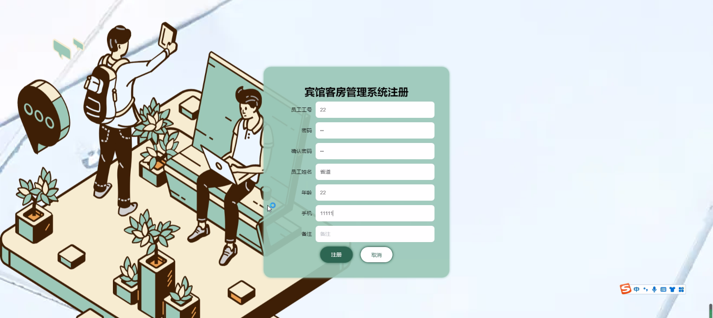
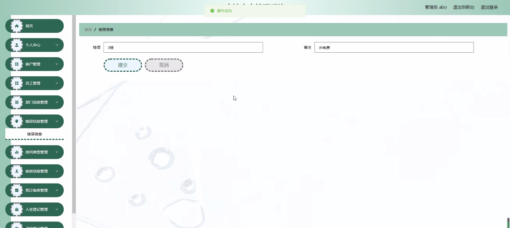
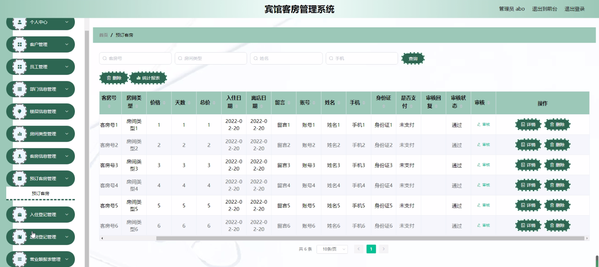
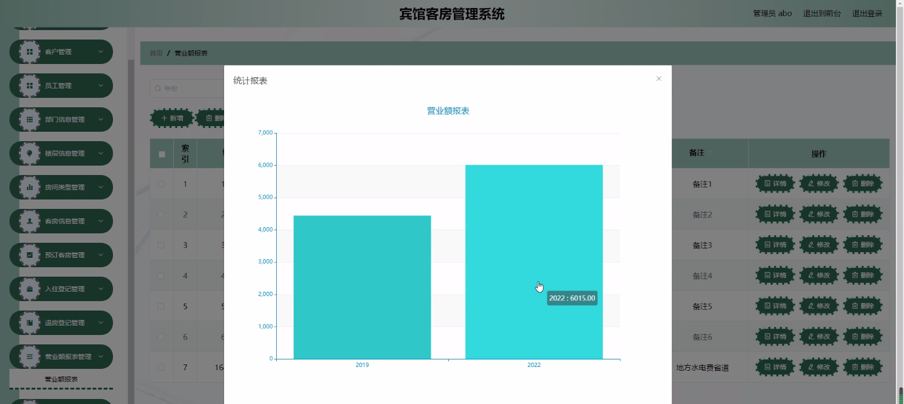
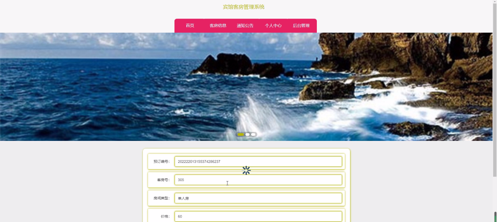
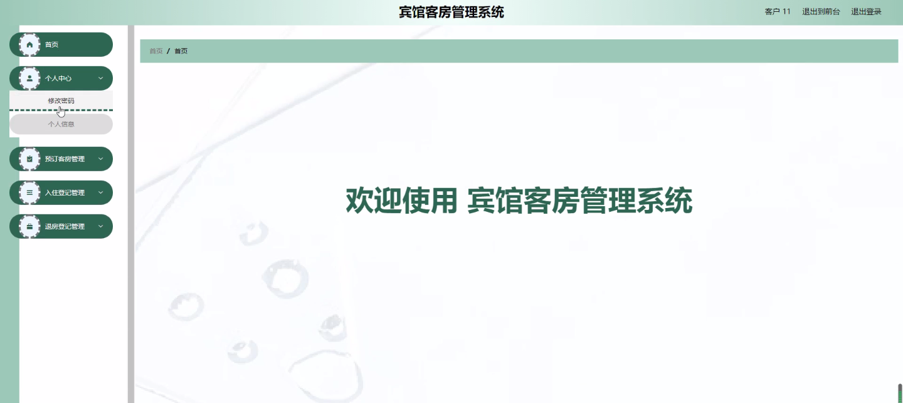
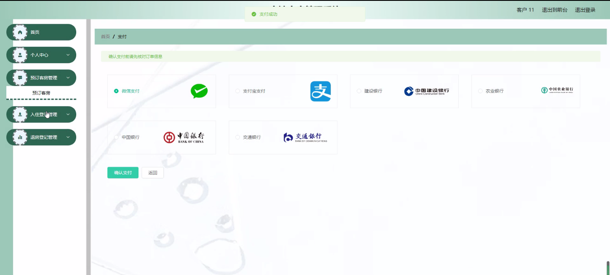

****本项目包含程序+源码+数据库+LW+调试部署环境，文末可获取一份本项目的java源码和数据库参考。****

## ******开题报告******

研究背景：
随着旅游业的快速发展和人们对生活品质要求的提高，宾馆行业迎来了蓬勃的发展机遇。然而，传统的手工管理方式已经无法满足日益增长的需求，客房管理系统应运而生。宾馆客房管理系统是一种基于计算机技术的信息管理系统，旨在提高宾馆的管理效率和服务质量，实现客房信息的准确记录、预订管理、入住登记、退房结算等功能。

研究意义：
宾馆客房管理系统的引入将带来诸多益处。首先，通过系统化的管理，可以大大提高宾馆的工作效率和管理水平，减少人为错误和重复劳动。其次，系统能够提供全面准确的客房信息，使得宾馆员工可以更好地为客人提供个性化的服务，提升客户满意度。此外，系统还能够生成各类报表和数据分析，为宾馆的决策提供科学依据，提升宾馆的竞争力。

研究目的：
本研究旨在设计和开发一套完善的宾馆客房管理系统，以满足宾馆行业日益增长的管理需求。通过该系统，宾馆能够实现客房信息的准确记录和查询、客房预订管理、入住登记和退房结算等功能，提高工作效率和服务质量，为宾馆的可持续发展提供支持。

研究内容： 本研究将重点关注以下系统功能：

  1. 客户管理：包括客户信息的录入、查询和管理，方便宾馆员工进行客户服务和沟通。
  2. 客房信息管理：记录客房的基本信息、价格、状态等，方便客房的预订和分配。
  3. 预订客房：提供在线预订功能，使客人可以方便地选择和预订客房。
  4. 楼层信息管理：记录楼层的基本信息和客房分布情况，方便员工引导客人到达目的地。
  5. 房间类型管理：定义不同类型的客房，方便客人根据需求选择合适的房间。
  6. 入住登记：记录客人入住信息，生成入住凭证和房卡，确保入住过程顺利进行。
  7. 退房登记：记录客人退房信息，结算费用并生成账单，确保退房过程准确无误。
  8. 部门信息管理：记录宾馆各个部门的基本信息和人员分配情况，方便协调和管理。
  9. 员工管理：包括员工信息的录入、查询和管理，方便宾馆管理人员进行人力资源管理。
  10. 营业额报表：根据系统数据生成各类报表和数据分析，为宾馆的经营决策提供参考。

拟解决的主要问题：
在宾馆客房管理过程中，存在着信息不准确、预订混乱、入住退房流程繁琐等问题。本研究旨在通过设计和开发一套完善的宾馆客房管理系统，解决以上问题，提高宾馆的管理效率和服务质量。

研究方案和预期成果：
本研究将采用软件开发的方法，结合宾馆行业的实际需求，设计和开发一套功能完备、易于使用的宾馆客房管理系统。预期成果包括系统的设计文档、系统源代码和可运行的软件程序。通过该系统的应用，预期能够提高宾馆的管理效率和服务质量，满足客户的需求，促进宾馆行业的可持续发展。

进度安排：

2022年9月至10月：需求分析和规划，进行用户需求调研和分析，确定系统功能和目标。

2022年11月至2023年1月：系统设计和开发，完成系统架构设计和技术选型，并开始编写代码。

2023年2月至3月：测试和优化，进行单元测试和集成测试，修复问题并优化系统性能。

2023年4月至5月：文档编写和培训，编写用户手册和系统文档，并进行相关人员的培训。

2023年5月：上线部署和维护，将系统部署到生产环境中，并定期进行维护和升级。

参考文献：

[1]王振华.SpringBoot在教学效果评估系统中的应用[J].电子技术,2023,(05):67-69.

[2]王明泉.基于SpringBoot远程热部署的探索和应用[J].信息与电脑(理论版),2023,(07):1-4.

[3]王亚东,李晓霞,陈强强,剡美娜.基于SpringBoot的需求发布平台设计[J].信息与电脑(理论版),2023,(01):105-107.

[4]陈新府豪.基于SpringBoot和Vue框架的创新方法推理系统的设计与实现[D].导师：黄静.浙江理工大学,2022.

[5]霍福华,韩慧.基于SpringBoot微服务架构下前后端分离的MVVM模型[J].电子技术与软件工程,2022,(01):73-76.

[6]韩策,张娜,王松亭,张凯,何方,袁峰.SpringBoot OPC客户端设计与研究[J].电子世界,2021,(19):25-26.

****以上是本项目程序开发之前开题报告内容，最终成品以下面界面为准，大家可以酌情参考使用。要源码参考请在文末进行获取！！****

## ******本项目的界面展示******

