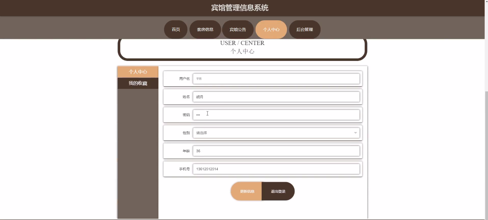
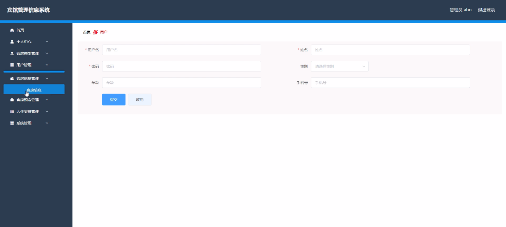
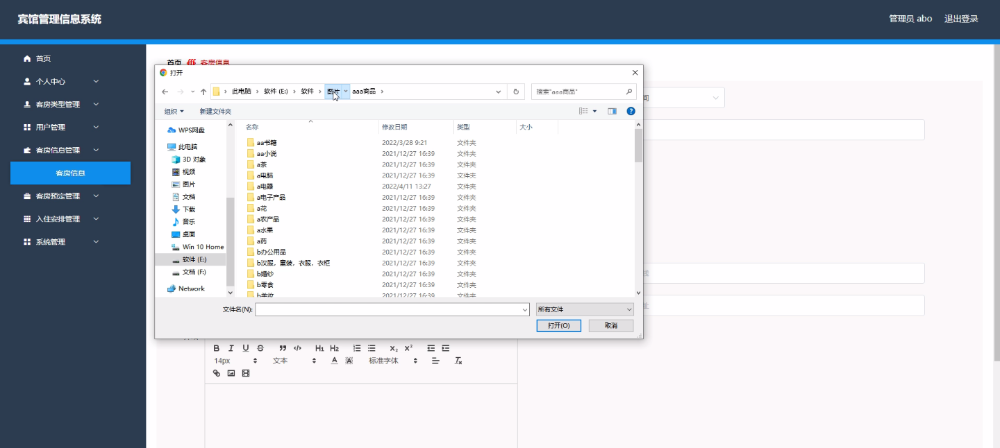
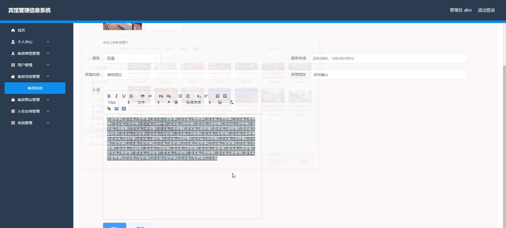
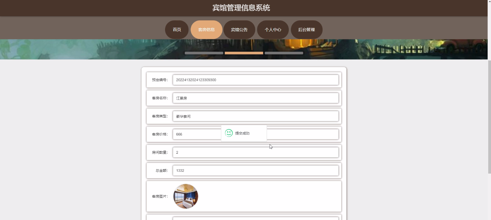
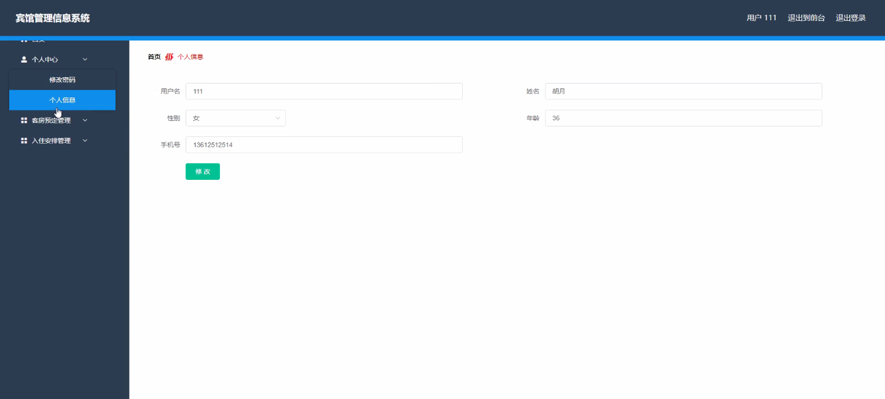
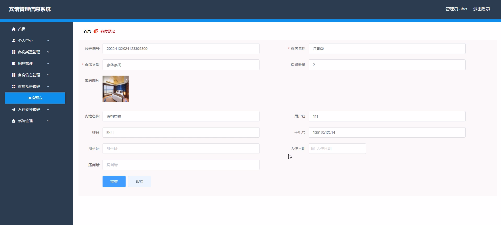

****本项目包含程序+源码+数据库+LW+调试部署环境，文末可获取一份本项目的java源码和数据库参考。****

## ******开题报告******

研究背景：
随着旅游业的蓬勃发展和人们对住宿需求的增加，宾馆管理成为一个重要的课题。传统的手工管理方式已经无法满足日益增长的需求，因此需要开发一种高效、智能化的宾馆管理信息系统来提升管理效率和服务质量。

研究意义：
宾馆管理信息系统的开发和应用具有重要的现实意义。首先，它可以帮助宾馆实现信息化管理，提高工作效率，减少人力资源的浪费。其次，它可以提供更好的客户服务体验，包括方便快捷的预定流程、个性化的入住安排等，从而增强客户的满意度和忠诚度。最后，它还可以为宾馆的战略决策提供科学依据，通过数据分析和预测，帮助宾馆制定合理的经营策略。

研究目的：
本研究旨在开发一套功能完善、操作简便的宾馆管理信息系统，以满足宾馆管理的各项需求。通过该系统，宾馆管理者可以实时监控客房情况、预定信息等，从而做出准确的决策和安排。同时，该系统还可以提供给客户方便快捷的预定渠道和个性化的入住服务，提升客户满意度。

研究内容：
本研究的主要内容包括以下系统功能：客房类型管理、用户管理、客房信息管理、客房预定管理、入住安排管理等。其中，客房类型管理功能用于管理不同类型的客房，包括房间大小、设施配置等信息；用户管理功能用于管理客户信息，包括个人资料、历史预定记录等；客房信息管理功能用于管理客房的基本信息，包括房间号、价格、可用状态等；客房预定管理功能用于处理客户的预定请求，包括预定时间、房型选择等；入住安排管理功能用于安排客户的入住事宜，包括分配房间、办理入住手续等。

拟解决的主要问题：
在开发宾馆管理信息系统的过程中，我们将重点解决以下问题：如何实现系统的高效性和稳定性，保证系统的正常运行；如何设计合理的界面和操作流程，提升用户体验；如何保障数据的安全性和隐私保护；如何进行系统的优化和升级，以适应不断变化的需求。

研究方案和预期成果：
本研究将采用面向对象的软件开发方法，结合数据库技术和网络技术，设计和实现宾馆管理信息系统。预计通过该系统的应用，可以提高宾馆的管理效率和服务质量，提升客户满意度，为宾馆的可持续发展提供有力支撑。同时，我们还将根据用户反馈和市场需求，不断改进和完善系统功能，以适应日益变化的宾馆管理需求。

进度安排：

2022年9月至10月：需求分析和规划，明确系统功能和目标，制定项目计划。

2022年11月至2023年1月：系统设计和编码，完成详细的系统设计并开始编写代码。

2023年2月至3月：用户界面开发和数据库开发，开发用户友好的界面和设计数据库结构。

2023年4月至5月：功能测试、文档编写和上线部署，对系统进行全面的功能测试并编写用户手册。

2023年5月：维护和升级，定期对系统进行维护和升级，修复bug和添加新功能。

参考文献：

[1]邱小群,邓丽艳,陈海潮.基于B/S的信息管理系统设计和实现[J].信息与电脑(理论版),2022,(20):146-148.

[2]谢霜.基于Java技术的网络管理体系结构的应用[J].网络安全技术与应用,2022,(10):14-15.

[3]宋锦华.高职院校Java程序设计课程改革研究[J].科技视界,2022,(20):133-135.

[4]曹嵩彭,王鹏宇.浅析Java语言在软件开发中的应用[J].信息记录材料,2022,(03):114-116.

[5]朱澈,余俊达.武汉东湖学院.基于Java的软硬件信息管理系统V1.0[Z].项目立项编号.鉴定单位.鉴定日期:

****以上是本项目程序开发之前开题报告内容，最终成品以下面界面为准，大家可以酌情参考使用。要源码参考请在文末进行获取！！****

## ******本项目的界面展示******

