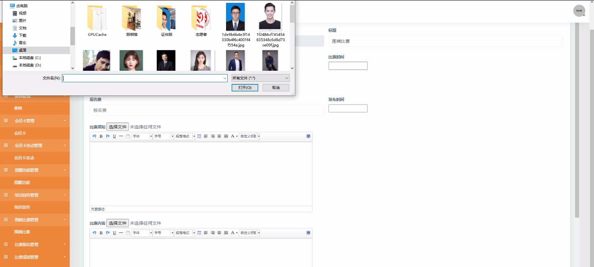

****本项目包含程序+源码+数据库+LW+调试部署环境，文末可获取一份本项目的java源码和数据库参考。****

## ******开题报告******

研究背景：
随着围棋在中国的普及和发展，越来越多的人加入到围棋学习和比赛中。然而，传统的围棋协会管理方式已经无法满足日益增长的需求。传统的纸质档案和手工记录方式效率低下，容易出现错误和遗漏。因此，建立一个高效、准确、便捷的信息管理系统对于巴州围棋协会来说具有重要意义。

研究意义：
巴州围棋协会信息管理系统的建立将极大地提高协会的管理水平和服务质量。通过引入先进的计算机技术和数据库管理系统，可以实现学员、教师、财务等各个环节的信息化管理，从而提高工作效率、降低管理成本，并且为广大围棋爱好者提供更好的服务体验。

研究目的：
本研究旨在设计和开发一套完善的巴州围棋协会信息管理系统，以满足协会日常运营和管理的需求。具体目标包括但不限于：提高信息处理效率，减少人力资源投入；实现数据的准确性和可靠性，避免信息错误和丢失；提供全面的功能支持，满足不同用户的需求；优化协会内部流程，提高工作效率。

研究内容： 本研究将围绕巴州围棋协会的信息管理需求展开，主要包括以下系统功能：

  1. 学员管理：包括学员档案管理、学员报名、学员课程信息等。
  2. 会员卡管理：包括会员卡发放、会员卡变更、会员卡使用记录等。
  3. 提醒功能：包括学员上课提醒、比赛通知提醒等。
  4. 教师管理：包括教师档案管理、教师排班、教师考勤等。
  5. 围棋培训：包括围棋课程设置、教材管理、教学计划安排等。
  6. 围棋比赛：包括赛事策划、报名缴费、成绩统计等。
  7. 财务管理：包括财务收支记录、费用结算、财务报表生成等。
  8. 班级层次：包括班级设置、学员分班、班级调整等。
  9. 学生打卡：记录学员上课打卡情况，方便考勤管理。
  10. 咨询信息：提供学员咨询服务，解答疑问、反馈意见等。

拟解决的主要问题： 通过建立巴州围棋协会信息管理系统，我们将解决以下主要问题：

  1. 信息处理效率低下：传统的纸质档案和手工记录方式容易出现错误和遗漏，导致信息处理效率低下。信息管理系统将实现自动化处理，提高工作效率。
  2. 数据准确性和可靠性：传统的人工记录容易出现数据错误和丢失的情况，而信息管理系统可以保证数据的准确性和可靠性。
  3. 用户需求满足度低：传统的管理方式无法满足不同用户的需求，而信息管理系统将提供全面的功能支持，满足不同用户的需求。
  4. 工作流程不优化：传统的管理方式存在流程繁琐、效率低下的问题，而信息管理系统将优化协会内部流程，提高工作效率。

研究方案和预期成果：
本研究将采用软件开发的方法，结合数据库技术和计算机网络技术，设计和开发巴州围棋协会信息管理系统。预期成果包括一个功能完善、操作简便、稳定可靠的信息管理系统，能够满足协会日常运营和管理的需求，并提高工作效率、降低管理成本。同时，预计该系统的推广应用将为其他围棋协会提供借鉴和参考，促进围棋事业的发展。

进度安排：

2022年9月至10月：开题报告编写和提交，完成开题报告的撰写并提交给指导教师进行审核。

2022年11月至2023年1月：系统设计和开发，根据开题报告的要求，进行系统设计和编码工作。

2023年2月至3月：论文撰写和初稿完成，开始撰写论文，并在这个阶段完成论文的初稿。

2023年4月至5月：论文修改和最终定稿，根据指导教师的意见对论文进行修改，并完成最终的定稿。

2023年5月：论文答辩和提交，参加论文答辩并根据答辩结果进行修改，最后将论文提交给学院或学校。

参考文献：

[1]喻佳,吴丹新.基于SpringBoot的Web快速开发框架[J].电脑编程技巧与维护,2021,(09):31-33.

[2]李鹏.基于SpringBoot快速开发平台的实现[J].电子技术与软件工程,2021,(12):36-37.

[3]叶开平,蔡维晟,陈家敏,邓斯妮.基于SpringBoot的综测可视化管理系统的研究与设计[J].电脑知识与技术,2021,(12):100-104.

[4]江健锋,徐振平.Springboot最小系统的设计与实现[J].电脑知识与技术,2021,(04):62-63.

[5]赵炯,司圣杰,周奇才,熊肖磊.通用信息获取系统设计与实现[J].起重运输机械,2020,(16):89-97.

[6]吴英宾.一种内外网数据交互系统的设计与实现[J].软件工程,2020,(08):25-27.

****以上是本项目程序开发之前开题报告内容，最终成品以下面界面为准，大家可以酌情参考使用。要源码参考请在文末进行获取！！****

## ******本项目的界面展示******

