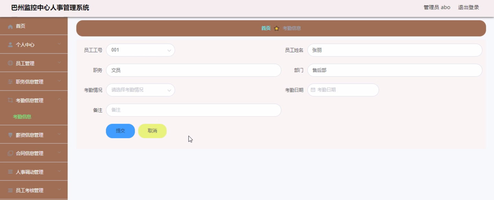
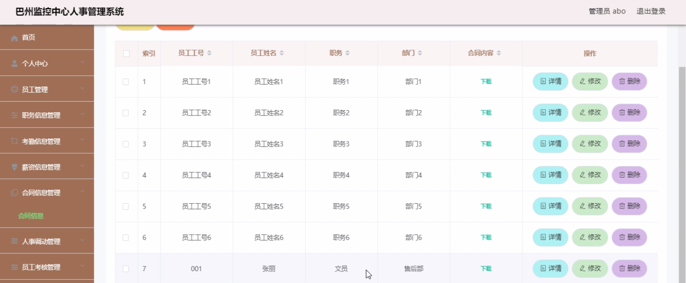
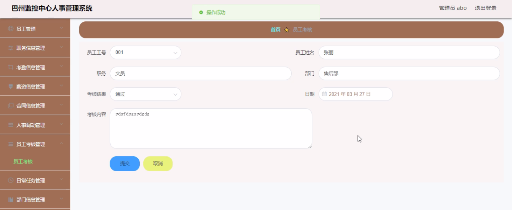
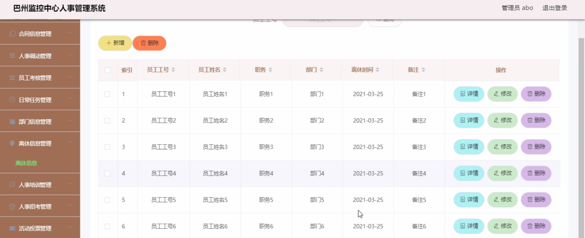
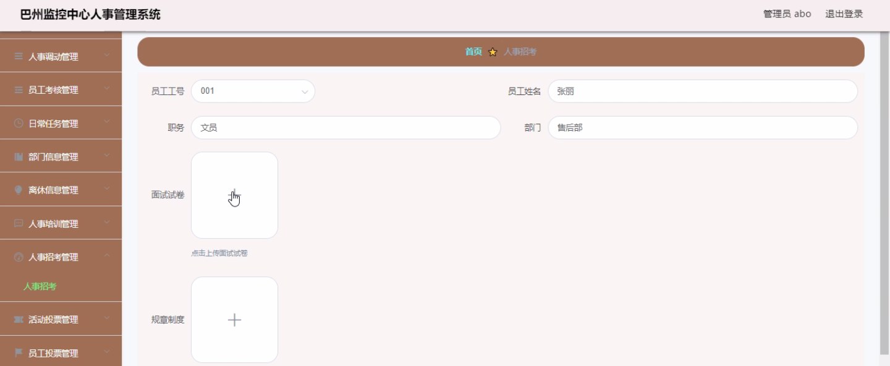
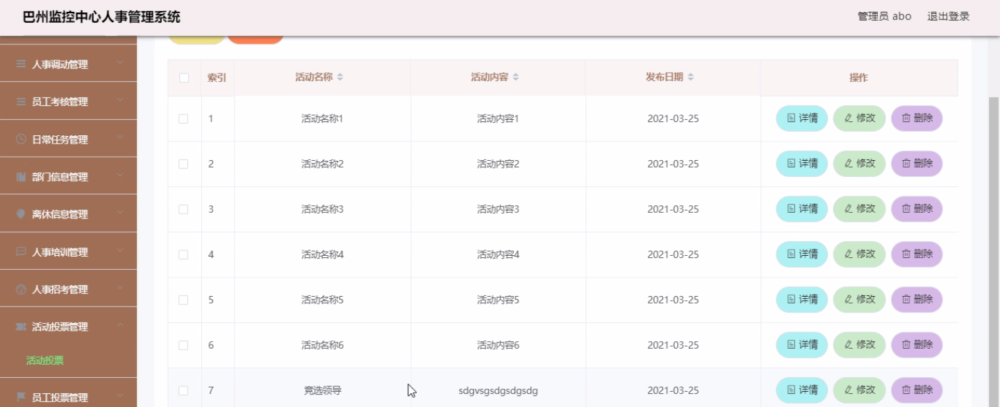

****本项目包含程序+源码+数据库+LW+调试部署环境，文末可获取一份本项目的java源码和数据库参考。****

## ******开题报告******

研究背景：
随着社会的发展和科技的进步，各个行业都在不断追求高效、便捷的管理方式。而人事管理作为一个组织内部重要的管理环节，对于企业的运营和发展起着至关重要的作用。然而，在传统的人事管理中，往往存在着信息不透明、数据处理效率低下、人力资源浪费等问题，这严重制约了企业的发展和提升。

研究意义：
针对上述问题，巴州监控中心人事管理系统的研究具有重要的现实意义。通过引入先进的信息技术和管理理念，该系统可以实现对员工信息、考勤信息、薪资信息、合同信息等多个方面的全面管理和优化，提高人事管理的效率和质量，为企业的决策提供科学依据，推动企业的可持续发展。

研究目的：
本研究旨在深入分析巴州监控中心人事管理系统的功能和特点，以及当前人事管理存在的问题和需求，通过研究系统的设计与开发，解决人事管理中的核心问题，提高管理效率和精确度，实现人力资源的合理配置和优化，从而推动企业的发展。

研究内容：
本研究将围绕巴州监控中心人事管理系统的各个功能模块展开研究，包括员工信息、职务信息、考勤信息、薪资信息、合同信息、人事调动、员工考核、日常任务、部门信息、离休信息、人事培训、人事招考、活动投票、员工投票、公告信息、任务完成、考核完成、员工打卡、试卷上传等方面。具体研究内容包括但不限于以下几个方面：

  1. 设计和优化员工信息管理模块，实现员工档案的全面管理和查询功能；
  2. 研究并完善考勤信息管理模块，提高考勤数据的采集和处理效率；
  3. 构建薪资信息管理模块，实现薪资计算和发放的自动化和规范化；
  4. 开发人事调动模块，实现人员调配和岗位变动的灵活管理；
  5. 设计员工考核模块，建立科学的考核指标体系和评价机制；
  6. 完善日常任务管理模块，提高任务分配和执行的效率；
  7. 构建人事培训模块，为员工提供个性化的培训计划和资源；
  8. 设计人事招考模块，实现招聘流程的规范化和信息化；
  9. 研究活动投票和员工投票模块，提供员工参与决策的渠道；
  10. 完善公告信息管理模块，加强内部沟通和信息传递；
  11. 开发任务完成和考核完成模块，实现对任务执行和绩效评估的监控；
  12. 设计员工打卡模块，提高考勤数据的准确性和可靠性；
  13. 研究试卷上传模块，为培训和考核提供在线测试和评估。

拟解决的主要问题：
本研究旨在解决巴州监控中心人事管理系统中存在的信息不透明、数据处理效率低下、人力资源浪费等问题。通过引入先进的信息技术和管理理念，优化系统功能和流程，提高人事管理的效率和质量，从而推动企业的发展。

研究方案和预期成果：
本研究将采用文献研究、案例分析、需求调研、系统设计和开发等方法，结合巴州监控中心人事管理系统的具体情况，制定相应的研究方案。预期成果包括系统功能的优化和完善、管理流程的优化和规范、人力资源的合理配置和优化等方面的改进，为巴州监控中心提供高效、便捷的人事管理系统，推动企业的可持续发展。

进度安排：

2022年9月至10月：需求分析和规划，进行用户需求调研和分析，确定系统功能和目标。

2022年11月至2023年1月：系统设计和开发，完成系统架构设计和技术选型，并开始编写代码。

2023年2月至3月：测试和优化，进行单元测试和集成测试，修复问题并优化系统性能。

2023年4月至5月：文档编写和培训，编写用户手册和系统文档，并进行相关人员的培训。

2023年5月：上线部署和维护，将系统部署到生产环境中，并定期进行维护和升级。

参考文献：

[1]王振华.SpringBoot在教学效果评估系统中的应用[J].电子技术,2023,(05):67-69.

[2]王明泉.基于SpringBoot远程热部署的探索和应用[J].信息与电脑(理论版),2023,(07):1-4.

[3]王亚东,李晓霞,陈强强,剡美娜.基于SpringBoot的需求发布平台设计[J].信息与电脑(理论版),2023,(01):105-107.

[4]陈新府豪.基于SpringBoot和Vue框架的创新方法推理系统的设计与实现[D].导师：黄静.浙江理工大学,2022.

[5]霍福华,韩慧.基于SpringBoot微服务架构下前后端分离的MVVM模型[J].电子技术与软件工程,2022,(01):73-76.

[6]韩策,张娜,王松亭,张凯,何方,袁峰.SpringBoot OPC客户端设计与研究[J].电子世界,2021,(19):25-26.

****以上是本项目程序开发之前开题报告内容，最终成品以下面界面为准，大家可以酌情参考使用。要源码参考请在文末进行获取！！****

## ******本项目的界面展示******

