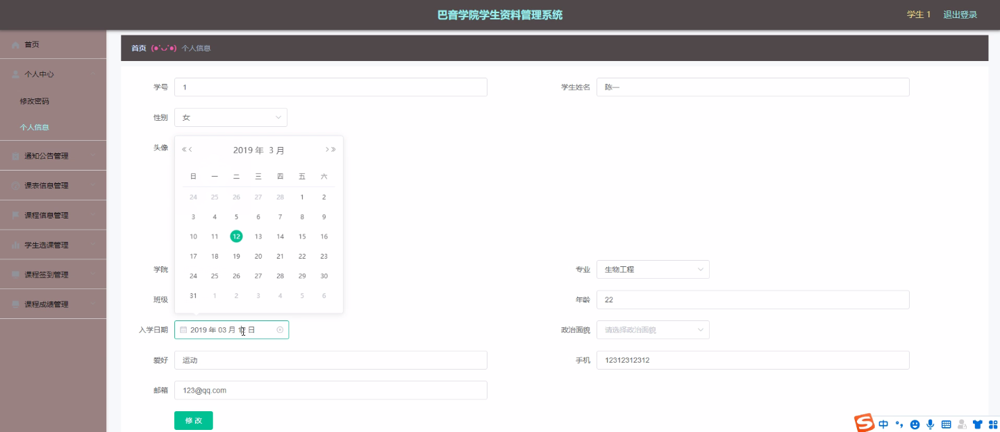

****本项目包含程序+源码+数据库+LW+调试部署环境，文末可获取一份本项目的java源码和数据库参考。****

## ******开题报告******

研究背景：
随着信息技术的快速发展和广泛应用，学生资料管理系统在高校中得到了广泛的应用。巴音学院作为一所现代化的高等教育机构，也面临着学生信息管理的挑战。传统的手工管理方式已经无法满足学院日益增长的学生规模和信息量，因此开发一个高效、可靠的学生资料管理系统具有重要意义。

研究意义：
学生资料管理系统的建立和应用对于巴音学院的管理和教学工作具有重要意义。首先，通过系统化的数据管理和信息共享，可以提高学生信息的准确性和完整性，为学院决策提供科学依据。其次，学生资料管理系统可以提高学院的工作效率，减轻教职员工的工作负担，提升办公自动化水平。最后，该系统还能够为学生提供更好的服务，提高学生满意度和学习体验。

研究目的：
本研究旨在开发一个全面、高效的巴音学院学生资料管理系统，以解决当前学生信息管理存在的问题。通过该系统，实现学生信息的集中管理、快速查询和信息共享，提高学院管理水平和教学质量。

研究内容：
本研究的主要内容包括以下系统功能：通知公告、学院、专业、班级、学生、课程名称、课表信息、课程信息、学生选课、课程签到、课程成绩和学生档案等。通过对这些功能的设计和实现，可以实现学生信息的全面管理和有效利用。

拟解决的主要问题：

  1. 学生信息管理的不准确性和不完整性问题；
  2. 学生信息查询和共享的效率低下问题；
  3. 教职员工工作负担过重的问题；
  4. 学生服务水平不高的问题。

研究方案：
本研究将采用软件开发的方法，结合巴音学院的实际需求，设计并开发一个学生资料管理系统。首先，进行需求调研和分析，明确系统功能和性能要求。然后，进行系统设计和架构搭建，确定数据库结构和界面设计。接下来，进行系统编码和测试，确保系统的稳定性和可靠性。最后，进行系统上线和运行，进行系统的优化和维护。

预期成果：
通过本研究，预期可以开发出一个功能完善、操作简便、安全可靠的巴音学院学生资料管理系统。该系统能够提高学生信息管理的准确性和完整性，提高学院的工作效率和服务水平，为学院决策提供科学依据，推动学院管理和教学工作的现代化发展。

进度安排：

2022年9月至10月：需求分析和规划，进行用户需求调研和分析，确定系统功能和目标。

2022年11月至2023年1月：系统设计和开发，完成系统架构设计和技术选型，并开始编写代码。

2023年2月至3月：测试和优化，进行单元测试和集成测试，修复问题并优化系统性能。

2023年4月至5月：文档编写和培训，编写用户手册和系统文档，并进行相关人员的培训。

2023年5月：上线部署和维护，将系统部署到生产环境中，并定期进行维护和升级。

参考文献：

[1]王振华.SpringBoot在教学效果评估系统中的应用[J].电子技术,2023,(05):67-69.

[2]王明泉.基于SpringBoot远程热部署的探索和应用[J].信息与电脑(理论版),2023,(07):1-4.

[3]王亚东,李晓霞,陈强强,剡美娜.基于SpringBoot的需求发布平台设计[J].信息与电脑(理论版),2023,(01):105-107.

[4]陈新府豪.基于SpringBoot和Vue框架的创新方法推理系统的设计与实现[D].导师：黄静.浙江理工大学,2022.

[5]霍福华,韩慧.基于SpringBoot微服务架构下前后端分离的MVVM模型[J].电子技术与软件工程,2022,(01):73-76.

[6]韩策,张娜,王松亭,张凯,何方,袁峰.SpringBoot OPC客户端设计与研究[J].电子世界,2021,(19):25-26.

****以上是本项目程序开发之前开题报告内容，最终成品以下面界面为准，大家可以酌情参考使用。要源码参考请在文末进行获取！！****

## ******本项目的界面展示******

