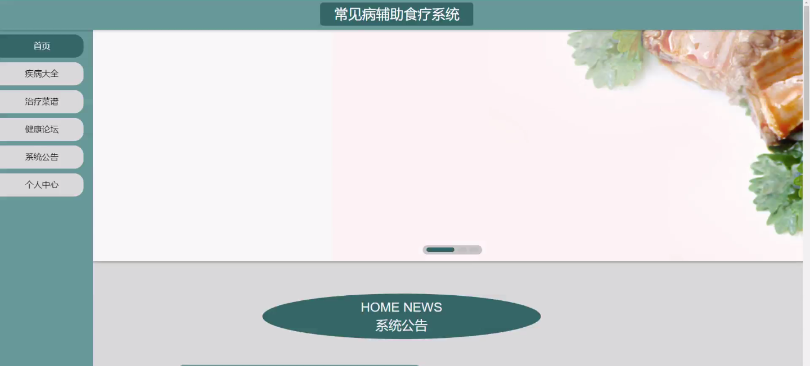
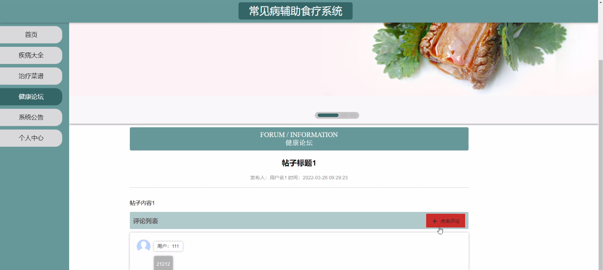
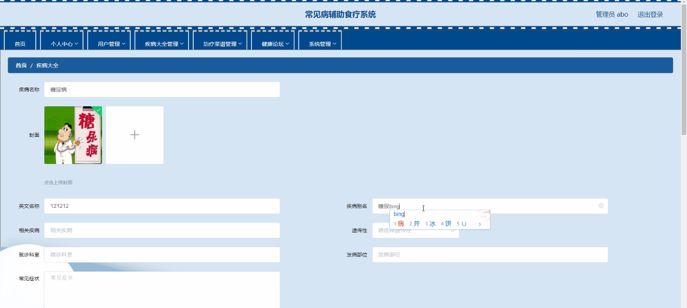
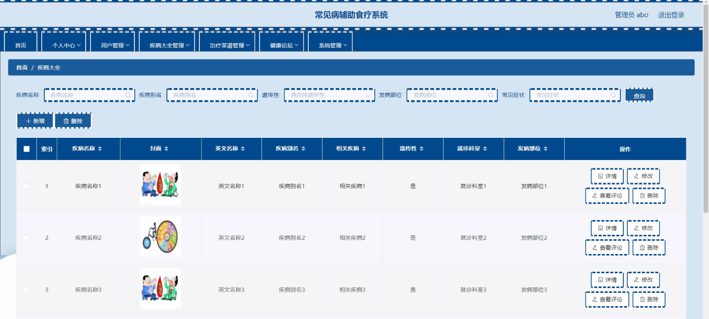
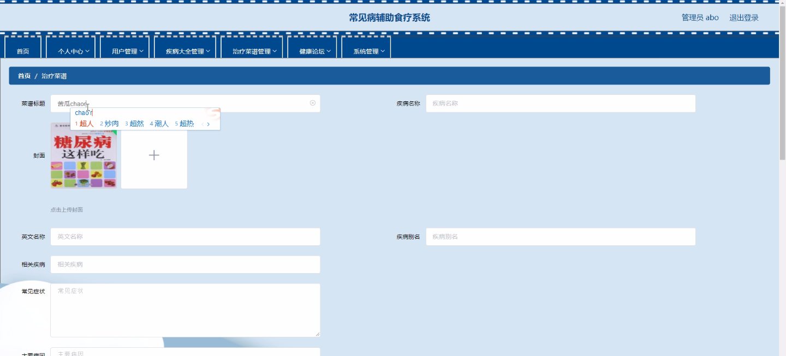
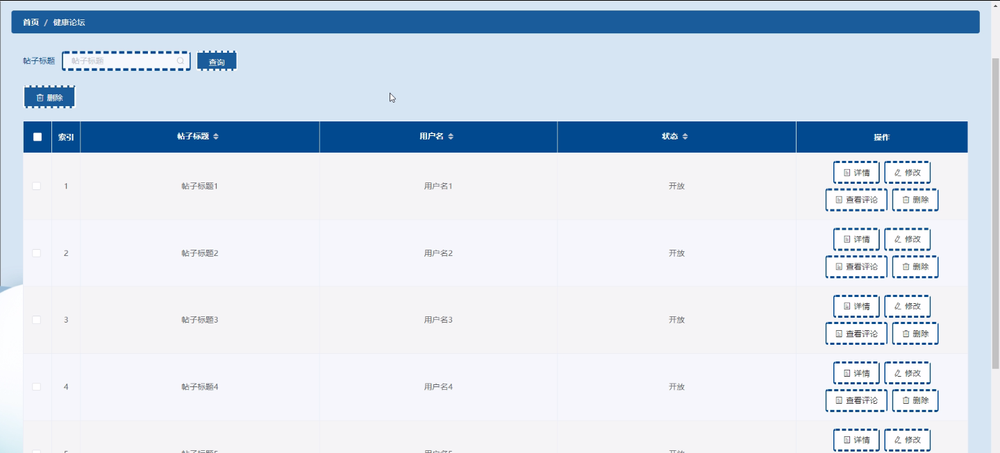
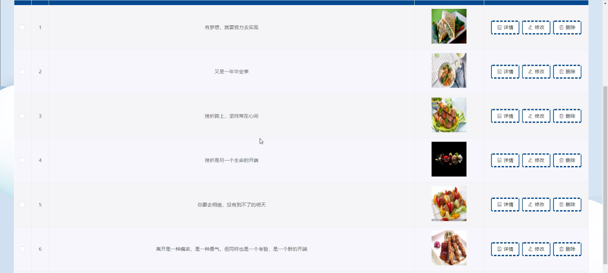

****本项目包含程序+源码+数据库+LW+调试部署环境，文末可获取一份本项目的java源码和数据库参考。****

## ******开题报告******

研究背景：
随着现代生活方式的改变和环境污染的加剧，慢性病的发病率不断上升，给人们的健康带来了严重威胁。传统的医学治疗方法虽然有效，但药物的副作用和依赖性也成为了一个问题。因此，越来越多的人开始关注辅助食疗的概念，通过合理的饮食来预防和治疗常见病，提高人体免疫力和自愈能力。

研究意义：
辅助食疗作为一种非药物干预手段，具有安全、经济、易操作等优点，对于改善人们的健康状况具有重要意义。通过针对不同疾病的饮食调理，可以减轻症状、促进康复，同时还能增强人体的营养摄入，提高身体的免疫力和抵抗力。因此，开发一个常见病辅助食疗系统具有重要的实际应用价值。

研究目的：
本研究旨在开发一个常见病辅助食疗系统，通过整合用户、疾病大全和治疗菜谱等功能，为用户提供个性化的饮食指导和健康管理服务。通过该系统，用户可以了解不同疾病的饮食禁忌和推荐，获取相应的治疗菜谱，并获得专业的营养建议，从而实现健康管理和疾病预防。

研究内容： 本研究的主要内容包括以下几个方面：

  1. 用户功能：开发一个用户注册和登录系统，用户可以通过注册账号并登录系统，享受个性化的服务。用户可以填写个人基本信息和健康状况，系统将根据用户的信息提供相应的饮食建议和菜谱推荐。

  2. 疾病大全功能：建立一个常见病的数据库，包括疾病的定义、症状、病因以及与饮食相关的注意事项和禁忌。用户可以通过搜索功能查找特定疾病的相关信息。

  3. 治疗菜谱功能：根据不同疾病的饮食要求，开发一套针对不同疾病的治疗菜谱。用户可以根据自身的疾病选择相应的菜谱，并获得详细的制作方法和食材搭配建议。

拟解决的主要问题：

  1. 用户缺乏专业的饮食指导和健康管理服务。
  2. 用户对于不同疾病的饮食禁忌和推荐缺乏了解。
  3. 用户在制定治疗菜谱时缺乏参考和指导。

研究方案和预期成果：
本研究将采用系统开发的方法，通过需求分析、系统设计和实现等步骤，开发一个常见病辅助食疗系统。预期成果包括一个完善的用户注册和登录系统、一个包含疾病大全和治疗菜谱功能的数据库，并且能够根据用户的需求提供个性化的饮食指导和健康管理服务。通过该系统，用户可以更好地了解和掌握辅助食疗的知识，实现健康管理和疾病预防。

进度安排：

2022年9月至10月：需求分析和规划，进行用户需求调研和分析，确定系统功能和目标。

2022年11月至2023年1月：系统设计和开发，完成系统架构设计和技术选型，并开始编写代码。

2023年2月至3月：测试和优化，进行单元测试和集成测试，修复问题并优化系统性能。

2023年4月至5月：文档编写和培训，编写用户手册和系统文档，并进行相关人员的培训。

2023年5月：上线部署和维护，将系统部署到生产环境中，并定期进行维护和升级。

参考文献：

[1]王振华.SpringBoot在教学效果评估系统中的应用[J].电子技术,2023,(05):67-69.

[2]王明泉.基于SpringBoot远程热部署的探索和应用[J].信息与电脑(理论版),2023,(07):1-4.

[3]王亚东,李晓霞,陈强强,剡美娜.基于SpringBoot的需求发布平台设计[J].信息与电脑(理论版),2023,(01):105-107.

[4]陈新府豪.基于SpringBoot和Vue框架的创新方法推理系统的设计与实现[D].导师：黄静.浙江理工大学,2022.

[5]霍福华,韩慧.基于SpringBoot微服务架构下前后端分离的MVVM模型[J].电子技术与软件工程,2022,(01):73-76.

[6]韩策,张娜,王松亭,张凯,何方,袁峰.SpringBoot OPC客户端设计与研究[J].电子世界,2021,(19):25-26.

****以上是本项目程序开发之前开题报告内容，最终成品以下面界面为准，大家可以酌情参考使用。要源码参考请在文末进行获取！！****

## ******本项目的界面展示******

