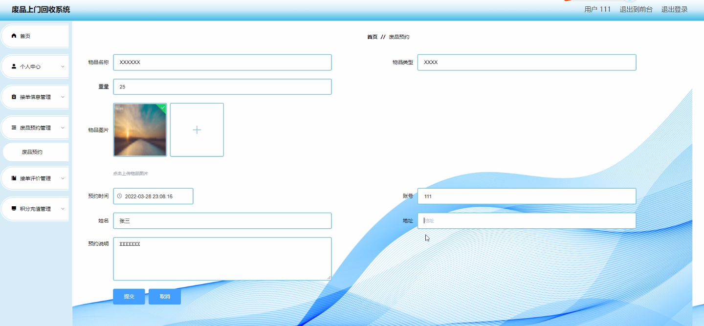
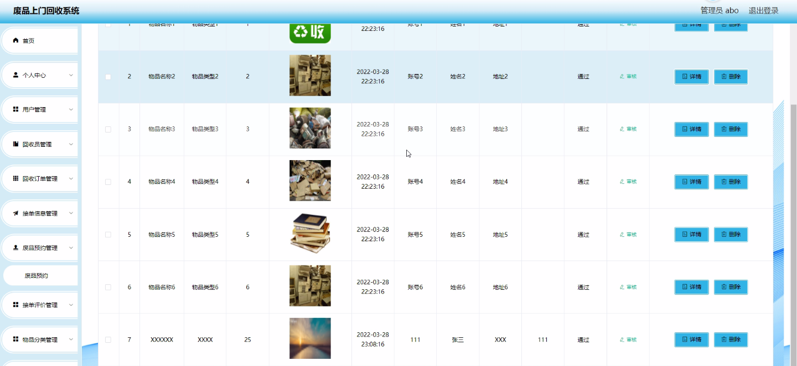
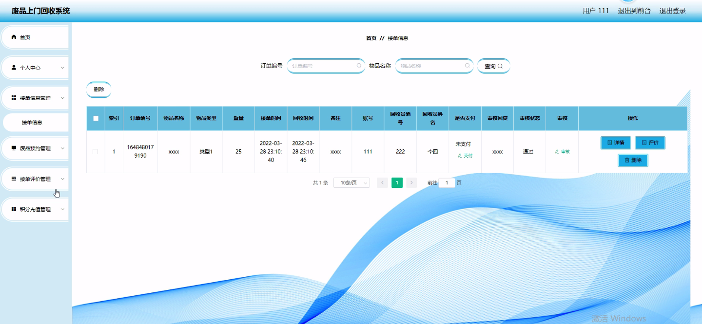
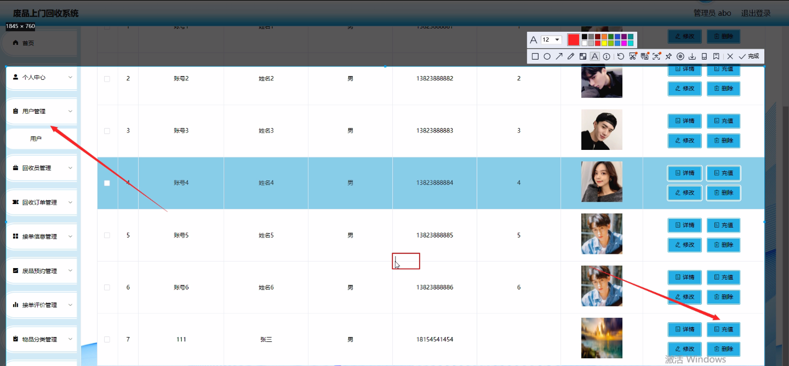
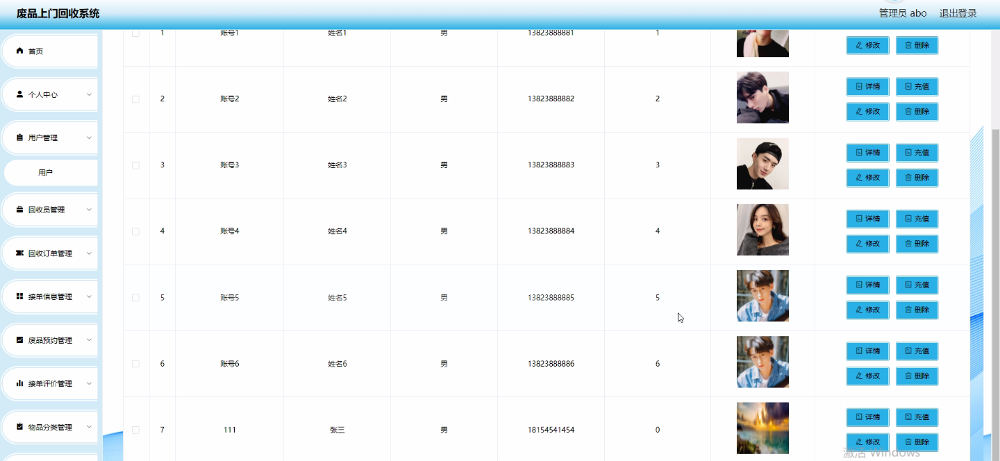

****本项目包含程序+源码+数据库+LW+调试部署环境，文末可获取一份本项目的java源码和数据库参考。****

## ******开题报告******

研究背景：
随着社会的发展和人们生活水平的提高，废品的产生量也在不断增加。然而，废品的处理和回收仍然存在许多问题。传统的废品回收方式通常需要人们自行将废品送往回收站或者等待定期的回收车辆上门收取，这给人们的生活带来了不便。同时，由于废品回收的效率和透明度不高，导致了资源的浪费和环境的污染。

研究意义：
建立一个废品上门回收系统可以有效解决传统回收方式存在的问题。通过该系统，用户可以方便地预约回收员上门回收废品，节省了时间和精力。同时，系统还可以实现废品分类、积分充值、接单评价等功能，促进了废品回收的科学化和规范化。此外，废品上门回收系统还能够提高回收效率，减少资源的浪费，对环境保护起到积极的作用。

研究目的：
本研究旨在设计和开发一套废品上门回收系统，以解决传统回收方式存在的问题，并提高废品回收的效率和透明度。通过该系统，用户可以方便地预约回收员上门回收废品，同时回收员也能够更加高效地接单和处理回收订单。通过废品分类、积分充值、接单评价等功能的实现，系统将推动废品回收的科学化和规范化。

研究内容：
本研究的主要内容包括以下系统功能的设计和开发：用户管理模块、回收员管理模块、回收订单管理模块、接单信息管理模块、积分充值管理模块、接单评价管理模块、废品分类管理模块、废品信息管理模块、取消订单管理模块等。通过对这些功能的设计和开发，实现废品上门回收系统的全面运作。

拟解决的主要问题：

  1. 传统废品回收方式不便捷，如何提供用户方便快捷的预约服务？
  2. 废品回收的效率和透明度低，如何提高回收员的接单和处理效率？
  3. 废品回收的科学化和规范化程度不高，如何实现废品分类、积分充值、接单评价等功能？
  4. 资源浪费和环境污染问题严重，如何通过废品上门回收系统减少资源浪费并促进环境保护？

研究方案：
本研究将采用软件工程的方法，结合用户需求和系统功能，进行废品上门回收系统的设计和开发。首先，对用户需求进行分析和调研，明确系统的功能和特点。然后，根据需求分析结果，进行系统的概要设计和详细设计。最后，通过编码、测试和部署等环节，完成废品上门回收系统的开发和实施。

预期成果：
预计通过本研究，可以设计和开发一套高效、便捷、科学化的废品上门回收系统。该系统将提供用户方便快捷的预约服务，提高回收员的接单和处理效率，实现废品分类、积分充值、接单评价等功能，减少资源浪费并促进环境保护。预计该系统的应用将带来社会效益和经济效益的双重提升。

进度安排：

2022年9月至10月：需求分析和规划，进行用户需求调研和分析，确定系统功能和目标。

2022年11月至2023年1月：系统设计和开发，完成系统架构设计和技术选型，并开始编写代码。

2023年2月至3月：测试和优化，进行单元测试和集成测试，修复问题并优化系统性能。

2023年4月至5月：文档编写和培训，编写用户手册和系统文档，并进行相关人员的培训。

2023年5月：上线部署和维护，将系统部署到生产环境中，并定期进行维护和升级。

参考文献：

[1]王振华.SpringBoot在教学效果评估系统中的应用[J].电子技术,2023,(05):67-69.

[2]王明泉.基于SpringBoot远程热部署的探索和应用[J].信息与电脑(理论版),2023,(07):1-4.

[3]王亚东,李晓霞,陈强强,剡美娜.基于SpringBoot的需求发布平台设计[J].信息与电脑(理论版),2023,(01):105-107.

[4]陈新府豪.基于SpringBoot和Vue框架的创新方法推理系统的设计与实现[D].导师：黄静.浙江理工大学,2022.

[5]霍福华,韩慧.基于SpringBoot微服务架构下前后端分离的MVVM模型[J].电子技术与软件工程,2022,(01):73-76.

[6]韩策,张娜,王松亭,张凯,何方,袁峰.SpringBoot OPC客户端设计与研究[J].电子世界,2021,(19):25-26.

****以上是本项目程序开发之前开题报告内容，最终成品以下面界面为准，大家可以酌情参考使用。要源码参考请在文末进行获取！！****

## ******本项目的界面展示******

