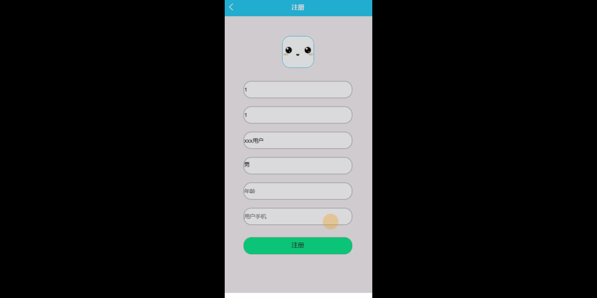
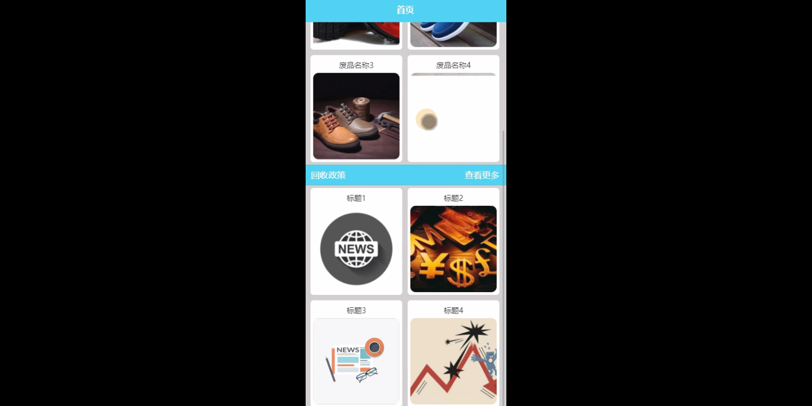
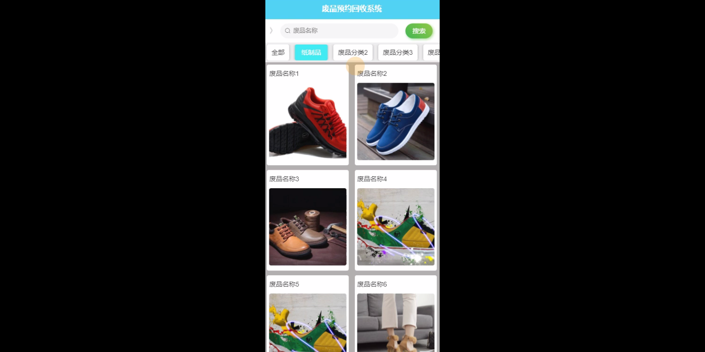
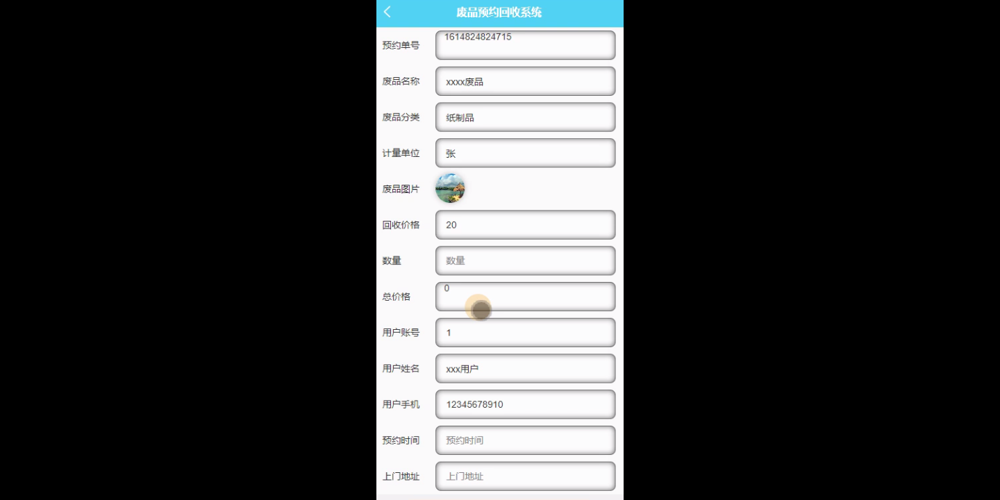

****本项目包含程序+源码+数据库+LW+调试部署环境，文末可获取一份本项目的java源码和数据库参考。****

## ******开题报告******

研究背景：
随着社会的快速发展和人们生活水平的提高，废品的产生量也日益增加。然而，废品的处理和回收一直是一个全球性的环境问题。传统的废品处理方式往往存在效率低下、资源浪费、环境污染等问题。因此，建立一个废品预约回收系统具有重要的现实意义。

研究意义：
废品预约回收系统的建立可以有效解决废品处理和回收的问题，提高废品回收的效率和质量，减少对环境的污染。同时，该系统还可以推动废品分类工作的开展，培养人们的环保意识，促进可持续发展。此外，废品预约回收系统还可以为废品回收企业提供更好的管理和运营方式，提升其竞争力和服务质量。

研究目的：
本研究旨在设计和开发一个废品预约回收系统，通过科学合理的规划和优化，实现废品的有效回收和再利用。具体目标包括：提供方便快捷的用户操作界面，实现废品分类和回收的自动化流程，制定科学合理的回收政策，提高废品回收的效率和质量。

研究内容： 本研究将主要围绕以下几个方面展开：

  1. 用户管理：设计用户注册、登录、信息管理等功能，方便用户使用系统进行废品预约回收。
  2. 废品分类：建立废品分类体系，实现废品的准确分类和标识，为后续的回收工作提供基础数据。
  3. 废品回收：设计废品回收流程，包括废品接收、运输、处理等环节，确保废品能够得到有效回收和再利用。
  4. 预约回收：提供用户预约回收的功能，包括时间选择、地址确认等，方便用户按需求安排废品回收服务。
  5. 回收政策：制定科学合理的回收政策，包括回收价格、补贴政策等，激励用户积极参与废品回收活动。

拟解决的主要问题：
本研究旨在解决废品处理和回收过程中存在的一些主要问题，包括废品分类不准确、回收流程复杂、用户操作不便等。通过设计和开发废品预约回收系统，可以提高废品回收的效率和质量，解决上述问题。

研究方案和预期成果：
本研究将采用系统设计和开发的方法，结合用户需求和废品回收的实际情况，设计和开发一个功能完善、操作便捷的废品预约回收系统。预期成果包括：建立科学合理的废品分类体系，实现废品的准确分类；设计高效的废品回收流程，提高回收效率和质量；制定科学合理的回收政策，激励用户积极参与废品回收活动。通过系统的应用和推广，预期可以有效解决废品处理和回收的问题，促进环境保护和可持续发展。

进度安排：

2022年9月至10月：开题报告编写和提交，完成开题报告的撰写并提交给指导教师进行审核。

2022年11月至2023年1月：系统设计和开发，根据开题报告的要求，进行系统设计和编码工作。

2023年2月至3月：论文撰写和初稿完成，开始撰写论文，并在这个阶段完成论文的初稿。

2023年4月至5月：论文修改和最终定稿，根据指导教师的意见对论文进行修改，并完成最终的定稿。

2023年5月：论文答辩和提交，参加论文答辩并根据答辩结果进行修改，最后将论文提交给学院或学校。

参考文献：

[1]喻佳,吴丹新.基于SpringBoot的Web快速开发框架[J].电脑编程技巧与维护,2021,(09):31-33.

[2]李鹏.基于SpringBoot快速开发平台的实现[J].电子技术与软件工程,2021,(12):36-37.

[3]叶开平,蔡维晟,陈家敏,邓斯妮.基于SpringBoot的综测可视化管理系统的研究与设计[J].电脑知识与技术,2021,(12):100-104.

[4]江健锋,徐振平.Springboot最小系统的设计与实现[J].电脑知识与技术,2021,(04):62-63.

[5]赵炯,司圣杰,周奇才,熊肖磊.通用信息获取系统设计与实现[J].起重运输机械,2020,(16):89-97.

[6]吴英宾.一种内外网数据交互系统的设计与实现[J].软件工程,2020,(08):25-27.

****以上是本项目程序开发之前开题报告内容，最终成品以下面界面为准，大家可以酌情参考使用。要源码参考请在文末进行获取！！****

## ******本项目的界面展示******

