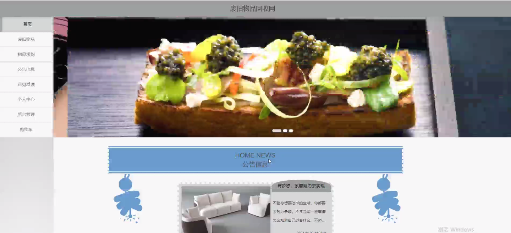
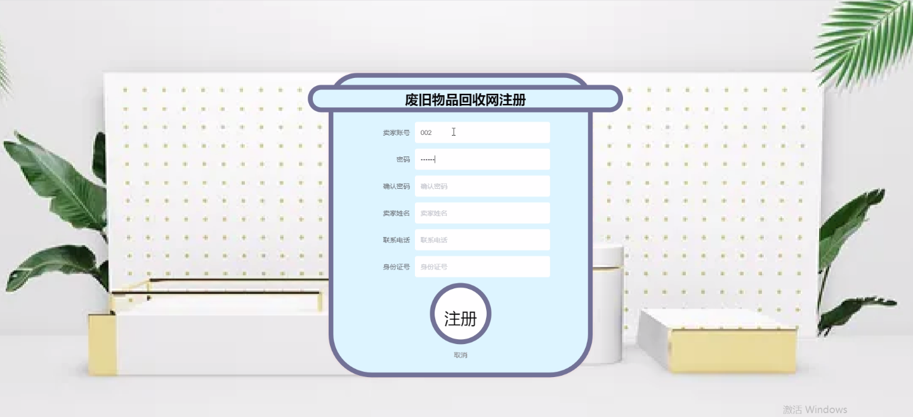
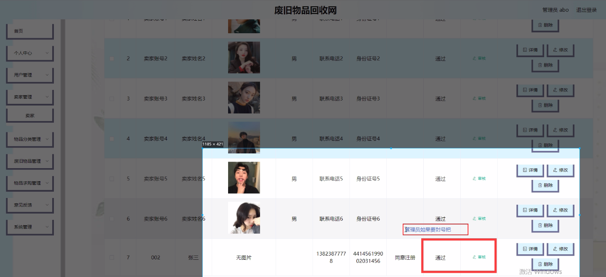
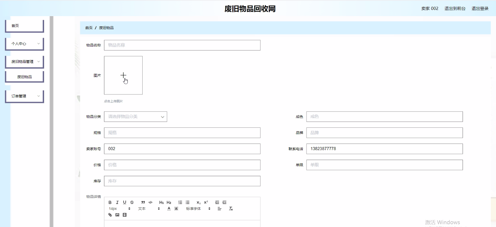
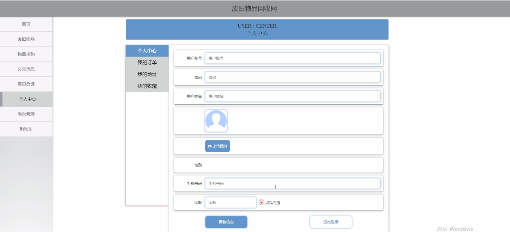
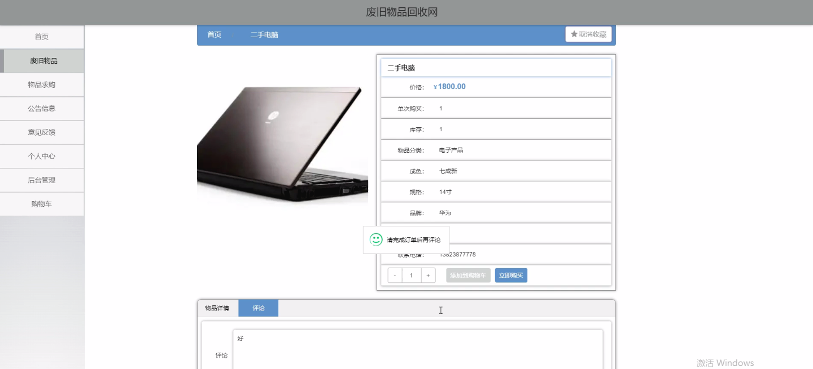
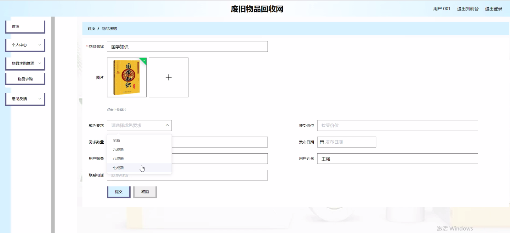
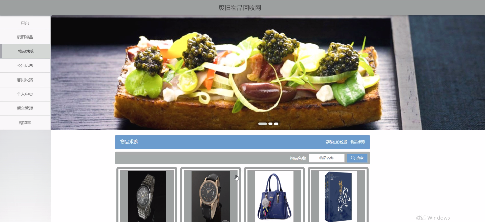

****本项目包含程序+源码+数据库+LW+调试部署环境，文末可获取一份本项目的java源码和数据库参考。****

## ******开题报告******

研究背景：
随着社会的不断发展和进步，人们对环境保护和资源回收的意识日益增强。废旧物品回收成为了一个重要的环保行动，通过回收再利用废旧物品，可以减少资源浪费和环境污染。然而，在传统的废旧物品回收方式中，存在着信息不对称、效率低下等问题，使得废旧物品回收难以得到有效推广和应用。

研究意义：
本研究旨在探索一种基于网络平台的废旧物品回收系统，通过构建一个废旧物品回收网，实现用户、卖家、物品分类、废旧物品、物品求购等系统功能的有机结合，提高废旧物品回收的效率和可持续性。这将为促进废旧物品回收行业的发展，推动环境保护事业做出积极贡献。

研究目的：
本研究的目的是设计和开发一个废旧物品回收网，通过整合各方资源和信息，建立一个高效、便捷的废旧物品回收平台，促进废旧物品的回收和再利用。同时，通过该系统，提高用户对废旧物品回收的参与度和认知度，培养环保意识，推动社会绿色发展。

研究内容： 本研究的主要内容包括以下几个方面：

  1. 用户功能：设计并实现用户注册、登录、个人信息管理等功能，为用户提供便捷的操作界面和个性化服务。

  2. 卖家功能：建立卖家账号体系，实现卖家发布废旧物品信息、管理交易记录等功能，促进废旧物品的有效回收和再利用。

  3. 物品分类功能：构建废旧物品分类体系，将废旧物品按照不同的类别进行分类，方便用户查找和选择需要回收的物品。

  4. 废旧物品功能：开发废旧物品信息展示页面，展示废旧物品的详细信息，包括物品的图片、描述、价格等，提供给用户参考和选择。

  5. 物品求购功能：设计并实现用户发布物品求购信息的功能，方便用户寻找需要的废旧物品，并促进废旧物品的流通和再利用。

拟解决的主要问题：
本研究拟解决传统废旧物品回收方式中存在的信息不对称、效率低下等问题，通过构建废旧物品回收网，整合各方资源和信息，提高废旧物品回收的效率和可持续性。

研究方案和预期成果：
本研究将采用系统设计与开发的方法，通过前期调研、需求分析、系统设计、系统实现等步骤，逐步完成废旧物品回收网的建设。预期成果包括一个功能完善、操作便捷的废旧物品回收网，能够满足用户、卖家、物品分类、废旧物品、物品求购等系统功能的需求，并有效促进废旧物品的回收和再利用。

进度安排：

2022年9月至10月：需求分析和规划，进行用户需求调研和分析，确定系统功能和目标。

2022年11月至2023年1月：系统设计和开发，完成系统架构设计和技术选型，并开始编写代码。

2023年2月至3月：测试和优化，进行单元测试和集成测试，修复问题并优化系统性能。

2023年4月至5月：文档编写和培训，编写用户手册和系统文档，并进行相关人员的培训。

2023年5月：上线部署和维护，将系统部署到生产环境中，并定期进行维护和升级。

参考文献：

[1]王振华.SpringBoot在教学效果评估系统中的应用[J].电子技术,2023,(05):67-69.

[2]王明泉.基于SpringBoot远程热部署的探索和应用[J].信息与电脑(理论版),2023,(07):1-4.

[3]王亚东,李晓霞,陈强强,剡美娜.基于SpringBoot的需求发布平台设计[J].信息与电脑(理论版),2023,(01):105-107.

[4]陈新府豪.基于SpringBoot和Vue框架的创新方法推理系统的设计与实现[D].导师：黄静.浙江理工大学,2022.

[5]霍福华,韩慧.基于SpringBoot微服务架构下前后端分离的MVVM模型[J].电子技术与软件工程,2022,(01):73-76.

[6]韩策,张娜,王松亭,张凯,何方,袁峰.SpringBoot OPC客户端设计与研究[J].电子世界,2021,(19):25-26.

****以上是本项目程序开发之前开题报告内容，最终成品以下面界面为准，大家可以酌情参考使用。要源码参考请在文末进行获取！！****

## ******本项目的界面展示******

