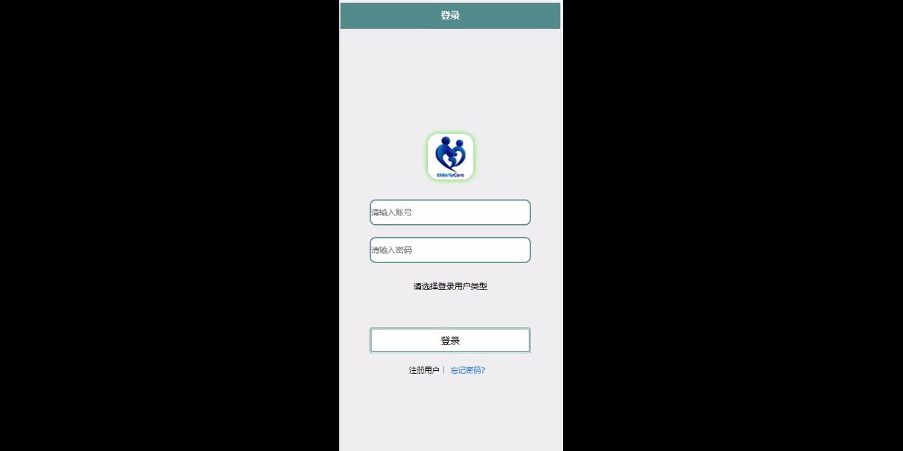
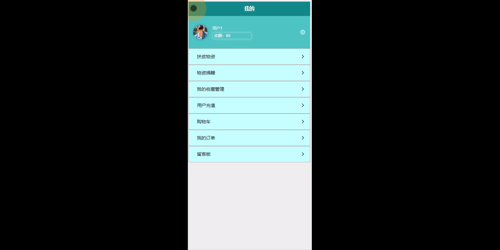
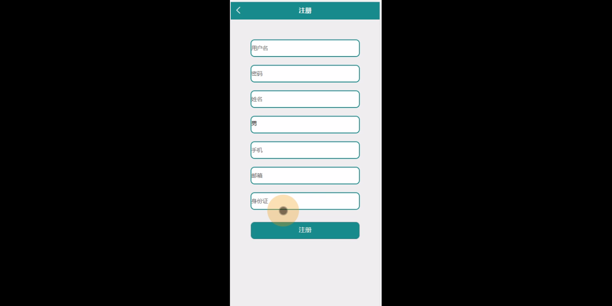
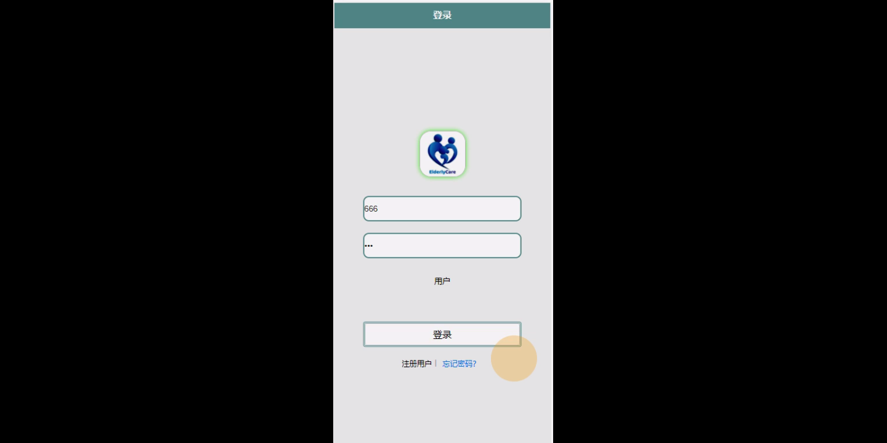
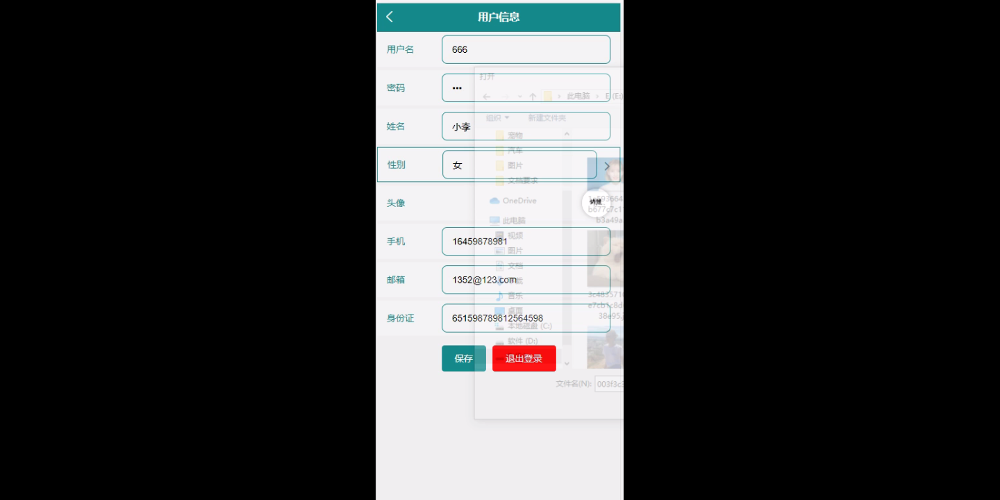
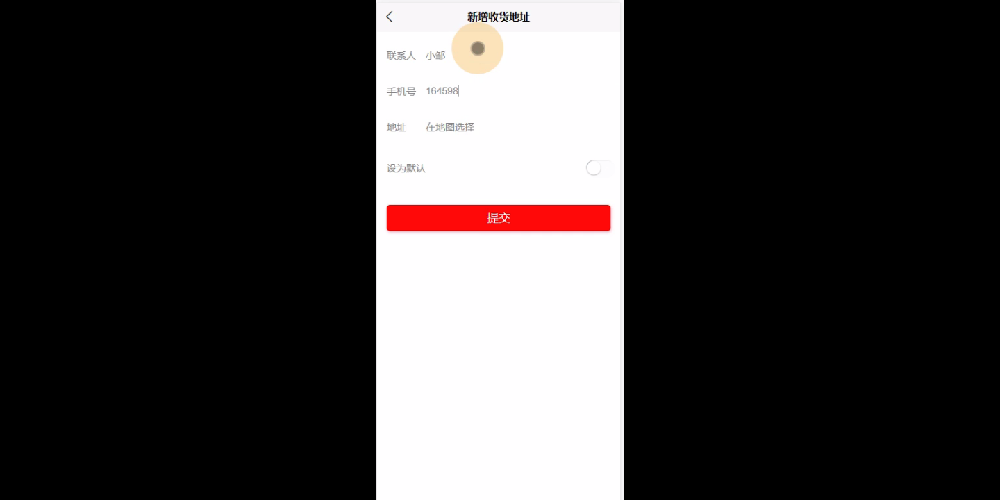
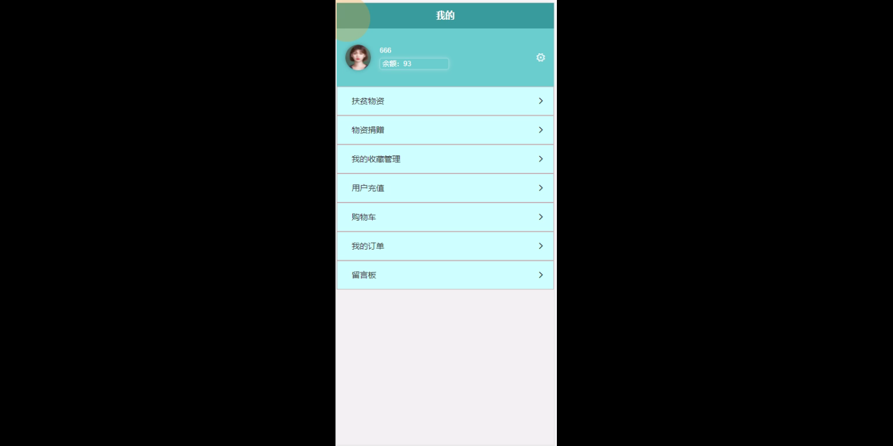
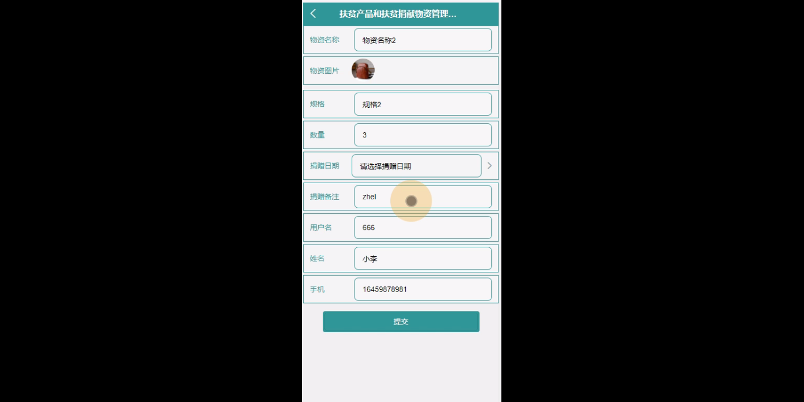

****本项目包含程序+源码+数据库+LW+调试部署环境，文末可获取一份本项目的java源码和数据库参考。****

## ******开题报告******

研究背景：
随着社会经济的发展，扶贫工作成为各国政府和社会组织关注的重点。然而，在扶贫过程中，存在着产品分类、扶贫项目、扶贫物资等方面的管理问题。传统的管理方式往往效率低下、信息不透明，无法满足扶贫工作的需求。因此，建立一个高效的扶贫产品和扶贫捐献物资管理系统具有重要的研究意义。

研究意义：
该系统的建立将有效提升扶贫工作的管理效率和透明度，帮助相关部门更好地了解和掌握扶贫产品和扶贫捐献物资的情况，进一步优化资源配置，提高扶贫工作的精准性和可持续性。同时，该系统还可以促进扶贫产品的推广和销售，为贫困地区的经济发展提供支持，推动脱贫攻坚工作取得更加显著的成效。

研究目的：
本研究旨在构建一个完善的扶贫产品和扶贫捐献物资管理系统，通过整合和优化现有资源，提高扶贫工作的效率和质量，推动贫困地区的可持续发展。具体目标包括但不限于：提供准确、及时的产品分类和信息管理；实现扶贫项目的全程监控和评估；建立透明、规范的物资捐赠流程；激励用户参与扶贫事业，形成良好的社会共治机制。

研究内容： 本研究将主要围绕以下系统功能展开：

  1. 产品分类：对扶贫产品进行合理分类，便于管理和推广。
  2. 扶贫产品：建立扶贫产品库，记录产品信息、销售情况等，方便相关部门了解产品的需求和市场反馈。
  3. 扶贫项目：对扶贫项目进行全程监控和评估，确保项目的顺利实施和效果的达到。
  4. 扶贫物资：建立物资库存管理系统，跟踪物资的流向和使用情况，确保物资的合理分配和利用。
  5. 用户：建立用户管理系统，记录用户信息和参与扶贫的情况，鼓励更多人参与到扶贫事业中来。
  6. 物资捐赠：建立透明、规范的物资捐赠流程，确保捐赠物资的准确记录和合理分配。

拟解决的主要问题：
本研究旨在解决传统扶贫工作中存在的管理效率低下、信息不透明等问题。通过建立扶贫产品和扶贫捐献物资管理系统，实现对产品分类、扶贫项目、扶贫物资等方面的全面管理和监控，提高资源的利用效率和扶贫工作的精准性。

研究方案和预期成果：
本研究将采用系统开发和数据分析相结合的方法，构建一个完善的扶贫产品和扶贫捐献物资管理系统。预期成果包括但不限于：系统功能的完善和优化，管理效率和透明度的显著提升，用户参与度的增加，扶贫工作的可持续发展能力的提升等。

进度安排：

2022年9月至10月：需求分析和规划，明确系统功能和目标，制定项目计划。

2022年11月至2023年1月：系统设计和编码，完成详细的系统设计并开始编写代码。

2023年2月至3月：用户界面开发和数据库开发，开发用户友好的界面和设计数据库结构。

2023年4月至5月：功能测试、文档编写和上线部署，对系统进行全面的功能测试并编写用户手册。

2023年5月：维护和升级，定期对系统进行维护和升级，修复bug和添加新功能。

参考文献：

[1]邱小群,邓丽艳,陈海潮.基于B/S的信息管理系统设计和实现[J].信息与电脑(理论版),2022,(20):146-148.

[2]谢霜.基于Java技术的网络管理体系结构的应用[J].网络安全技术与应用,2022,(10):14-15.

[3]宋锦华.高职院校Java程序设计课程改革研究[J].科技视界,2022,(20):133-135.

[4]曹嵩彭,王鹏宇.浅析Java语言在软件开发中的应用[J].信息记录材料,2022,(03):114-116.

[5]朱澈,余俊达.武汉东湖学院.基于Java的软硬件信息管理系统V1.0[Z].项目立项编号.鉴定单位.鉴定日期:

****以上是本项目程序开发之前开题报告内容，最终成品以下面界面为准，大家可以酌情参考使用。要源码参考请在文末进行获取！！****

## ******本项目的界面展示******

