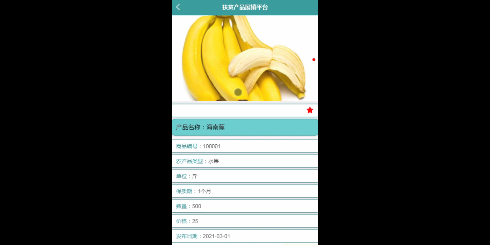

****本项目包含程序+源码+数据库+LW+调试部署环境，文末可获取一份本项目的java源码和数据库参考。****

## ******开题报告******

研究背景：
随着社会经济的发展和人们生活水平的提高，扶贫工作成为了我国社会发展的重要议题。然而，在扶贫过程中，农产品销售一直是一个关键问题。传统的销售渠道存在信息不对称、交易成本高等问题，使得农产品难以得到合理的定价和销售。因此，建立一个扶贫产品展销平台具有重要的现实意义。

研究意义：
扶贫产品展销平台的建立将有助于解决农产品销售中的问题，促进农村经济的发展和农民收入的增加。通过搭建一个集用户、卖家、农产品类型、农产品信息、订单信息等系统功能于一体的平台，可以提供全面的信息服务和便捷的交易环境，有效地连接供需双方，提高农产品的销售效率和市场竞争力。

研究目的：
本研究旨在探索并构建一个扶贫产品展销平台，通过整合资源和优化服务，提高农产品销售的效益和可持续性。具体目标包括：（1）提供一个方便快捷的交易平台，促进农产品的销售和流通；（2）提供全面的农产品信息，帮助用户了解产品特点和市场需求；（3）降低交易成本，提高农产品的竞争力；（4）促进农村经济发展，增加农民收入。

研究内容：
本研究的主要内容包括以下系统功能的设计与实现：用户管理模块、卖家管理模块、农产品类型管理模块、农产品信息管理模块、订单信息管理模块等。具体而言，需要对每个模块进行详细的需求分析和功能设计，并结合实际情况进行系统开发和测试。同时，还需要考虑平台的安全性、稳定性和用户体验等方面的问题。

拟解决的主要问题：
通过扶贫产品展销平台的建立，本研究旨在解决农产品销售中存在的信息不对称、交易成本高等问题。通过提供全面的农产品信息和便捷的交易环境，可以降低买卖双方的交易成本，提高农产品的销售效率和市场竞争力。同时，通过促进农村经济的发展和农民收入的增加，可以推动农村地区的脱贫致富。

研究方案和预期成果：
本研究将采用系统开发的方法，结合需求分析、功能设计和实际测试，构建一个完善的扶贫产品展销平台。预期成果包括：（1）一个具有用户管理、卖家管理、农产品类型管理、农产品信息管理、订单信息管理等系统功能的平台；（2）提供全面的农产品信息和便捷的交易环境，促进农产品的销售和流通；（3）降低交易成本，提高农产品的竞争力；（4）促进农村经济发展，增加农民收入。

进度安排：

2022年9月至10月：需求分析和规划，明确系统功能和目标，制定项目计划。

2022年11月至2023年1月：系统设计和编码，完成详细的系统设计并开始编写代码。

2023年2月至3月：用户界面开发和数据库开发，开发用户友好的界面和设计数据库结构。

2023年4月至5月：功能测试、文档编写和上线部署，对系统进行全面的功能测试并编写用户手册。

2023年5月：维护和升级，定期对系统进行维护和升级，修复bug和添加新功能。

参考文献：

[1]邱小群,邓丽艳,陈海潮.基于B/S的信息管理系统设计和实现[J].信息与电脑(理论版),2022,(20):146-148.

[2]谢霜.基于Java技术的网络管理体系结构的应用[J].网络安全技术与应用,2022,(10):14-15.

[3]宋锦华.高职院校Java程序设计课程改革研究[J].科技视界,2022,(20):133-135.

[4]曹嵩彭,王鹏宇.浅析Java语言在软件开发中的应用[J].信息记录材料,2022,(03):114-116.

[5]朱澈,余俊达.武汉东湖学院.基于Java的软硬件信息管理系统V1.0[Z].项目立项编号.鉴定单位.鉴定日期:

****以上是本项目程序开发之前开题报告内容，最终成品以下面界面为准，大家可以酌情参考使用。要源码参考请在文末进行获取！！****

## ******本项目的界面展示******

