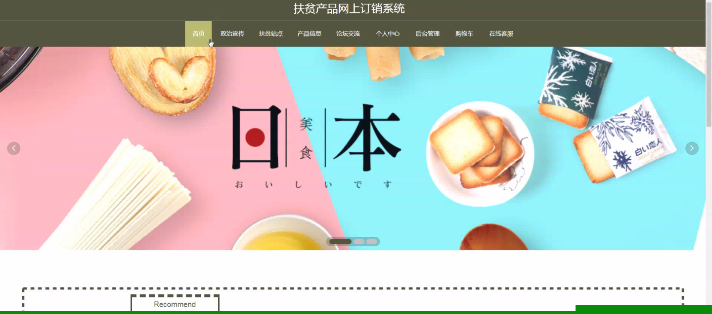
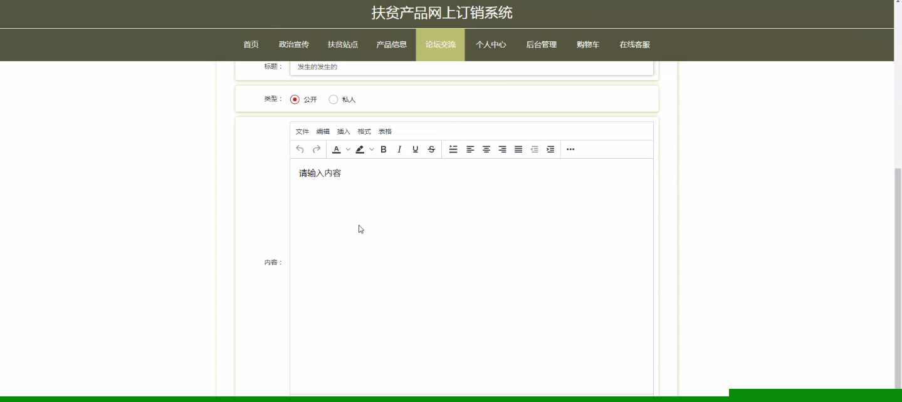
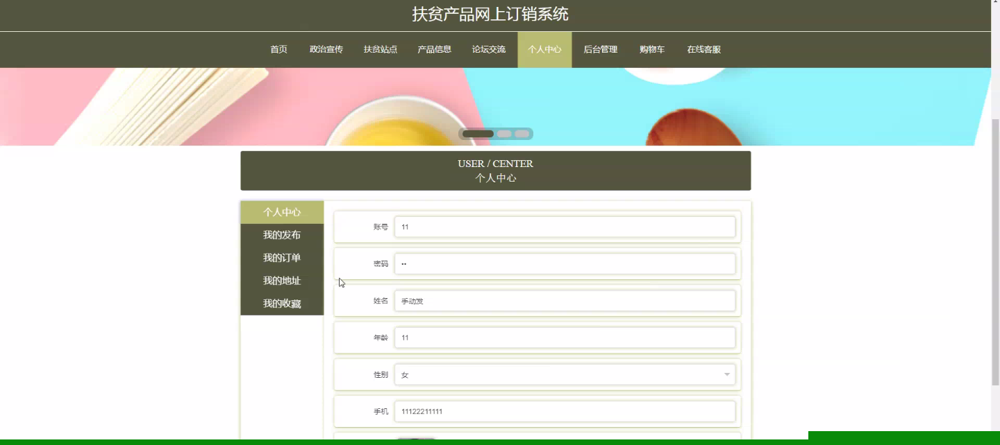
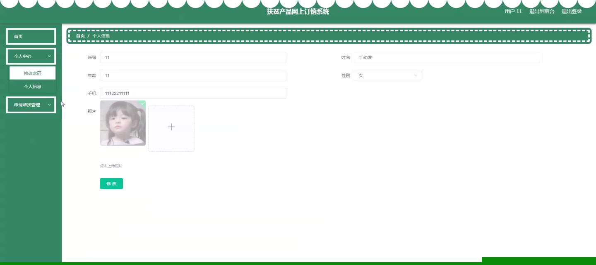
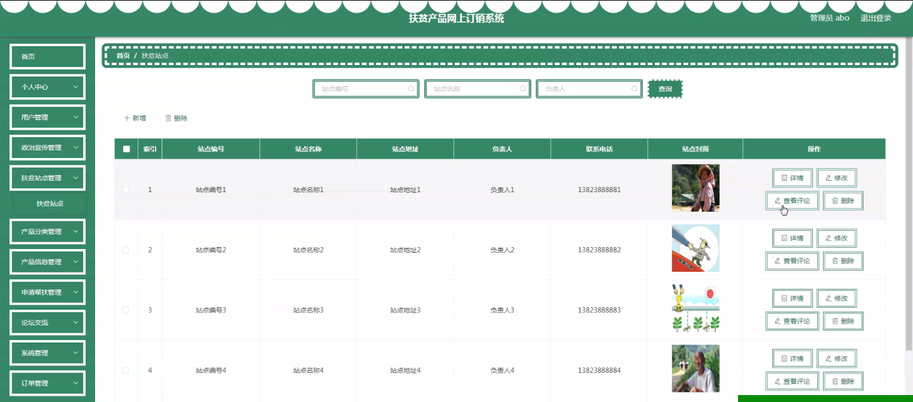
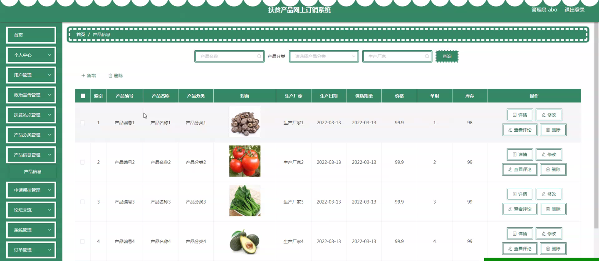
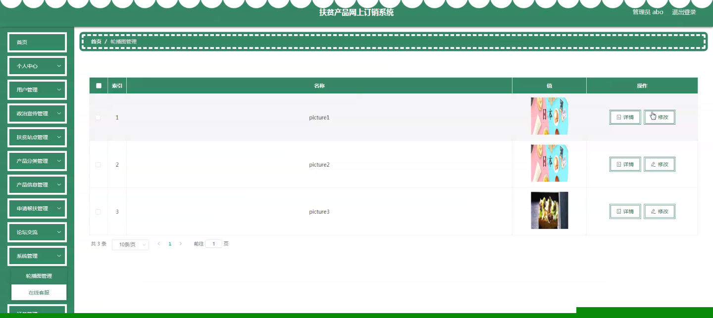
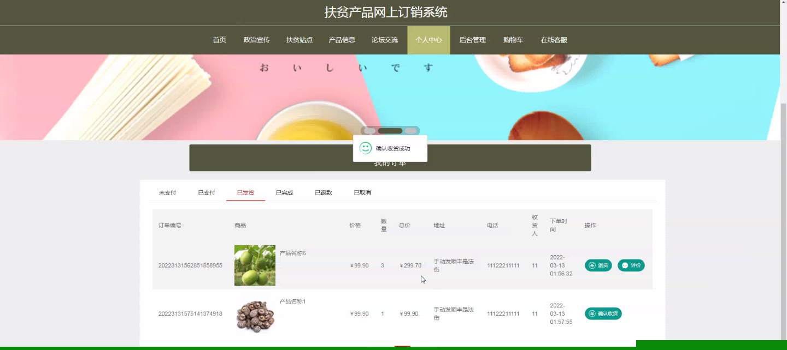

****本项目包含程序+源码+数据库+LW+调试部署环境，文末可获取一份本项目的java源码和数据库参考。****

## ******开题报告******

研究背景：
随着互联网的快速发展和普及，电子商务已经成为了现代社会中不可或缺的一部分。然而，在许多地区，特别是贫困地区，由于交通不便、信息不对称等原因，传统的销售模式无法满足人们的需求，导致贫困地区的产品难以推广和销售。因此，开发一个扶贫产品网上订销系统具有重要的意义。

研究意义：
扶贫产品网上订销系统的建立可以促进贫困地区的经济发展和脱贫致富。通过该系统，贫困地区的产品可以通过互联网渠道进行销售，突破了传统销售模式的限制，扩大了产品的市场覆盖范围，提高了产品的知名度和竞争力。同时，该系统还可以提供就业机会，帮助贫困地区的居民增加收入，改善生活条件。

研究目的：
本研究旨在开发一个功能完善、易于使用的扶贫产品网上订销系统，以解决贫困地区产品销售面临的问题。通过该系统，用户可以方便地浏览和购买贫困地区的产品，同时也可以了解产品的背后故事和扶贫政策。通过提高产品的销售量和知名度，进一步推动贫困地区的经济发展和脱贫致富。

研究内容：
本研究将重点关注以下系统功能：用户管理、产品分类、产品信息管理、申请帮扶、政治宣传、扶贫站点等。用户管理功能包括用户注册、登录、个人信息管理等，以确保用户的身份安全和个性化服务。产品分类功能将根据不同的产品特点进行分类，方便用户查找和筛选。产品信息管理功能将包括产品的展示、介绍、价格等信息的管理和更新。申请帮扶功能将提供给需要帮助的贫困地区居民，使他们能够得到必要的支持和援助。政治宣传功能将用于传播扶贫政策和相关信息，增强公众对扶贫工作的认识和理解。扶贫站点功能将提供实时的扶贫站点信息，方便用户了解扶贫工作的进展和成果。

拟解决的主要问题：

  1. 传统销售模式无法满足贫困地区产品推广和销售的需求。
  2. 交通不便、信息不对称等因素限制了贫困地区产品的市场覆盖范围和竞争力。
  3. 贫困地区居民缺乏就业机会，收入水平较低。

研究方案：
本研究将采用软件开发的方法，结合用户需求分析和系统设计原则，开发一个功能完善、易于使用的扶贫产品网上订销系统。在系统开发过程中，将充分考虑贫困地区的实际情况和用户的特殊需求，确保系统能够满足用户的期望并提供良好的用户体验。同时，还将加强与相关部门和组织的合作，以获取更多的产品资源和政策支持。

预期成果：
通过本研究，预计可以开发出一个高效、可靠的扶贫产品网上订销系统，为贫困地区的产品销售提供有力支持。该系统将能够帮助贫困地区的居民增加收入，改善生活条件，促进贫困地区的经济发展和脱贫致富。同时，该系统也将提供给广大用户一个方便快捷的购物平台，使他们能够购买到优质的扶贫产品，并了解背后的故事和意义。

进度安排：

2022年9月至10月：需求分析和规划，进行用户需求调研和分析，确定系统功能和目标。

2022年11月至2023年1月：系统设计和开发，完成系统架构设计和技术选型，并开始编写代码。

2023年2月至3月：测试和优化，进行单元测试和集成测试，修复问题并优化系统性能。

2023年4月至5月：文档编写和培训，编写用户手册和系统文档，并进行相关人员的培训。

2023年5月：上线部署和维护，将系统部署到生产环境中，并定期进行维护和升级。

参考文献：

[1]王振华.SpringBoot在教学效果评估系统中的应用[J].电子技术,2023,(05):67-69.

[2]王明泉.基于SpringBoot远程热部署的探索和应用[J].信息与电脑(理论版),2023,(07):1-4.

[3]王亚东,李晓霞,陈强强,剡美娜.基于SpringBoot的需求发布平台设计[J].信息与电脑(理论版),2023,(01):105-107.

[4]陈新府豪.基于SpringBoot和Vue框架的创新方法推理系统的设计与实现[D].导师：黄静.浙江理工大学,2022.

[5]霍福华,韩慧.基于SpringBoot微服务架构下前后端分离的MVVM模型[J].电子技术与软件工程,2022,(01):73-76.

[6]韩策,张娜,王松亭,张凯,何方,袁峰.SpringBoot OPC客户端设计与研究[J].电子世界,2021,(19):25-26.

****以上是本项目程序开发之前开题报告内容，最终成品以下面界面为准，大家可以酌情参考使用。要源码参考请在文末进行获取！！****

## ******本项目的界面展示******

