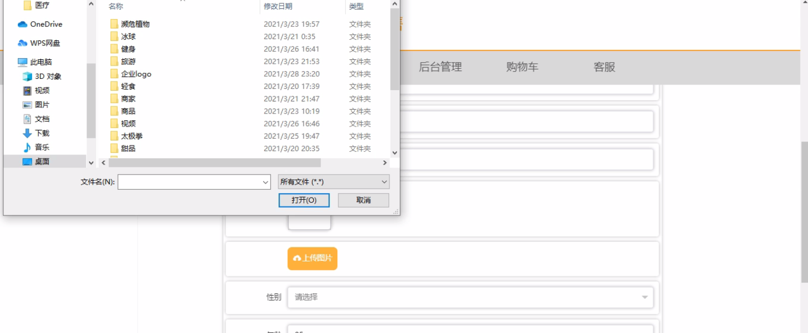
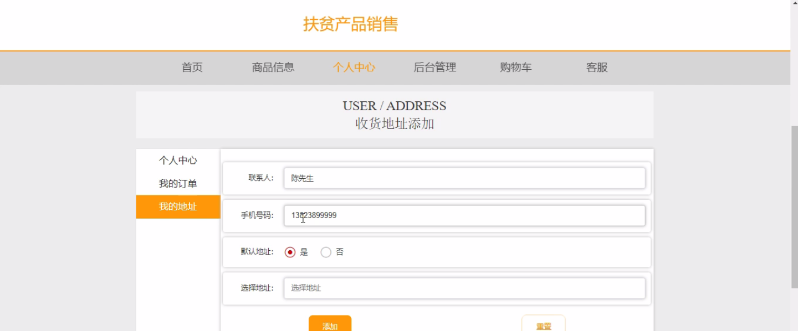
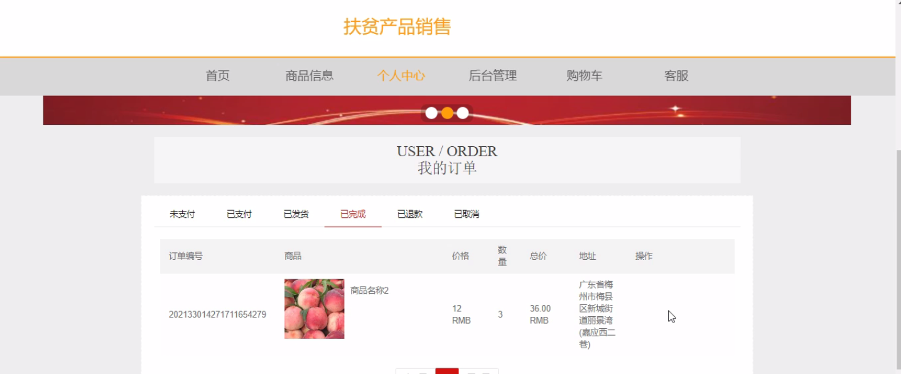
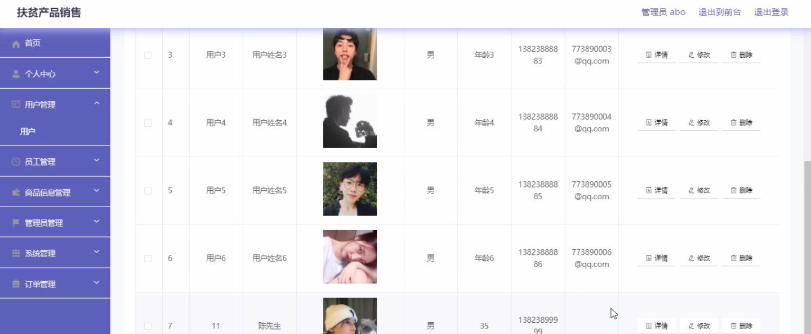
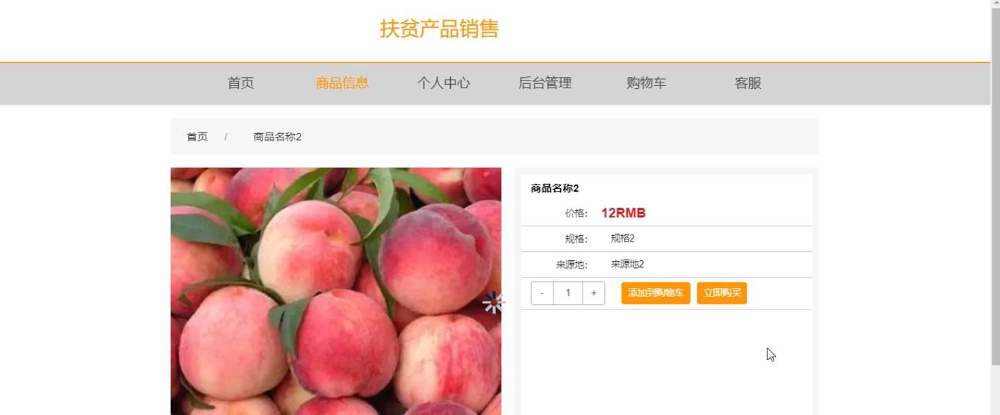

****本项目包含程序+源码+数据库+LW+调试部署环境，文末可获取一份本项目的java源码和数据库参考。****

## ******开题报告******

研究背景：
在当前社会经济发展的背景下，扶贫工作一直是我国政府高度重视的领域之一。为了实现全面建设小康社会的目标，推动贫困地区脱贫致富，扶贫产品销售成为了一种重要的手段和途径。扶贫产品销售旨在通过促进贫困地区特色产品的生产和销售，提高当地居民的收入水平，改善他们的生活条件，推动贫困地区的可持续发展。

研究意义：
扶贫产品销售的意义不仅仅体现在经济层面上，更具有深远的社会意义。首先，通过扶贫产品销售，可以有效缩小城乡差距，促进区域协调发展。其次，扶贫产品销售可以激发贫困地区的创业创新活力，带动就业增长，减少贫困人口数量。此外，扶贫产品销售还能够保护和传承贫困地区的传统文化和民族特色，增强地方文化自信，促进民族团结和社会稳定。

研究目的：
本研究旨在探索和分析扶贫产品销售的关键问题，为进一步推动贫困地区的脱贫致富工作提供理论指导和实践参考。具体目的包括：了解扶贫产品销售的现状和存在的问题；研究扶贫产品销售对贫困地区经济发展的影响；探索有效的扶贫产品销售模式和策略；提出相应的政策建议，促进扶贫产品销售的可持续发展。

研究内容： 本研究将围绕扶贫产品销售展开深入研究，主要包括以下几个方面的内容：

  1. 用户系统功能：研究用户对扶贫产品的需求和购买行为，分析用户的消费心理和消费偏好，以及用户对扶贫产品销售的认知和态度。

  2. 员工系统功能：研究扶贫产品销售中的人力资源管理问题，包括员工培训、激励机制、绩效评估等方面，以提高员工的专业素养和销售能力。

  3. 商品信息系统功能：研究扶贫产品的生产和供应链管理，包括产品设计、质量控制、物流配送等方面，以确保扶贫产品的品质和供应的稳定性。

拟解决的主要问题：
在研究过程中，我们将重点解决以下几个主要问题：如何提高扶贫产品的市场竞争力；如何加强扶贫产品销售渠道建设；如何推动扶贫产品的品牌建设和营销策略；如何增强贫困地区居民对扶贫产品的消费意识和购买能力。

研究方案和预期成果：
本研究将采用文献综述、实地调研、问卷调查、案例分析等方法进行深入研究。通过收集和分析相关数据和信息，总结经验教训，提出可行性建议和政策措施，为扶贫产品销售提供科学依据和实践指导。预期成果包括：提出切实可行的扶贫产品销售模式和策略；促进贫困地区的脱贫致富工作；推动扶贫产品销售的可持续发展。

进度安排：

2022年9月至10月：开题报告编写和提交，完成开题报告的撰写并提交给指导教师进行审核。

2022年11月至2023年1月：系统设计和开发，根据开题报告的要求，进行系统设计和编码工作。

2023年2月至3月：论文撰写和初稿完成，开始撰写论文，并在这个阶段完成论文的初稿。

2023年4月至5月：论文修改和最终定稿，根据指导教师的意见对论文进行修改，并完成最终的定稿。

2023年5月：论文答辩和提交，参加论文答辩并根据答辩结果进行修改，最后将论文提交给学院或学校。

参考文献：

[1]喻佳,吴丹新.基于SpringBoot的Web快速开发框架[J].电脑编程技巧与维护,2021,(09):31-33.

[2]李鹏.基于SpringBoot快速开发平台的实现[J].电子技术与软件工程,2021,(12):36-37.

[3]叶开平,蔡维晟,陈家敏,邓斯妮.基于SpringBoot的综测可视化管理系统的研究与设计[J].电脑知识与技术,2021,(12):100-104.

[4]江健锋,徐振平.Springboot最小系统的设计与实现[J].电脑知识与技术,2021,(04):62-63.

[5]赵炯,司圣杰,周奇才,熊肖磊.通用信息获取系统设计与实现[J].起重运输机械,2020,(16):89-97.

[6]吴英宾.一种内外网数据交互系统的设计与实现[J].软件工程,2020,(08):25-27.

****以上是本项目程序开发之前开题报告内容，最终成品以下面界面为准，大家可以酌情参考使用。要源码参考请在文末进行获取！！****

## ******本项目的界面展示******

