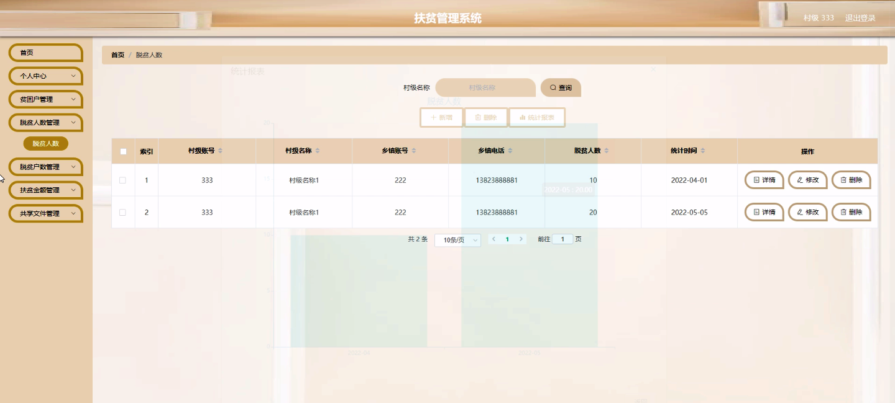
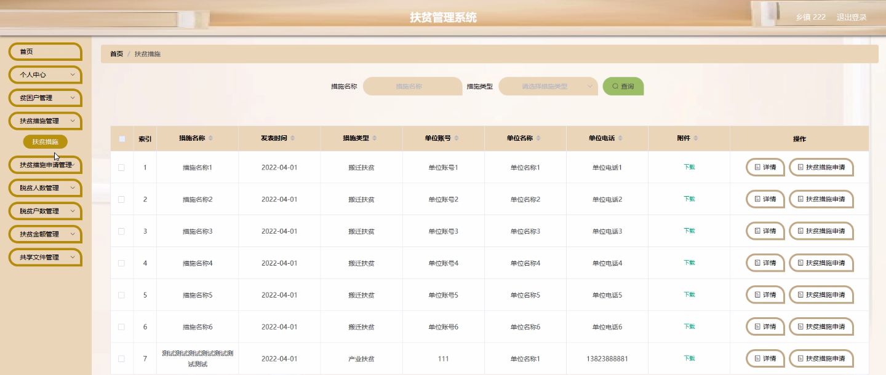
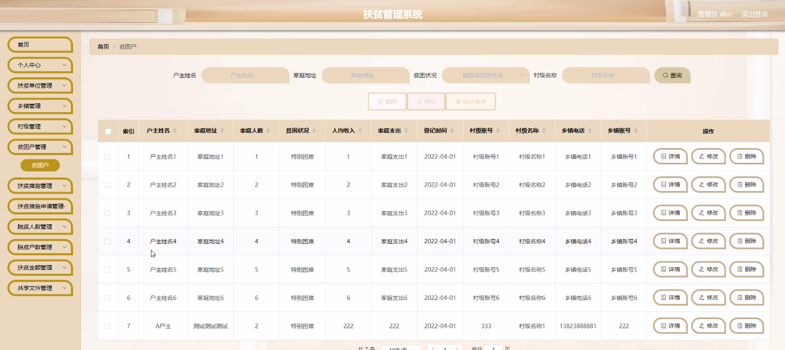

****本项目包含程序+源码+数据库+LW+调试部署环境，文末可获取一份本项目的java源码和数据库参考。****

## ******开题报告******

研究背景：
随着社会经济的发展和国家政策的实施，扶贫工作成为了当前社会关注的焦点。然而，传统的扶贫管理方式存在着信息不对称、数据不准确、决策效率低下等问题，给扶贫工作带来了一定的困难。因此，建立一个高效、准确、可靠的扶贫管理系统具有重要意义。

研究意义：
扶贫管理系统的建立将有助于提高扶贫工作的科学性和精准性，优化资源配置，提升扶贫工作的效益。通过系统化的数据收集、分析和共享，可以更好地了解贫困地区的实际情况，制定更加有效的扶贫措施，促进贫困户脱贫致富，推动社会的可持续发展。

研究目的：
本研究旨在设计和开发一种扶贫管理系统，以提供全面、准确、及时的扶贫信息，并支持相关部门和机构进行决策和管理。通过该系统，扶贫单位、乡镇、村级、贫困户等各级参与者可以实现信息共享、资源协同，提高扶贫工作的效率和质量。

研究内容： 本研究的主要内容包括以下几个方面：

  1. 扶贫单位管理功能：建立扶贫单位的信息库，包括机构人员、资金、物资等相关信息，实现对扶贫工作的全面管理和监督。

  2. 乡镇、村级管理功能：提供乡镇、村级管理者进行数据录入、统计分析、决策支持等功能，帮助他们更好地了解本地区的扶贫情况，制定合理的扶贫措施。

  3. 贫困户管理功能：建立贫困户档案，记录其基本信息、收入情况、脱贫进展等数据，为制定个性化的扶贫方案提供依据。

  4. 扶贫措施申请功能：贫困户可以通过系统提交扶贫需求申请，包括培训、产业扶持、教育支持等，方便相关部门进行审核和安排。

  5. 数据统计与分析功能：对扶贫工作中的各项指标进行统计和分析，为决策者提供科学依据，评估扶贫政策的有效性。

拟解决的主要问题：
本研究旨在解决传统扶贫管理方式中存在的信息不对称、数据不准确、决策效率低下等问题。通过建立扶贫管理系统，实现扶贫信息的全面、准确、及时共享，提高扶贫工作的科学性和精准性。

研究方案：
本研究将采用需求分析、系统设计、数据库构建、软件开发等方法进行。首先，对扶贫工作中各级参与者的需求进行调研和分析，确定系统功能和模块。然后，设计系统的架构和界面，建立相关数据库，并进行系统开发和测试。最后，根据用户反馈和实际运行情况进行优化和改进。

预期成果：
通过本研究，预期可以建立一个高效、准确、可靠的扶贫管理系统，实现扶贫信息的全面共享和资源的协同利用。该系统将为扶贫工作提供科学依据和决策支持，促进贫困地区的脱贫致富，推动社会的可持续发展。

进度安排：

2022年9月至10月：需求分析和规划，明确系统功能和目标，制定项目计划。

2022年11月至2023年1月：系统设计和编码，完成详细的系统设计并开始编写代码。

2023年2月至3月：用户界面开发和数据库开发，开发用户友好的界面和设计数据库结构。

2023年4月至5月：功能测试、文档编写和上线部署，对系统进行全面的功能测试并编写用户手册。

2023年5月：维护和升级，定期对系统进行维护和升级，修复bug和添加新功能。

参考文献：

[1]邱小群,邓丽艳,陈海潮.基于B/S的信息管理系统设计和实现[J].信息与电脑(理论版),2022,(20):146-148.

[2]谢霜.基于Java技术的网络管理体系结构的应用[J].网络安全技术与应用,2022,(10):14-15.

[3]宋锦华.高职院校Java程序设计课程改革研究[J].科技视界,2022,(20):133-135.

[4]曹嵩彭,王鹏宇.浅析Java语言在软件开发中的应用[J].信息记录材料,2022,(03):114-116.

[5]朱澈,余俊达.武汉东湖学院.基于Java的软硬件信息管理系统V1.0[Z].项目立项编号.鉴定单位.鉴定日期:

****以上是本项目程序开发之前开题报告内容，最终成品以下面界面为准，大家可以酌情参考使用。要源码参考请在文末进行获取！！****

## ******本项目的界面展示******

