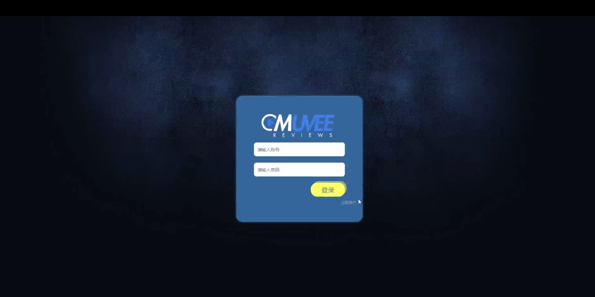
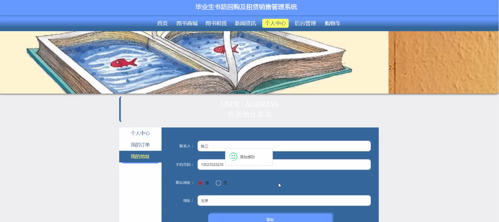
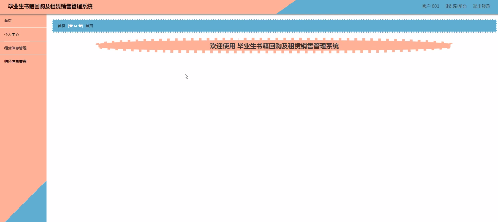
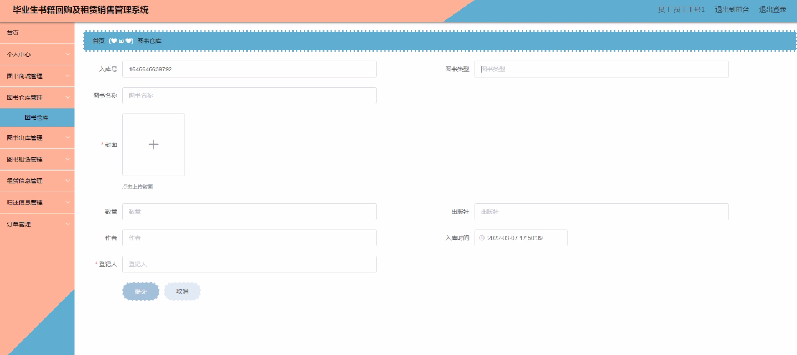
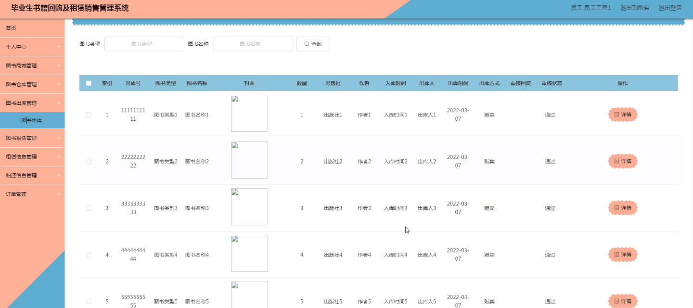
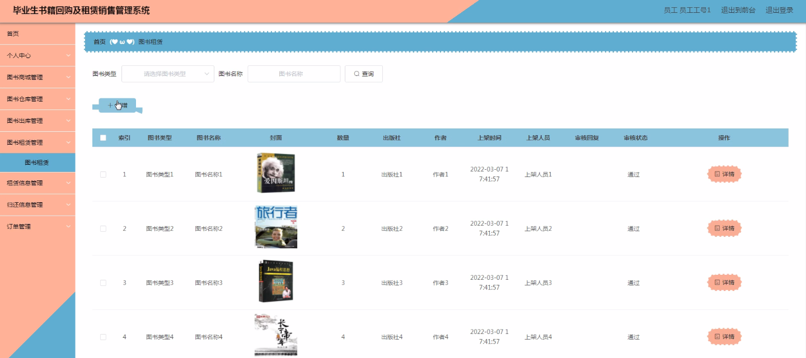

****本项目包含程序+源码+数据库+LW+调试部署环境，文末可获取一份本项目的java源码和数据库参考。****

## ******开题报告******

研究背景：
随着高等教育的普及和学生人数的增加，大学毕业生数量也在不断增长。然而，面对竞争激烈的就业市场，很多毕业生面临着就业困难的问题。同时，毕业生常常需要购买大量的教材和参考书籍来提升自己的专业能力。然而，这些书籍一旦使用完毕，往往成为闲置资产，造成了资源的浪费。

研究意义：
针对毕业生书籍回购及租赁销售管理系统的研究具有重要的现实意义。首先，该系统可以帮助毕业生将闲置的书籍进行回购或租赁，减少资源的浪费，提高资源利用率。其次，通过建立一个便捷的销售平台，毕业生可以更加方便地购买和出售书籍，降低购书成本，提高学习效率。最后，该系统还可以促进图书商城的发展，推动图书行业的创新与发展。

研究目的：
本研究的目的是设计和开发一套毕业生书籍回购及租赁销售管理系统，以解决毕业生面临的书籍闲置和资源浪费问题。通过该系统，毕业生可以方便地回购或租赁自己不再需要的书籍，并与其他学生进行交流和交易。同时，该系统还可以提供图书商城、图书类型、图书仓库、图书出库、图书租赁、租赁信息、归还信息等功能，为用户提供全方位的服务。

研究内容： 本研究的主要内容包括以下几个方面：

  1. 客户管理：建立客户档案，记录毕业生的个人信息和书籍需求，方便系统进行匹配和推荐。
  2. 员工管理：管理系统的操作人员，确保系统正常运行和数据安全。
  3. 图书商城：搭建一个在线购书平台，展示各类图书并提供购买渠道。
  4. 图书类型：对图书进行分类管理，方便用户查找和筛选。
  5. 图书仓库：管理系统中所有可回购和租赁的图书库存，确保及时供应。
  6. 图书出库：处理毕业生回购和租赁的图书出库流程，确保顺利交付给用户。
  7. 图书租赁：提供毕业生之间的图书租赁服务，方便学生之间的资源共享。
  8. 租赁信息：记录毕业生的租赁信息，包括租借时间、归还时间等，方便系统进行管理和统计。
  9. 归还信息：记录毕业生归还图书的信息，确保图书的及时归还和库存更新。
  10. 科系管理：建立科系档案，方便毕业生按照专业需求进行图书选择。

拟解决的主要问题：
本研究旨在解决毕业生面临的书籍闲置和资源浪费问题。通过搭建一个集回购、租赁和销售于一体的管理系统，提供一个便捷的平台供毕业生交流和交易书籍。同时，通过分类管理和推荐系统，帮助毕业生更好地找到自己需要的书籍，并促进图书商城的发展。

研究方案和预期成果：
本研究将采用软件开发的方法，设计和开发一套毕业生书籍回购及租赁销售管理系统。通过需求分析、系统设计、编码实现和测试验证等步骤，最终完成一个功能完善、操作简便的系统。预期成果包括一个具有良好用户体验的系统界面，能够满足毕业生的需求，并提供准确、及时的图书信息和交易服务。

进度安排：

2022年9月至10月：开题报告编写和提交，完成开题报告的撰写并提交给指导教师进行审核。

2022年11月至2023年1月：系统设计和开发，根据开题报告的要求，进行系统设计和编码工作。

2023年2月至3月：论文撰写和初稿完成，开始撰写论文，并在这个阶段完成论文的初稿。

2023年4月至5月：论文修改和最终定稿，根据指导教师的意见对论文进行修改，并完成最终的定稿。

2023年5月：论文答辩和提交，参加论文答辩并根据答辩结果进行修改，最后将论文提交给学院或学校。

参考文献：

[1]喻佳,吴丹新.基于SpringBoot的Web快速开发框架[J].电脑编程技巧与维护,2021,(09):31-33.

[2]李鹏.基于SpringBoot快速开发平台的实现[J].电子技术与软件工程,2021,(12):36-37.

[3]叶开平,蔡维晟,陈家敏,邓斯妮.基于SpringBoot的综测可视化管理系统的研究与设计[J].电脑知识与技术,2021,(12):100-104.

[4]江健锋,徐振平.Springboot最小系统的设计与实现[J].电脑知识与技术,2021,(04):62-63.

[5]赵炯,司圣杰,周奇才,熊肖磊.通用信息获取系统设计与实现[J].起重运输机械,2020,(16):89-97.

[6]吴英宾.一种内外网数据交互系统的设计与实现[J].软件工程,2020,(08):25-27.

****以上是本项目程序开发之前开题报告内容，最终成品以下面界面为准，大家可以酌情参考使用。要源码参考请在文末进行获取！！****

## ******本项目的界面展示******

