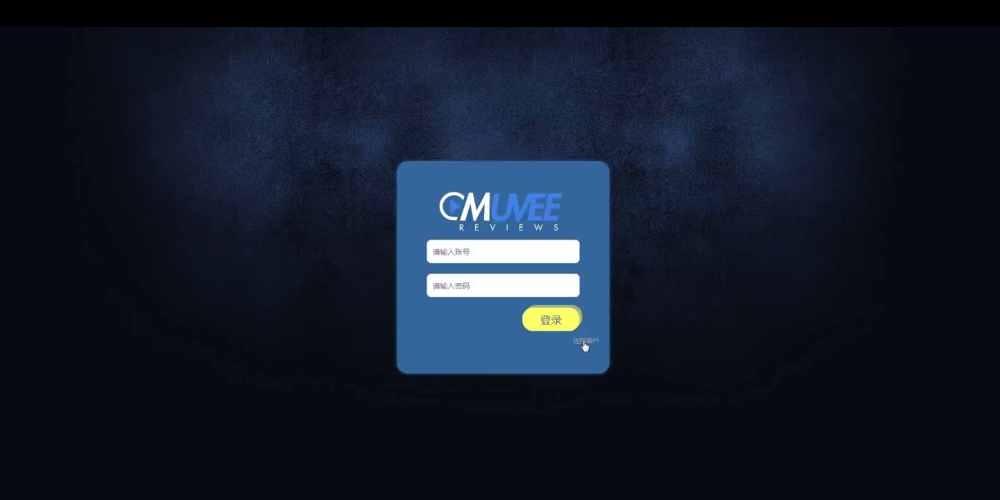
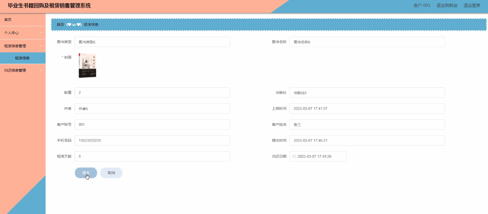
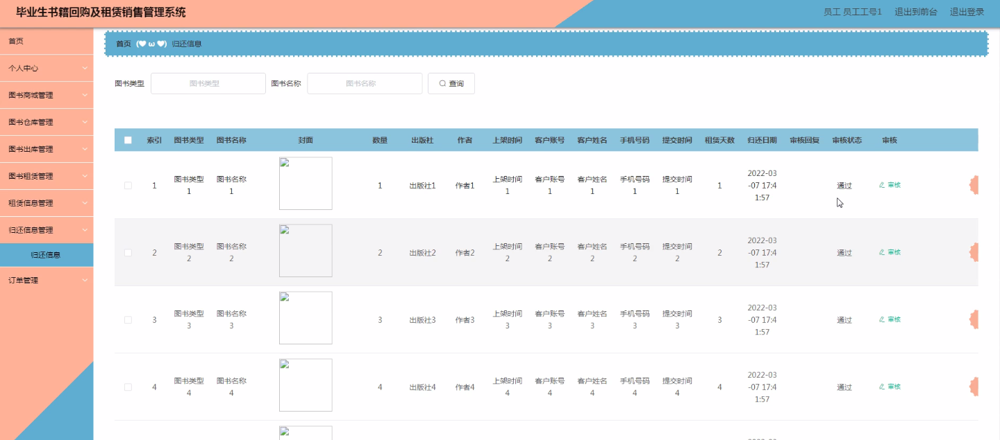
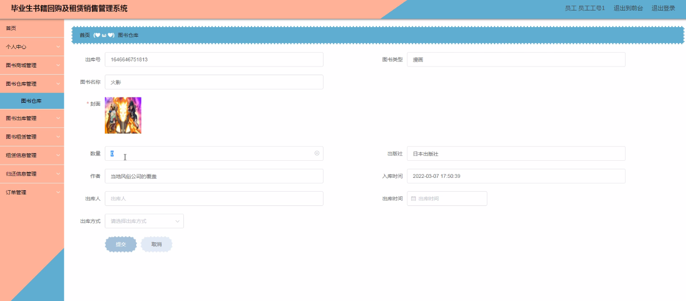
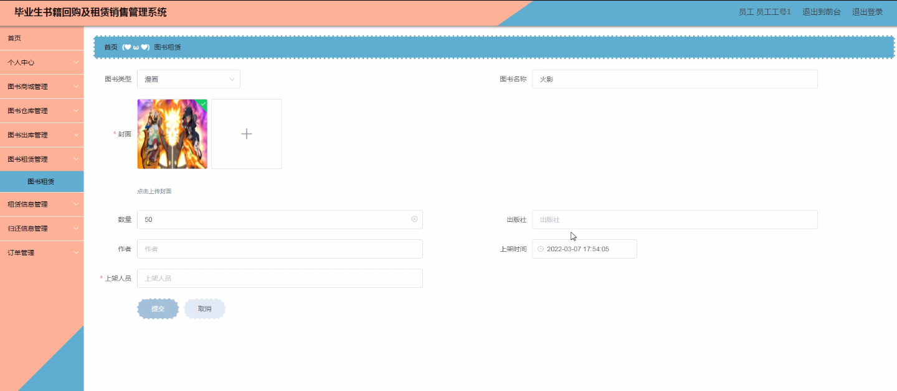

****本项目包含程序+源码+数据库+LW+调试部署环境，文末可获取一份本项目的java源码和数据库参考。****

## ******开题报告******

研究背景：
随着大学毕业生人数的不断增加，毕业生书籍回购及租赁销售管理系统的需求也日益显著。传统的书籍回购和销售方式存在一些问题，如信息不对称、流程繁琐、效率低下等。因此，开发一个高效、便捷的系统来管理毕业生书籍回购及租赁销售是非常必要的。

研究意义：
该系统的建立将极大地提升毕业生书籍回购及租赁销售的管理效率和服务质量。通过引入现代化的信息技术手段，可以实现图书信息的准确记录、快速查询和自动化处理，为毕业生提供更加便捷的回购和租赁服务。同时，该系统还能够促进图书商城的发展，提升图书销售额，推动图书产业的发展。

研究目的：
本研究旨在设计和开发一套完整的毕业生书籍回购及租赁销售管理系统，以满足毕业生和图书商城的需求。通过该系统，毕业生可以方便地进行书籍回购和租赁操作，而图书商城可以实现图书信息的集中管理和销售数据的统计分析，提升服务质量和经营效益。

研究内容：
本研究的主要内容包括以下系统功能：客户管理、员工管理、图书商城、图书类型管理、图书仓库管理、图书出库管理、图书租赁管理、租赁信息管理、归还信息管理、科系管理等。通过这些功能模块的设计和实现，可以实现毕业生书籍回购及租赁销售全流程的自动化管理。

拟解决的主要问题：

  1. 信息不对称问题：传统的回购和租赁方式存在信息不对称的情况，导致毕业生无法准确了解书籍回购和租赁的相关信息。通过系统的建立，可以实现信息的共享和透明，提高信息的准确性和可靠性。
  2. 流程繁琐问题：传统的回购和租赁流程繁琐，需要耗费大量的时间和人力资源。通过系统的自动化处理，可以简化流程，提高操作效率，节省时间和成本。
  3. 效率低下问题：传统的回购和租赁方式效率低下，无法满足大规模毕业生的需求。通过系统的引入，可以实现快速查询和处理，提高回购和租赁的效率。

研究方案：
本研究将采用软件开发的方法，结合数据库技术和网络技术，设计和开发毕业生书籍回购及租赁销售管理系统。通过需求分析、系统设计、编码实现和测试调试等阶段，逐步完成系统的建设，并进行相应的优化和改进。

预期成果：
预期的研究成果是一个功能完善、稳定可靠的毕业生书籍回购及租赁销售管理系统。该系统能够满足毕业生和图书商城的需求，提供便捷的回购和租赁服务，提高管理效率和服务质量。同时，该系统还具备扩展性和可维护性，可以根据需要进行功能的扩展和升级，以适应未来的发展需求。

进度安排：

2022年9月至10月：需求分析和规划，明确系统功能和目标，制定项目计划。

2022年11月至2023年1月：系统设计和编码，完成详细的系统设计并开始编写代码。

2023年2月至3月：用户界面开发和数据库开发，开发用户友好的界面和设计数据库结构。

2023年4月至5月：功能测试、文档编写和上线部署，对系统进行全面的功能测试并编写用户手册。

2023年5月：维护和升级，定期对系统进行维护和升级，修复bug和添加新功能。

参考文献：

[1]邱小群,邓丽艳,陈海潮.基于B/S的信息管理系统设计和实现[J].信息与电脑(理论版),2022,(20):146-148.

[2]谢霜.基于Java技术的网络管理体系结构的应用[J].网络安全技术与应用,2022,(10):14-15.

[3]宋锦华.高职院校Java程序设计课程改革研究[J].科技视界,2022,(20):133-135.

[4]曹嵩彭,王鹏宇.浅析Java语言在软件开发中的应用[J].信息记录材料,2022,(03):114-116.

[5]朱澈,余俊达.武汉东湖学院.基于Java的软硬件信息管理系统V1.0[Z].项目立项编号.鉴定单位.鉴定日期:

****以上是本项目程序开发之前开题报告内容，最终成品以下面界面为准，大家可以酌情参考使用。要源码参考请在文末进行获取！！****

## ******本项目的界面展示******

