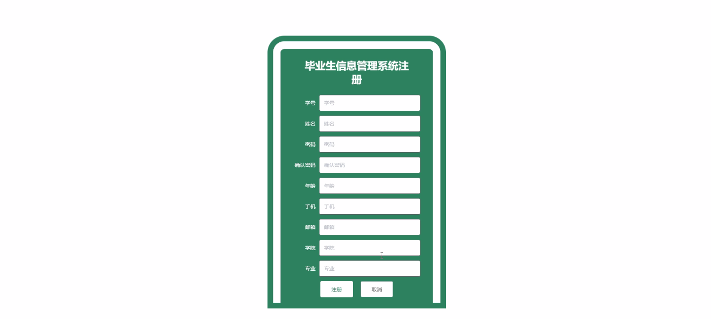
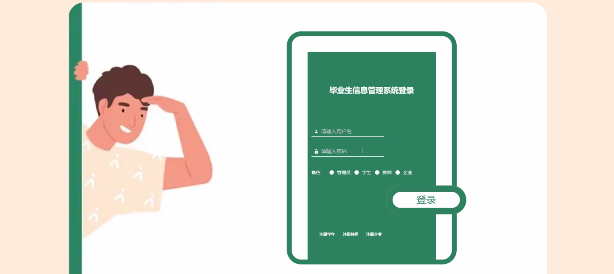
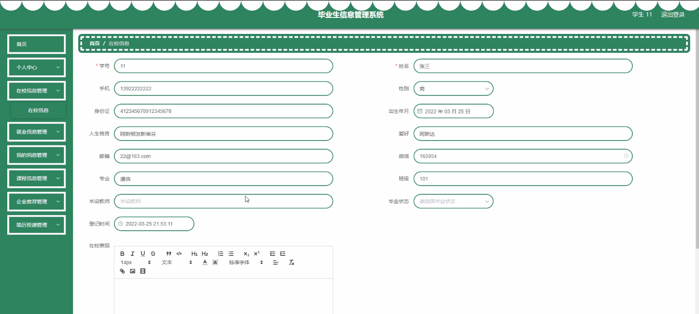
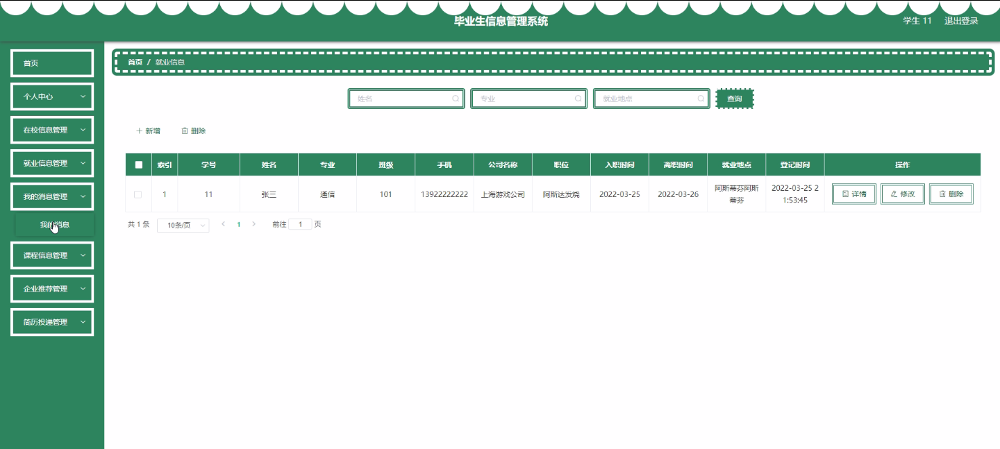
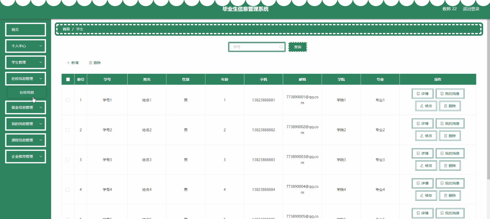
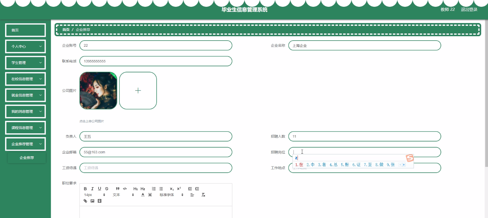
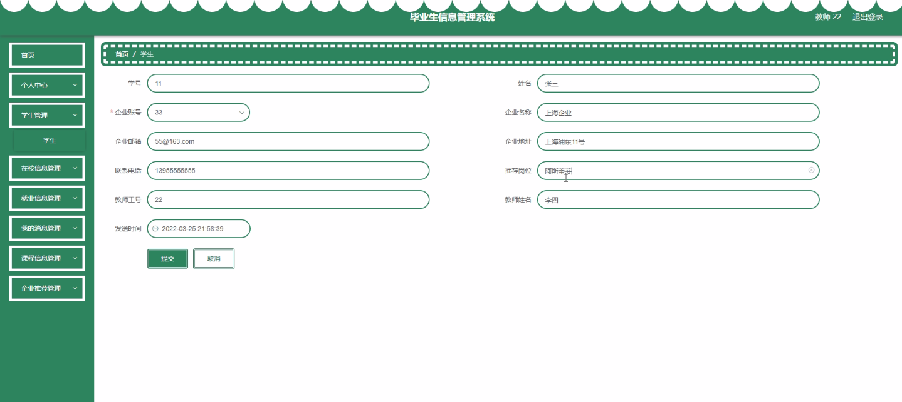
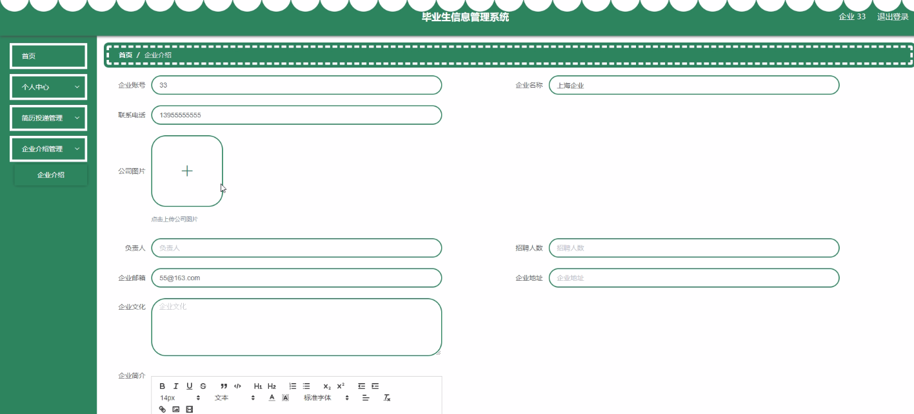

****本项目包含程序+源码+数据库+LW+调试部署环境，文末可获取一份本项目的java源码和数据库参考。****

## ******开题报告******

研究背景：
随着社会的不断发展和教育水平的提高，高校毕业生数量逐年增加。然而，与此同时，毕业生就业形势却面临着一系列挑战。传统的人力资源管理方式已经无法满足大规模毕业生信息管理的需求，因此，开发一个毕业生信息管理系统成为了当务之急。

研究意义：
毕业生信息管理系统的建立对于高校和毕业生都具有重要意义。对于高校来说，该系统可以帮助学校更好地了解毕业生的就业情况，优化就业指导服务，提高毕业生就业率和就业质量。对于毕业生来说，该系统可以提供全面、准确的就业信息，帮助他们更好地了解就业市场，提高就业竞争力。

研究目的：
本研究旨在设计和开发一套完善的毕业生信息管理系统，以实现高校毕业生信息的集中管理和全面掌握。通过该系统，高校可以及时获取毕业生的个人信息、学习成绩、就业意向等数据，并进行有效的分析和利用，为毕业生提供精准的就业指导和服务。

研究内容： 本研究的主要内容包括以下几个方面：

  1. 学生信息管理：包括学生的基本信息、学习成绩、奖励惩罚等数据的录入、查询和统计分析。

  2. 在校信息管理：包括学生在校期间的各类活动记录、社团组织管理、学术交流等信息的管理和展示。

  3. 就业信息管理：包括毕业生的就业意向、实习经历、求职进展等信息的收集、整理和发布。

  4. 教师信息管理：包括教师的个人信息、教学经验、科研成果等数据的管理和查询。

  5. 我的消息管理：包括系统通知、个人消息、提醒等功能，方便用户及时获取相关信息。

  6. 课程信息管理：包括课程安排、选课情况、成绩查询等功能，方便学生和教师进行教学管理。

  7. 企业信息管理：包括企业的基本信息、招聘信息、合作项目等数据的管理和展示。

  8. 企业推荐与简历投递：通过系统智能匹配算法，为毕业生推荐合适的企业，并提供简历投递功能。

  9. 企业介绍：为毕业生提供详细的企业信息和就业指导，帮助他们更好地了解就业市场。

拟解决的主要问题： 通过毕业生信息管理系统，可以解决以下问题：

  1. 信息分散：传统的信息管理方式存在信息分散、不完整的问题，难以全面了解毕业生的情况。

  2. 就业指导不精准：缺乏准确的毕业生信息，高校无法提供个性化的就业指导服务。

  3. 招聘信息不对称：学校和企业之间信息交流不畅，学生往往无法获取到最新的招聘信息。

  4. 求职效率低下：毕业生需要花费大量时间和精力在各个平台上搜索招聘信息，效率低下。

研究方案和预期成果： 本研究将采用软件开发方法，设计并实现一个功能完善、易于使用的毕业生信息管理系统。预期的成果包括：

  1. 系统的设计与开发：设计并实现一个集学生、教师、企业等多方信息于一体的毕业生信息管理系统。

  2. 数据的集中管理：实现毕业生信息的集中录入、查询和统计分析，方便高校进行全面的就业数据分析。

  3. 智能匹配算法：通过智能匹配算法，为毕业生提供个性化的企业推荐和简历投递服务。

  4. 提高就业率和就业质量：通过系统的使用，提高高校毕业生的就业率和就业质量，满足学生和社会的需求。

  5. 提升教育质量：通过对毕业生信息的全面掌握，为高校提供科学决策依据，提升教育质量。

进度安排：

2022年9月至10月：需求分析和规划，明确系统功能和目标，制定项目计划。

2022年11月至2023年1月：系统设计和编码，完成详细的系统设计并开始编写代码。

2023年2月至3月：用户界面开发和数据库开发，开发用户友好的界面和设计数据库结构。

2023年4月至5月：功能测试、文档编写和上线部署，对系统进行全面的功能测试并编写用户手册。

2023年5月：维护和升级，定期对系统进行维护和升级，修复bug和添加新功能。

参考文献：

[1]邱小群,邓丽艳,陈海潮.基于B/S的信息管理系统设计和实现[J].信息与电脑(理论版),2022,(20):146-148.

[2]谢霜.基于Java技术的网络管理体系结构的应用[J].网络安全技术与应用,2022,(10):14-15.

[3]宋锦华.高职院校Java程序设计课程改革研究[J].科技视界,2022,(20):133-135.

[4]曹嵩彭,王鹏宇.浅析Java语言在软件开发中的应用[J].信息记录材料,2022,(03):114-116.

[5]朱澈,余俊达.武汉东湖学院.基于Java的软硬件信息管理系统V1.0[Z].项目立项编号.鉴定单位.鉴定日期:

****以上是本项目程序开发之前开题报告内容，最终成品以下面界面为准，大家可以酌情参考使用。要源码参考请在文末进行获取！！****

## ******本项目的界面展示******

