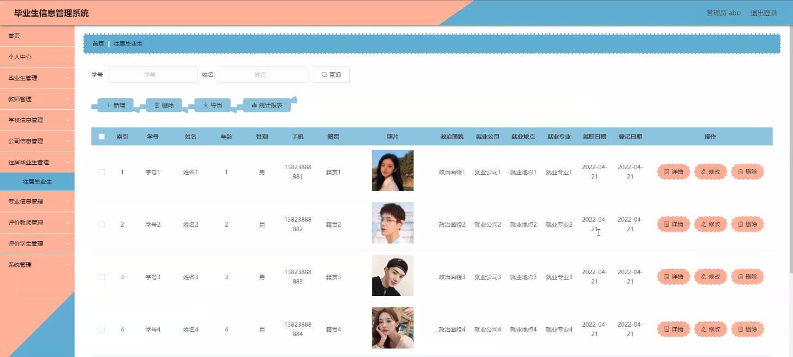

****本项目包含程序+源码+数据库+LW+调试部署环境，文末可获取一份本项目的java源码和数据库参考。****

## ******开题报告******

研究背景：
随着高等教育的普及和毕业生数量的不断增加，毕业生信息管理成为了一个重要的问题。传统的人工管理方式已经无法满足大规模毕业生信息的处理需求，因此需要建立一个高效、准确、可靠的毕业生信息管理系统来解决这一问题。

研究意义：
毕业生信息管理系统的建立对于学校、企事业单位以及毕业生本身都具有重要的意义。首先，对于学校来说，通过该系统可以更好地管理和维护毕业生的信息，提供给企事业单位更准确的毕业生信息，为学校校友资源的开发和利用提供支持。其次，对于企事业单位来说，该系统可以帮助他们更方便地获取毕业生的相关信息，提高招聘效率和质量。最后，对于毕业生本身来说，该系统可以提供一个便捷的平台，帮助他们管理个人信息，了解就业市场动态，提高就业竞争力。

研究目的：
本研究旨在设计和开发一个完善的毕业生信息管理系统，实现对毕业生信息的全面管理和有效利用。通过该系统，可以实现毕业生信息的快速录入、查询和更新，同时提供给企事业单位一个方便的渠道来获取毕业生的相关信息。通过研究和实践，探索如何优化毕业生信息管理流程，提高信息管理的效率和准确性。

研究内容：
本研究的主要内容包括以下系统功能：毕业生信息管理、往届毕业生信息管理、教师信息管理、专业信息管理、学校信息管理、公司信息管理等。具体而言，需要设计并实现毕业生信息的录入、查询、修改和删除功能，同时还需要建立与其他系统功能的关联，以实现全面的信息管理。

拟解决的主要问题：

  1. 如何设计一个用户友好的界面，使得毕业生信息的录入和查询更加简便和高效？
  2. 如何确保毕业生信息的安全性和隐私保护？
  3. 如何与其他系统功能进行有效的数据交互和共享？
  4. 如何提高毕业生信息管理的准确性和及时性？
  5. 如何优化系统性能，提高系统的稳定性和可靠性？

研究方案和预期成果：
本研究将采用软件工程的方法，结合数据库技术和网络技术，设计和开发一个基于Web的毕业生信息管理系统。通过需求分析、系统设计、编码实现和系统测试等步骤，最终实现一个功能完善、稳定可靠的毕业生信息管理系统。预期成果包括：用户友好的界面设计、高效的信息录入和查询功能、数据安全和隐私保护机制、与其他系统功能的良好集成以及系统的稳定性和可靠性。该系统的应用将提高毕业生信息管理的效率和准确性，为学校、企事业单位和毕业生本身带来实际的价值。

进度安排：

2022年9月至10月：需求分析和规划，进行用户需求调研和分析，确定系统功能和目标。

2022年11月至2023年1月：系统设计和开发，完成系统架构设计和技术选型，并开始编写代码。

2023年2月至3月：测试和优化，进行单元测试和集成测试，修复问题并优化系统性能。

2023年4月至5月：文档编写和培训，编写用户手册和系统文档，并进行相关人员的培训。

2023年5月：上线部署和维护，将系统部署到生产环境中，并定期进行维护和升级。

参考文献：

[1]王振华.SpringBoot在教学效果评估系统中的应用[J].电子技术,2023,(05):67-69.

[2]王明泉.基于SpringBoot远程热部署的探索和应用[J].信息与电脑(理论版),2023,(07):1-4.

[3]王亚东,李晓霞,陈强强,剡美娜.基于SpringBoot的需求发布平台设计[J].信息与电脑(理论版),2023,(01):105-107.

[4]陈新府豪.基于SpringBoot和Vue框架的创新方法推理系统的设计与实现[D].导师：黄静.浙江理工大学,2022.

[5]霍福华,韩慧.基于SpringBoot微服务架构下前后端分离的MVVM模型[J].电子技术与软件工程,2022,(01):73-76.

[6]韩策,张娜,王松亭,张凯,何方,袁峰.SpringBoot OPC客户端设计与研究[J].电子世界,2021,(19):25-26.

****以上是本项目程序开发之前开题报告内容，最终成品以下面界面为准，大家可以酌情参考使用。要源码参考请在文末进行获取！！****

## ******本项目的界面展示******

