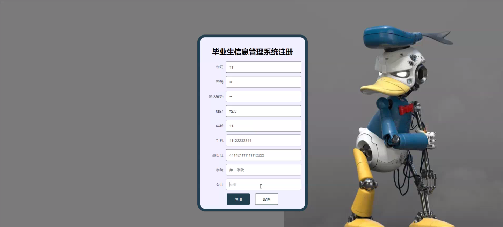
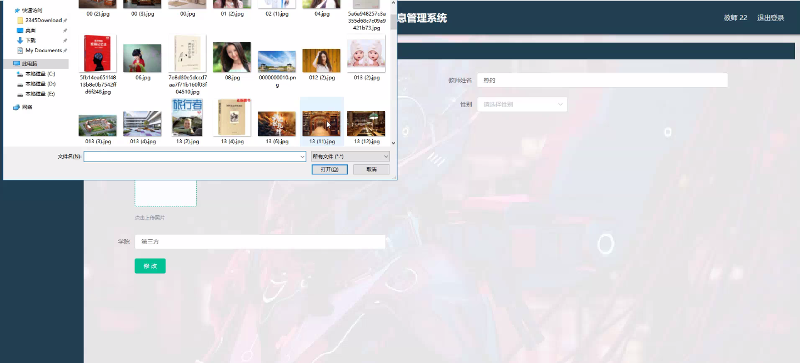
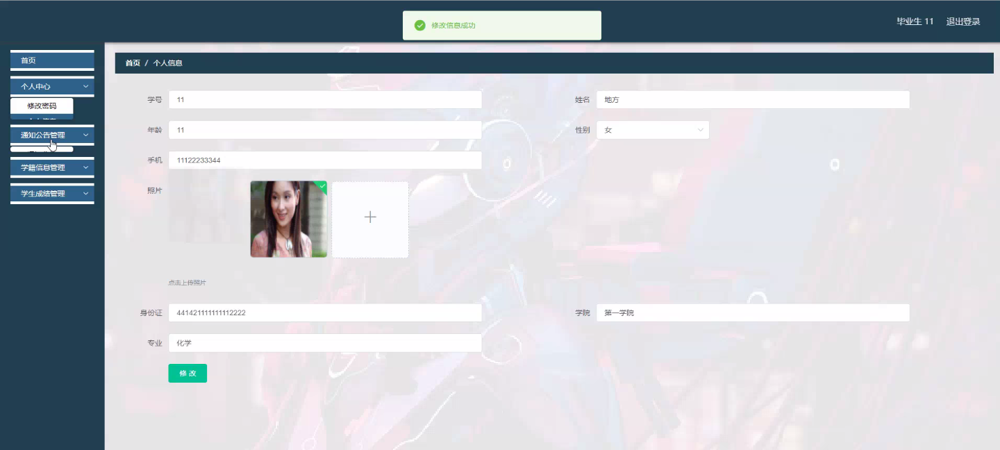
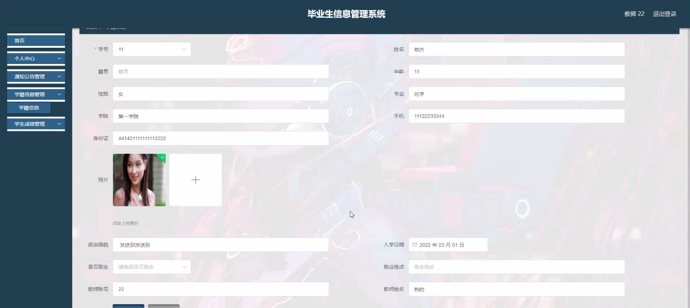
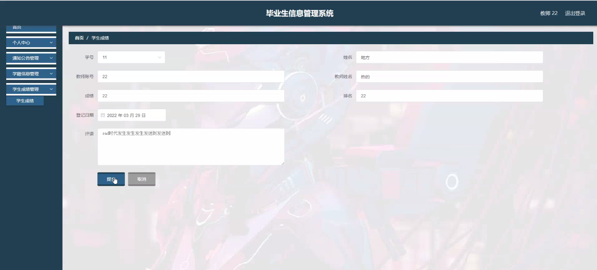
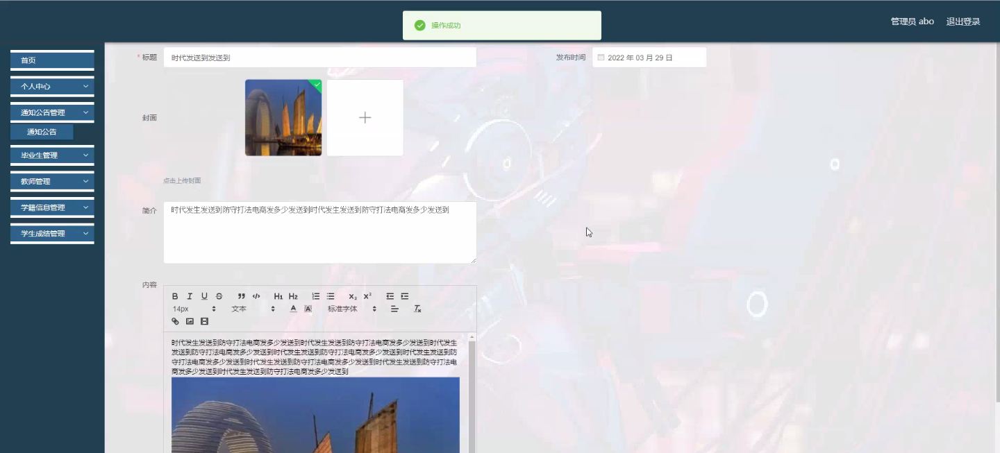
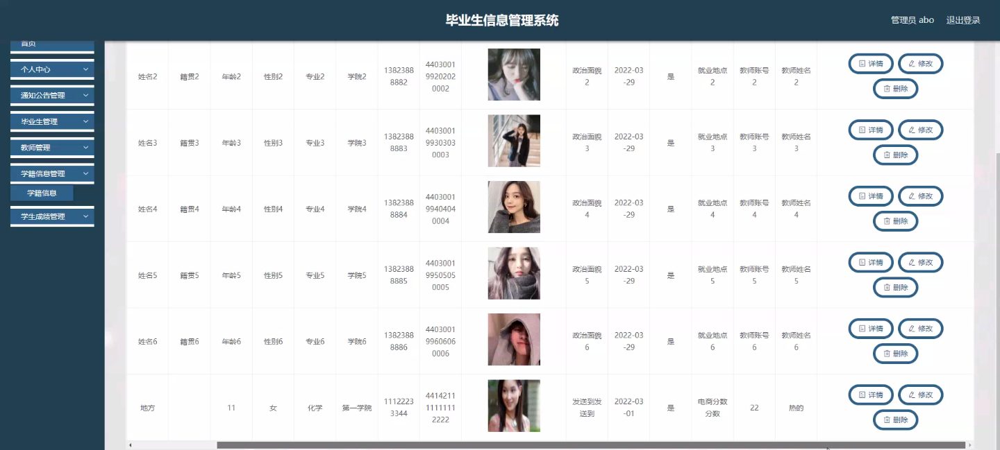

****本项目包含程序+源码+数据库+LW+调试部署环境，文末可获取一份本项目的java源码和数据库参考。****

## ******开题报告******

研究背景：
随着高等教育的普及和大学生规模的不断扩大，毕业生信息管理成为了一个重要的问题。传统的手工管理方式已经无法满足大规模、复杂的毕业生信息管理需求。因此，开发一个高效、可靠的毕业生信息管理系统具有重要的现实意义。

研究意义：
毕业生信息管理系统的建立和应用对于高校和社会各界都具有重要的意义。首先，通过系统化、集中化管理毕业生信息，可以提高信息的准确性和时效性，方便学校和相关部门进行数据分析和决策。其次，毕业生信息管理系统可以提供给毕业生更加便捷的服务，包括学籍查询、成绩查询、通知公告等，提升毕业生的满意度和用户体验。最后，该系统还可以为企事业单位提供毕业生招聘和人才储备的重要参考。

研究目的：
本研究旨在设计和开发一套完善的毕业生信息管理系统，以解决传统手工管理方式存在的问题，并提升毕业生信息管理的效率和质量。通过引入先进的信息技术和管理理念，实现毕业生信息的集中管理、快速查询和精确分析，为高校和毕业生提供更好的服务。

研究内容：
本研究的主要内容包括以下系统功能：毕业生信息管理、教师信息管理、学籍信息管理、学生成绩管理、通知公告管理等。具体而言，将通过设计和开发相应的模块和功能，实现毕业生个人信息的录入、修改和查询；教师信息的管理和统计；学籍信息的维护和更新；学生成绩的录入和统计分析；通知公告的发布和推送等功能。

拟解决的主要问题：

  1. 传统手工管理方式下，毕业生信息容易出现错误和遗漏，如何提高信息的准确性和完整性？
  2. 传统查询方式效率低下，如何实现毕业生信息的快速查询和统计分析？
  3. 学籍信息和成绩信息的管理存在繁琐和重复操作，如何简化和优化管理流程？
  4. 如何保证毕业生个人信息的安全性和隐私保护？
  5. 如何提升毕业生对于系统的使用满意度和用户体验？

研究方案和预期成果：
本研究将采用软件工程的方法，结合需求分析、系统设计和开发实现，构建一个完善的毕业生信息管理系统。预期的成果包括：系统界面友好、操作简便；数据准确性高、查询效率快；功能模块齐全、满足用户需求；系统安全可靠、保护用户隐私；用户满意度高、提升信息管理效率。通过研究成果的应用和推广，将为高校和社会各界提供一种先进、高效的毕业生信息管理解决方案。

进度安排：

2022年9月至10月：开题报告编写和提交，完成开题报告的撰写并提交给指导教师进行审核。

2022年11月至2023年1月：系统设计和开发，根据开题报告的要求，进行系统设计和编码工作。

2023年2月至3月：论文撰写和初稿完成，开始撰写论文，并在这个阶段完成论文的初稿。

2023年4月至5月：论文修改和最终定稿，根据指导教师的意见对论文进行修改，并完成最终的定稿。

2023年5月：论文答辩和提交，参加论文答辩并根据答辩结果进行修改，最后将论文提交给学院或学校。

参考文献：

[1]喻佳,吴丹新.基于SpringBoot的Web快速开发框架[J].电脑编程技巧与维护,2021,(09):31-33.

[2]李鹏.基于SpringBoot快速开发平台的实现[J].电子技术与软件工程,2021,(12):36-37.

[3]叶开平,蔡维晟,陈家敏,邓斯妮.基于SpringBoot的综测可视化管理系统的研究与设计[J].电脑知识与技术,2021,(12):100-104.

[4]江健锋,徐振平.Springboot最小系统的设计与实现[J].电脑知识与技术,2021,(04):62-63.

[5]赵炯,司圣杰,周奇才,熊肖磊.通用信息获取系统设计与实现[J].起重运输机械,2020,(16):89-97.

[6]吴英宾.一种内外网数据交互系统的设计与实现[J].软件工程,2020,(08):25-27.

****以上是本项目程序开发之前开题报告内容，最终成品以下面界面为准，大家可以酌情参考使用。要源码参考请在文末进行获取！！****

## ******本项目的界面展示******

