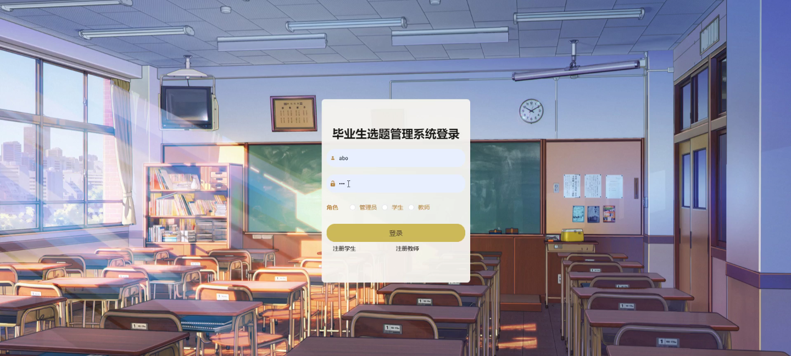
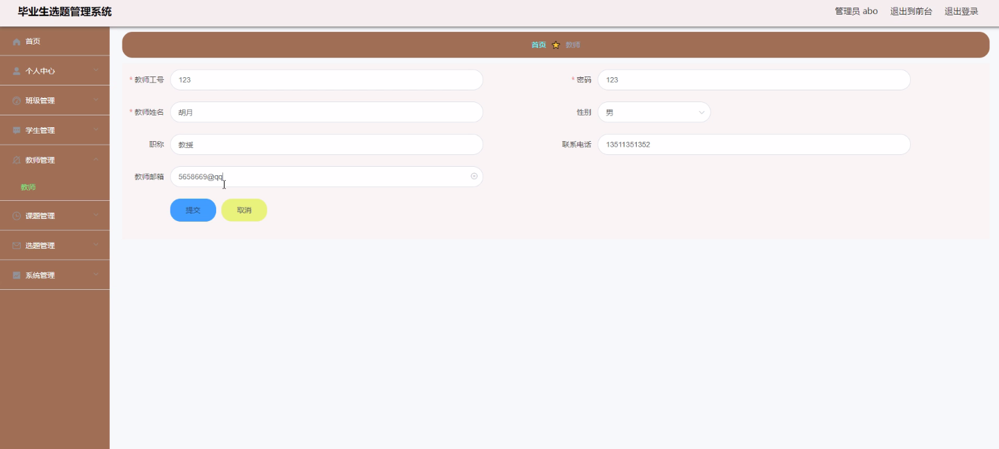
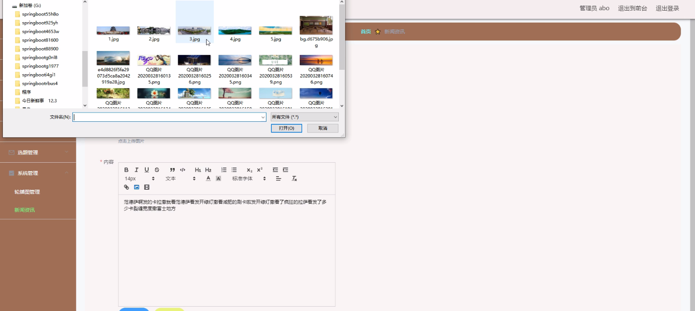
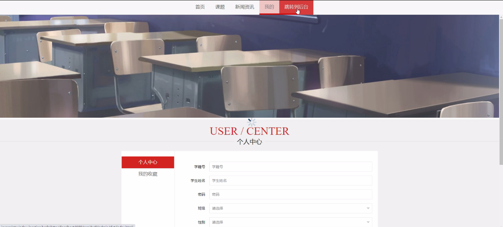
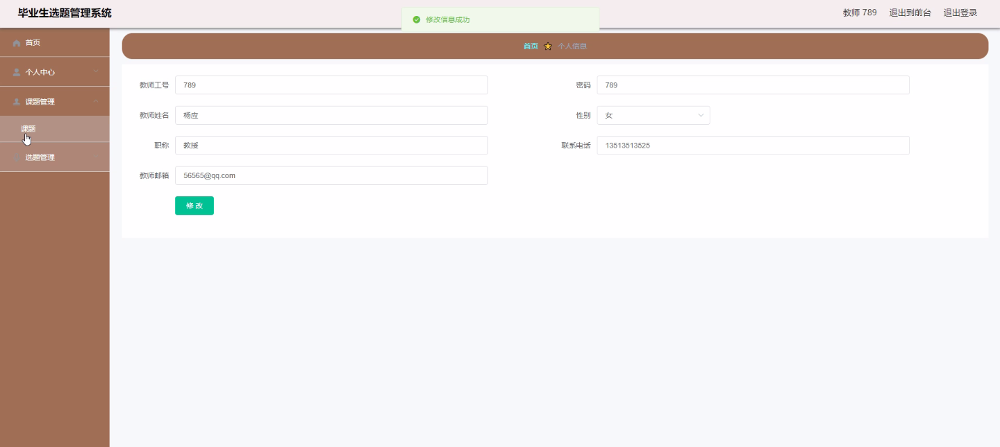
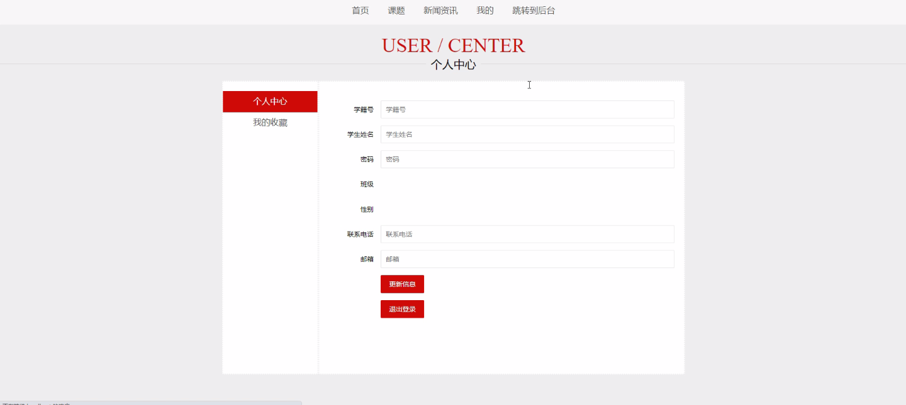
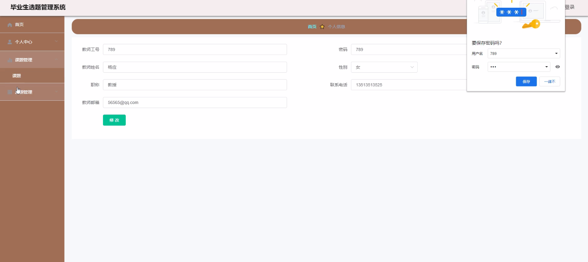

****本项目包含程序+源码+数据库+LW+调试部署环境，文末可获取一份本项目的java源码和数据库参考。****

## ******开题报告******

研究背景、意义和目的是毕业生选题管理系统设计与开发的基础，通过以下内容进行说明：

研究背景：
随着高等教育的普及和发展，大学毕业生人数逐年增加。而毕业设计或论文选题一直是毕业生必须面对的重要任务之一。然而，在传统的选题管理方式下，学生和教师之间的沟通效率低下，选题过程繁琐，容易出现信息不对称的情况。因此，开发一个高效的毕业生选题管理系统具有重要的现实意义。

研究意义：
毕业生选题管理系统的开发可以提高选题流程的效率和质量，为毕业生提供更好的选题服务。通过系统化的管理和信息化的支持，可以使学生和教师之间的交流更加便捷和高效，减少选题过程中的误解和纠纷，提升选题结果的科学性和可行性。

研究目的：
本研究旨在设计和开发一套毕业生选题管理系统，以满足学生和教师在选题过程中的需求。通过系统的功能和特点，实现选题信息的集中管理、快速查询和有效交流，提高选题的科学性和准确性。同时，通过系统的应用，促进学生和教师之间的互动和合作，提升教学质量和毕业生的综合素质。

研究内容： 根据系统功能，本研究将主要包括以下内容：

  1. 班级管理：实现对各个班级信息的录入、查询和统计分析，方便学生和教师进行班级选题管理和协作。

  2. 学生管理：对学生信息进行录入、查询和管理，包括个人基本信息、选题意向等，为学生提供个性化的选题服务。

  3. 教师管理：实现对教师信息的录入、查询和管理，包括教师专业领域、指导经验等，为教师提供更好的选题指导和支持。

  4. 课题信息管理：对各个课题的基本信息进行录入、查询和管理，包括课题名称、研究方向、预期成果等，为学生选择合适的课题提供参考。

  5. 选题信息管理：记录学生选题的过程和结果，包括选题申请、审批、确认等环节，确保选题过程的规范和透明。

  6. 学院信息管理：对学院的基本信息进行录入、查询和管理，包括学院名称、专业设置等，为学生和教师提供更好的选题资源。

  7. 任务书信息管理：记录学生选题后的任务书信息，包括任务书的编写、提交、审核等环节，确保任务书的质量和准确性。

  8. 设计信息管理：对毕业设计或论文的设计过程进行记录和管理，包括设计进度、成果展示等，为学生和教师提供项目管理的支持。

拟解决的主要问题： 通过毕业生选题管理系统的设计与开发，可以解决传统选题管理方式中存在的以下问题：

  1. 信息不对称：学生和教师之间在选题过程中容易出现信息不对称的情况，导致选题结果的不准确和不合理。

  2. 选题流程繁琐：传统的选题流程需要学生和教师进行多次面对面沟通和文件传递，耗时且容易出错。

  3. 选题结果科学性不高：由于选题过程中的信息不完整和交流不畅，选题结果的科学性和可行性有待提高。

  4. 教学质量不稳定：传统选题管理方式下，教师的指导质量和效果存在差异，影响毕业生的综合素质和成果。

研究方案和预期成果：
本研究将采用系统开发的方法，结合需求分析、系统设计和系统实现等步骤，设计和开发一套完整的毕业生选题管理系统。预期的成果包括一个功能完善、操作简便、界面友好的系统，能够满足学生和教师在选题过程中的需求，提高选题流程的效率和质量，促进教学质量的稳定提升。

进度安排：

2022年9月至10月：需求分析和规划，明确系统功能和目标，制定项目计划。

2022年11月至2023年1月：系统设计和编码，完成详细的系统设计并开始编写代码。

2023年2月至3月：用户界面开发和数据库开发，开发用户友好的界面和设计数据库结构。

2023年4月至5月：功能测试、文档编写和上线部署，对系统进行全面的功能测试并编写用户手册。

2023年5月：维护和升级，定期对系统进行维护和升级，修复bug和添加新功能。

参考文献：

[1]邱小群,邓丽艳,陈海潮.基于B/S的信息管理系统设计和实现[J].信息与电脑(理论版),2022,(20):146-148.

[2]谢霜.基于Java技术的网络管理体系结构的应用[J].网络安全技术与应用,2022,(10):14-15.

[3]宋锦华.高职院校Java程序设计课程改革研究[J].科技视界,2022,(20):133-135.

[4]曹嵩彭,王鹏宇.浅析Java语言在软件开发中的应用[J].信息记录材料,2022,(03):114-116.

[5]朱澈,余俊达.武汉东湖学院.基于Java的软硬件信息管理系统V1.0[Z].项目立项编号.鉴定单位.鉴定日期:

****以上是本项目程序开发之前开题报告内容，最终成品以下面界面为准，大家可以酌情参考使用。要源码参考请在文末进行获取！！****

## ******本项目的界面展示******

