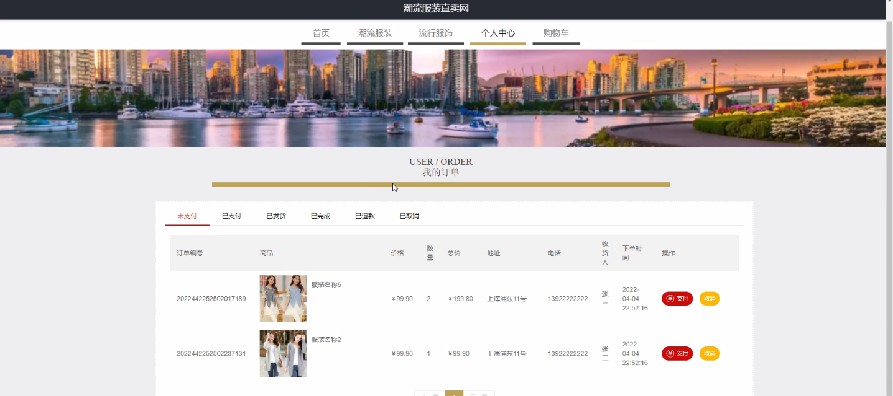
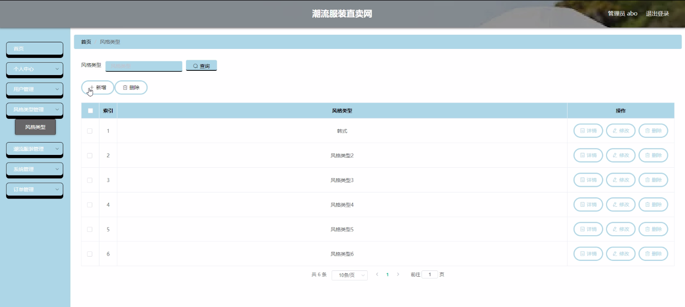
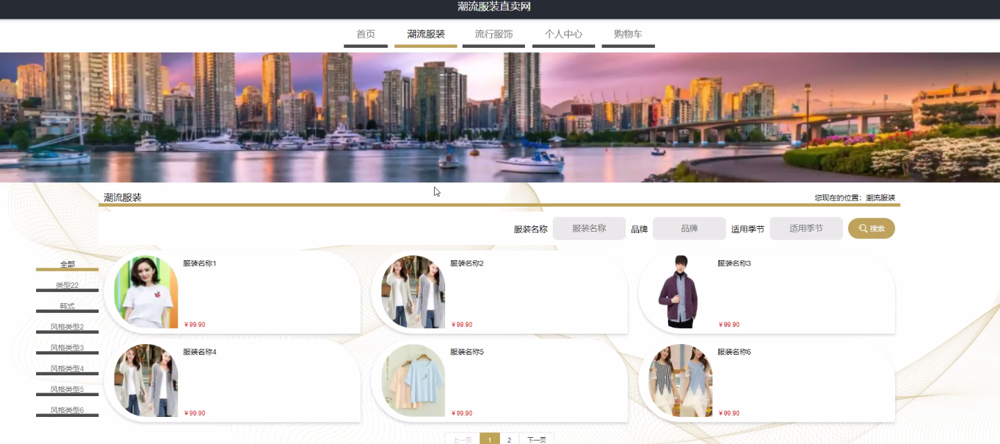

****本项目包含程序+源码+数据库+LW+调试部署环境，文末可获取一份本项目的java源码和数据库参考。****

## ******开题报告******

研究背景：
随着互联网的快速发展和电子商务的兴起，潮流服装行业也逐渐进入了线上销售的时代。潮流服装直卖网作为一种新型的销售模式，通过线上平台直接销售潮流服装，受到了越来越多消费者的关注和喜爱。然而，随着市场竞争的加剧，如何提供更好的用户体验、满足不同风格类型的需求，成为了潮流服装直卖网面临的重要问题。

研究意义：
对于潮流服装直卖网来说，深入研究其系统功能，探索用户、风格类型和潮流服装等方面的关系，具有重要的理论和实践意义。首先，通过分析用户需求和购买行为，可以为潮流服装直卖网提供精准的推荐服务，提高用户的购物体验和满意度。其次，研究不同风格类型的潮流服装在市场中的表现和受欢迎程度，可以为潮流服装直卖网提供产品策划和销售方向的参考。最后，通过研究潮流服装直卖网的系统功能，可以为行业提供参考和借鉴，推动整个潮流服装行业的发展。

研究目的： 本研究旨在深入探讨潮流服装直卖网的系统功能，包括用户、风格类型和潮流服装等方面的关系。具体目的如下：

  1. 分析用户需求和购买行为，了解用户对于潮流服装直卖网的偏好和期望，提高用户的购物体验和满意度。
  2. 研究不同风格类型的潮流服装在市场中的表现和受欢迎程度，为潮流服装直卖网提供产品策划和销售方向的参考。
  3. 探索潮流服装直卖网的系统功能，优化平台的设计和运营，提升整体竞争力。

研究内容： 本研究将重点围绕潮流服装直卖网的系统功能展开，主要包括以下几个方面：

  1. 用户分析：通过调查问卷、用户行为数据等方式，分析用户的特征、需求和购买行为，挖掘用户的潜在需求和购物偏好。
  2. 风格类型研究：对市场上常见的潮流服装风格进行分类和分析，了解不同风格类型的特点、受欢迎程度以及与用户需求的匹配度。
  3. 潮流服装分析：对潮流服装的设计、材质、品牌等方面进行研究，探索潮流服装在市场中的表现和受欢迎程度。
  4. 系统功能优化：通过对潮流服装直卖网的系统功能进行分析和评估，提出相应的优化方案，改进平台的设计和运营。

拟解决的主要问题：

  1. 如何提高潮流服装直卖网的用户体验和满意度？
  2. 不同风格类型的潮流服装在市场中的表现如何？如何根据用户需求进行产品策划和销售？
  3. 如何优化潮流服装直卖网的系统功能，提升整体竞争力？

研究方案和预期成果： 本研究将采用定量和定性相结合的方法，包括问卷调查、数据分析、案例研究等。预期的研究成果包括：

  1. 对潮流服装直卖网用户需求和购买行为的深入理解，为平台提供精准的推荐服务和个性化定制方案。
  2. 对不同风格类型的潮流服装在市场中的表现和受欢迎程度的研究结果，为平台提供产品策划和销售方向的参考。
  3. 对潮流服装直卖网系统功能的优化方案，提升平台的设计和运营效果，增强竞争力。

进度安排：

2022年9月至10月：需求分析和规划，进行用户需求调研和分析，确定系统功能和目标。

2022年11月至2023年1月：系统设计和开发，完成系统架构设计和技术选型，并开始编写代码。

2023年2月至3月：测试和优化，进行单元测试和集成测试，修复问题并优化系统性能。

2023年4月至5月：文档编写和培训，编写用户手册和系统文档，并进行相关人员的培训。

2023年5月：上线部署和维护，将系统部署到生产环境中，并定期进行维护和升级。

参考文献：

[1]王振华.SpringBoot在教学效果评估系统中的应用[J].电子技术,2023,(05):67-69.

[2]王明泉.基于SpringBoot远程热部署的探索和应用[J].信息与电脑(理论版),2023,(07):1-4.

[3]王亚东,李晓霞,陈强强,剡美娜.基于SpringBoot的需求发布平台设计[J].信息与电脑(理论版),2023,(01):105-107.

[4]陈新府豪.基于SpringBoot和Vue框架的创新方法推理系统的设计与实现[D].导师：黄静.浙江理工大学,2022.

[5]霍福华,韩慧.基于SpringBoot微服务架构下前后端分离的MVVM模型[J].电子技术与软件工程,2022,(01):73-76.

[6]韩策,张娜,王松亭,张凯,何方,袁峰.SpringBoot OPC客户端设计与研究[J].电子世界,2021,(19):25-26.

****以上是本项目程序开发之前开题报告内容，最终成品以下面界面为准，大家可以酌情参考使用。要源码参考请在文末进行获取！！****

## ******本项目的界面展示******

