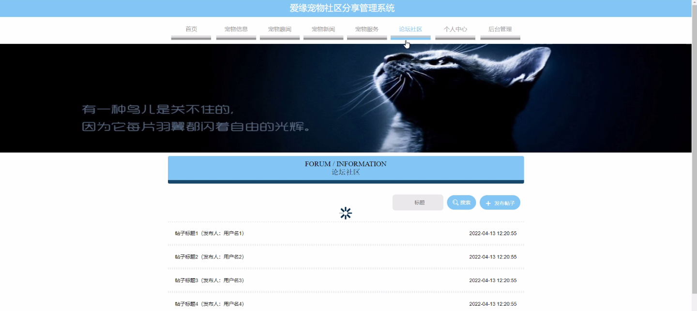
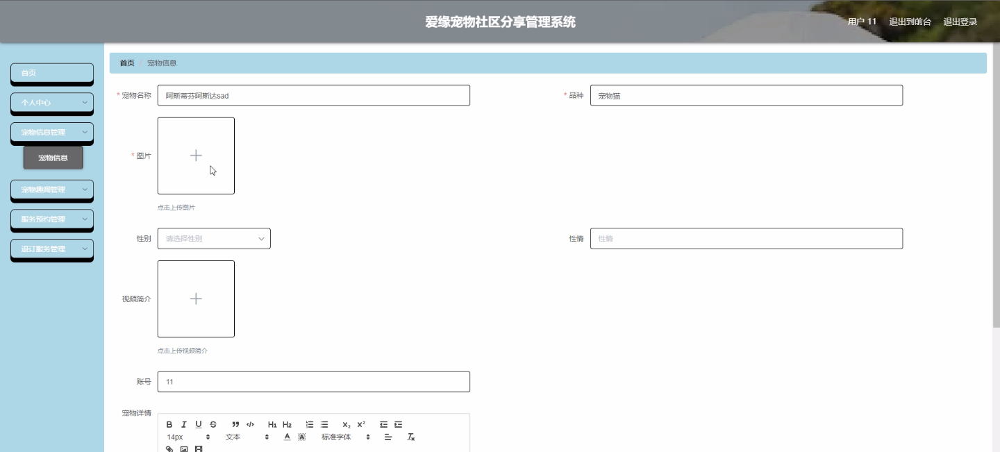
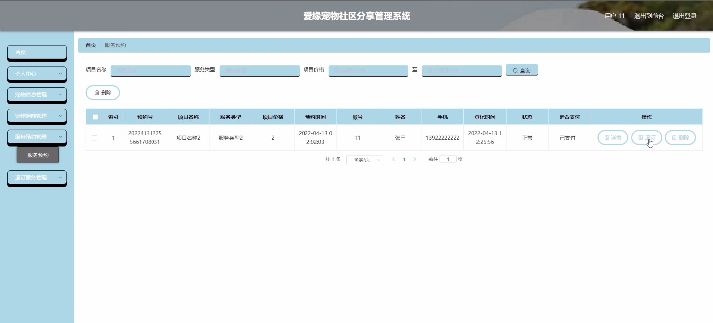
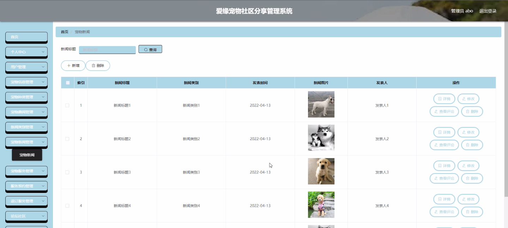
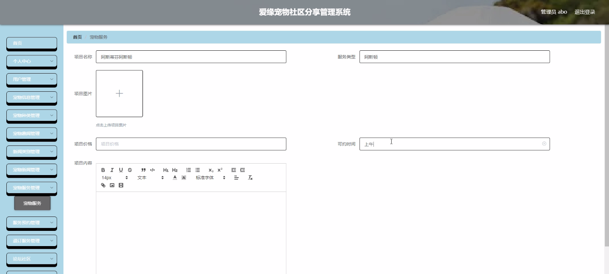
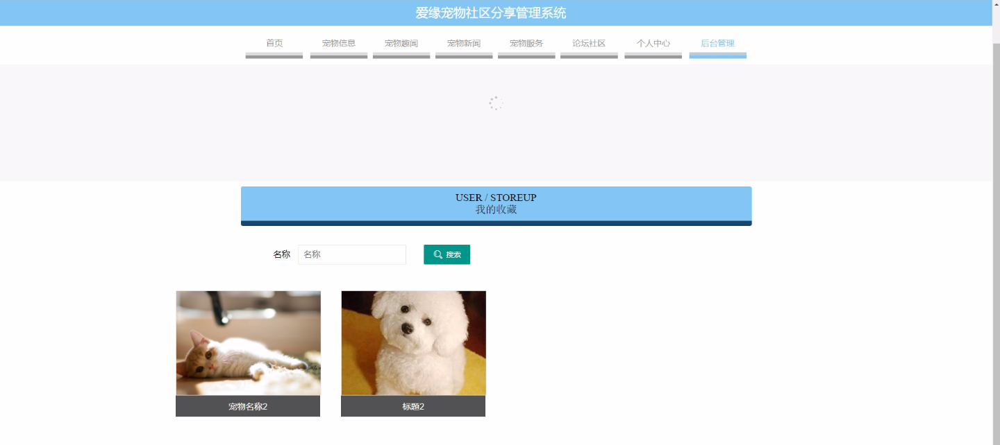

****本项目包含程序+源码+数据库+LW+调试部署环境，文末可获取一份本项目的java源码和数据库参考。****

## ******开题报告******

研究背景：
随着社会经济的发展和人们生活水平的提高，宠物在人们的生活中扮演着越来越重要的角色。然而，目前市场上缺乏一个专业的、综合性的宠物社区分享管理系统，以满足宠物主人们对于宠物信息、服务和交流的需求。因此，开发一个功能完善、用户友好的宠物社区分享管理系统具有重要的现实意义。

研究意义：
宠物社区分享管理系统的开发不仅可以方便宠物主人们获取各种宠物相关信息，还能促进宠物主人之间的交流与互动，提供宠物服务预约等功能，为宠物主人们提供全方位的宠物管理服务。此外，该系统还可以为宠物行业从业者提供一个广阔的平台，推动宠物行业的发展和创新。

研究目的：
本研究旨在开发一款功能完善、易于使用的宠物社区分享管理系统，通过整合各类宠物相关信息和服务，为宠物主人们提供便捷的宠物管理平台，提高宠物主人们的生活质量和宠物养育体验。

研究内容：
本研究的主要内容包括以下系统功能：用户管理、宠物信息管理、宠物种类管理、宠物趣闻管理、新闻类别管理、宠物新闻管理、宠物服务管理、服务预约管理、退订服务管理等。通过这些功能的整合和优化，实现一个全面、高效的宠物社区分享管理系统。

拟解决的主要问题：

  1. 宠物主人们在获取宠物相关信息时面临信息分散、不全面的问题；
  2. 宠物主人们在寻找宠物服务和预约服务时存在不便利性；
  3. 宠物主人们在与其他宠物主人交流和互动时缺乏平台和渠道。

研究方案：
本研究将采用软件开发方法，结合用户需求调研和市场分析，设计并开发一款基于Web或移动端的宠物社区分享管理系统。通过前后端技术的结合，构建一个稳定、安全、易用的系统，并提供完善的用户界面和功能模块。

预期成果：
预计本研究将开发出一款功能齐全、操作简便的宠物社区分享管理系统，能够满足宠物主人们对于宠物信息、服务和交流的需求。该系统将提供全面的宠物管理功能，方便宠物主人们获取各类宠物相关信息、预约宠物服务，并促进宠物主人之间的交流与互动。同时，该系统还将为宠物行业从业者提供一个广阔的平台，推动宠物行业的发展和创新。

进度安排：

2022年9月至10月：需求分析和规划，明确系统功能和目标，制定项目计划。

2022年11月至2023年1月：系统设计和编码，完成详细的系统设计并开始编写代码。

2023年2月至3月：用户界面开发和数据库开发，开发用户友好的界面和设计数据库结构。

2023年4月至5月：功能测试、文档编写和上线部署，对系统进行全面的功能测试并编写用户手册。

2023年5月：维护和升级，定期对系统进行维护和升级，修复bug和添加新功能。

参考文献：

[1]邱小群,邓丽艳,陈海潮.基于B/S的信息管理系统设计和实现[J].信息与电脑(理论版),2022,(20):146-148.

[2]谢霜.基于Java技术的网络管理体系结构的应用[J].网络安全技术与应用,2022,(10):14-15.

[3]宋锦华.高职院校Java程序设计课程改革研究[J].科技视界,2022,(20):133-135.

[4]曹嵩彭,王鹏宇.浅析Java语言在软件开发中的应用[J].信息记录材料,2022,(03):114-116.

[5]朱澈,余俊达.武汉东湖学院.基于Java的软硬件信息管理系统V1.0[Z].项目立项编号.鉴定单位.鉴定日期:

****以上是本项目程序开发之前开题报告内容，最终成品以下面界面为准，大家可以酌情参考使用。要源码参考请在文末进行获取！！****

## ******本项目的界面展示******

