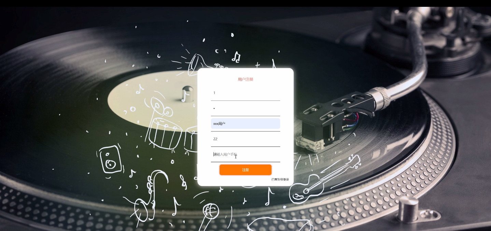
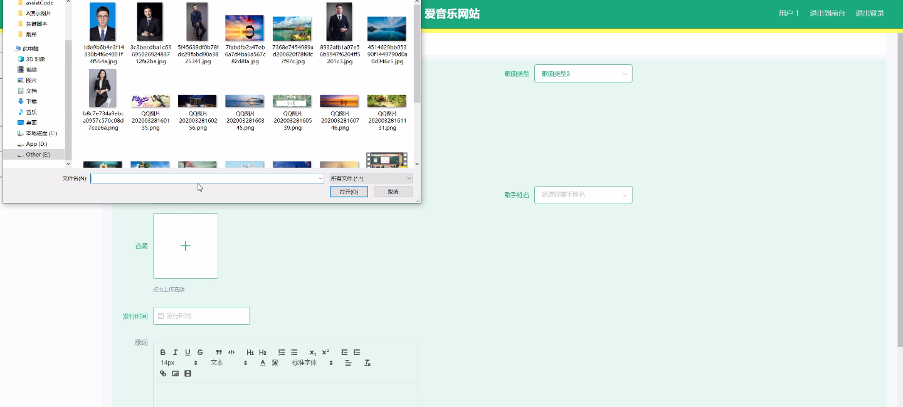
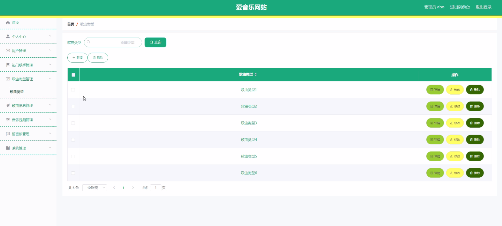
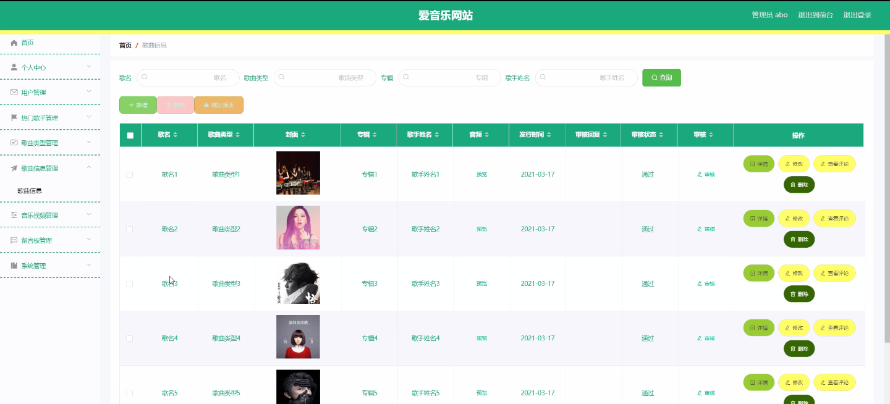
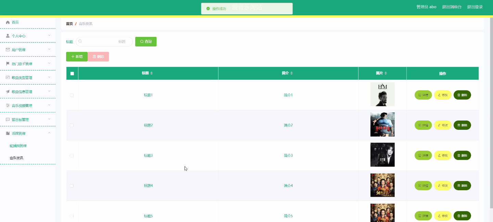
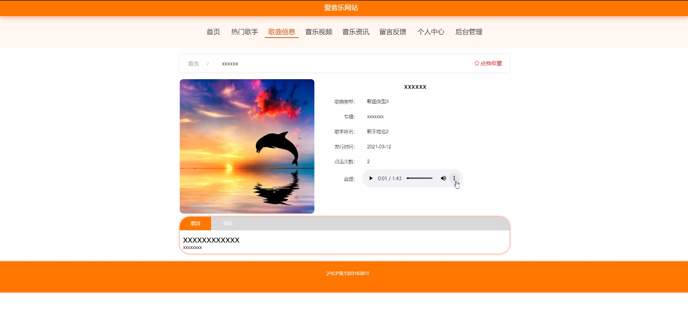

****本项目包含程序+源码+数据库+LW+调试部署环境，文末可获取一份本项目的java源码和数据库参考。****

## ******开题报告******

研究背景：
随着互联网的快速发展，音乐产业也进入了数字化时代。越来越多的人通过网络平台获取和分享音乐，音乐网站成为人们追求音乐享受的重要途径之一。然而，当前市场上存在着大量的音乐网站，用户面临着选择困难和信息过载的问题。因此，有必要对音乐网站进行深入研究，以提供更好的用户体验和满足用户需求。

研究意义：
本研究旨在探索音乐网站的设计与优化，以提高用户的使用体验和满意度。通过对音乐网站的功能、内容和交互方式进行分析和研究，可以为音乐网站的开发者和运营者提供有针对性的建议和指导，从而提升音乐网站的竞争力和用户粘性。同时，研究结果还可以为音乐产业的发展提供参考，促进音乐资源的传播和推广。

研究目的：
本研究的目的是通过对音乐网站的研究，深入了解用户需求和行为特征，探索如何提供更好的音乐服务和用户体验。具体目标包括：1.分析用户对音乐网站的需求和期望，了解他们在使用过程中的痛点和问题；2.研究不同热门歌手、歌曲类型和音乐视频对用户的吸引力和影响因素；3.探索如何提供个性化推荐和定制化服务，满足用户多样化的音乐偏好和需求。

研究内容： 本研究将围绕以下系统功能展开研究：

  1. 用户：分析用户的特征、行为和需求，包括年龄、性别、地域等方面的差异，以及用户在音乐网站上的注册、登录、搜索、收藏等操作行为。
  2. 热门歌手：研究热门歌手对用户的吸引力和影响因素，包括歌手的知名度、曲风、音乐作品质量等方面的因素，并通过数据分析和用户调研来验证研究结果。
  3. 歌曲类型：探索不同歌曲类型对用户的吸引力和影响因素，包括流行、摇滚、民谣等不同类型的音乐，以及用户对不同类型音乐的喜好和偏好。
  4. 歌曲信息：研究歌曲的基本信息，包括歌曲名称、演唱者、作词作曲等方面的内容，以及用户对歌曲信息的搜索和浏览行为。
  5. 音乐视频：分析音乐视频在音乐网站中的重要性和影响力，探索用户对音乐视频的需求和喜好，并研究如何提供高质量的音乐视频服务。

拟解决的主要问题：

  1. 如何提高音乐网站的用户体验和满意度？
  2. 如何根据用户的特征和需求，提供个性化推荐和定制化服务？
  3. 如何增加热门歌手和歌曲类型的吸引力，提升用户对其的关注度和喜爱程度？
  4. 如何优化歌曲信息的展示和搜索功能，提供更便捷的歌曲查询和浏览方式？
  5. 如何提供高质量的音乐视频服务，满足用户对音乐视频的需求和期望？

研究方案和预期成果：
本研究将采用综合性的研究方法，包括文献调研、数据分析、用户调研等。通过对音乐网站的功能和内容进行分析和评估，结合用户需求和行为特征，提出相应的优化方案和建议。预期成果包括：1.针对音乐网站的设计和改进方案；2.用户需求和行为特征的分析报告；3.热门歌手和歌曲类型的影响因素研究结果；4.个性化推荐和定制化服务的实施方案；5.音乐视频服务的优化策略。这些成果将为音乐网站的开发者和运营者提供有价值的参考和指导，促进音乐网站的发展和创新。

新话题

进度安排：

2022年9月至10月：开题报告编写和提交，完成开题报告的撰写并提交给指导教师进行审核。

2022年11月至2023年1月：系统设计和开发，根据开题报告的要求，进行系统设计和编码工作。

2023年2月至3月：论文撰写和初稿完成，开始撰写论文，并在这个阶段完成论文的初稿。

2023年4月至5月：论文修改和最终定稿，根据指导教师的意见对论文进行修改，并完成最终的定稿。

2023年5月：论文答辩和提交，参加论文答辩并根据答辩结果进行修改，最后将论文提交给学院或学校。

参考文献：

[1]喻佳,吴丹新.基于SpringBoot的Web快速开发框架[J].电脑编程技巧与维护,2021,(09):31-33.

[2]李鹏.基于SpringBoot快速开发平台的实现[J].电子技术与软件工程,2021,(12):36-37.

[3]叶开平,蔡维晟,陈家敏,邓斯妮.基于SpringBoot的综测可视化管理系统的研究与设计[J].电脑知识与技术,2021,(12):100-104.

[4]江健锋,徐振平.Springboot最小系统的设计与实现[J].电脑知识与技术,2021,(04):62-63.

[5]赵炯,司圣杰,周奇才,熊肖磊.通用信息获取系统设计与实现[J].起重运输机械,2020,(16):89-97.

[6]吴英宾.一种内外网数据交互系统的设计与实现[J].软件工程,2020,(08):25-27.

****以上是本项目程序开发之前开题报告内容，最终成品以下面界面为准，大家可以酌情参考使用。要源码参考请在文末进行获取！！****

## ******本项目的界面展示******

