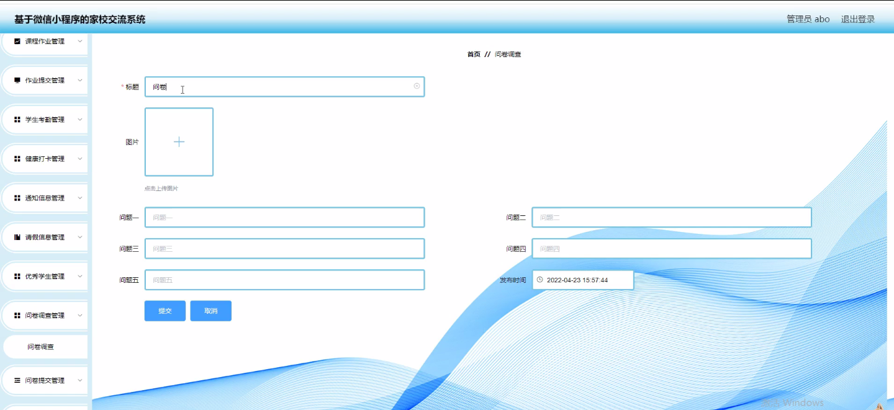
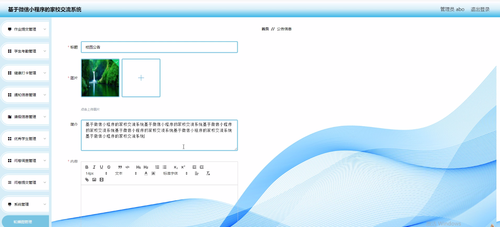
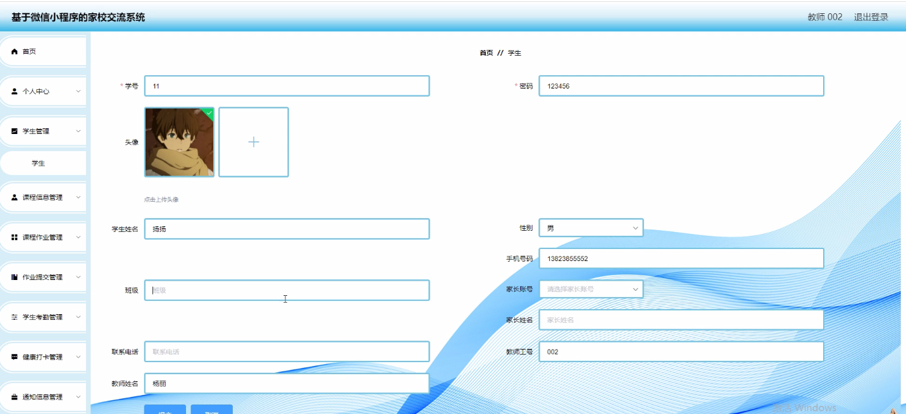
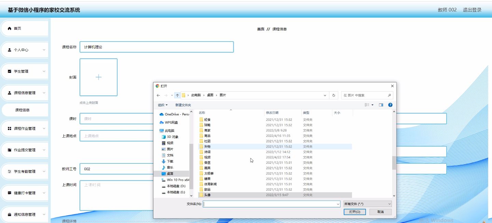
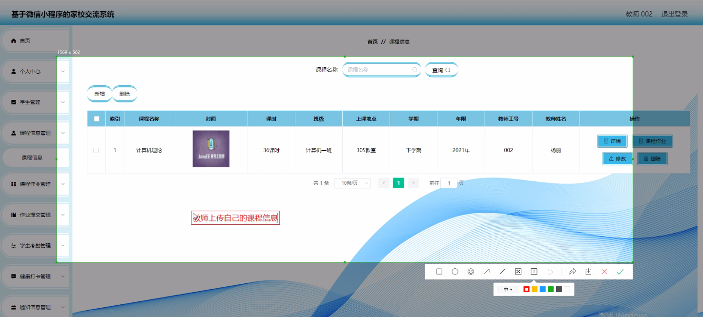
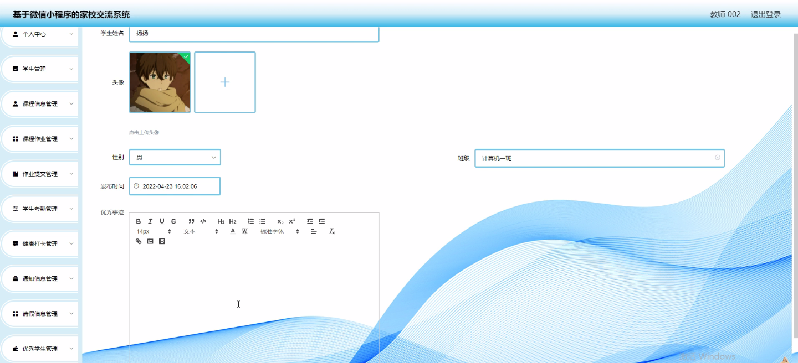

****本项目包含程序+源码+数据库+LW+调试部署环境，文末可获取一份本项目的java源码和数据库参考。****

## ******开题报告******

研究背景：
随着信息技术的不断发展和应用，教育管理系统在学校教育管理中起到了重要的作用。传统的教育管理方式已经无法满足现代学校管理的需求，需要借助信息化手段来提高教育管理的效率和质量。班得乐是一种基于互联网的教育管理系统，它集成了学生、家长、教师等多个角色的功能模块，可以实现课程信息管理、作业管理、考勤管理、健康打卡、通知信息发布等功能。然而，在实际应用中，仍存在一些问题和挑战，因此有必要对班得乐进行深入研究，以进一步完善其功能和提升其应用价值。

研究意义：
班得乐作为一种教育管理系统，具有重要的实践意义和推广价值。通过对班得乐进行研究，可以深入了解其在教育管理中的应用情况和效果，为学校教育管理的改进和优化提供参考依据。同时，研究班得乐还可以探索教育信息化发展的新路径和新模式，为其他类似系统的设计和开发提供借鉴和参考。此外，研究班得乐还可以促进学校与家长、学生之间的有效沟通和协作，提高教育质量和学生综合素质的培养。

研究目的：
本研究旨在通过对班得乐的深入研究，探索其在教育管理中的应用效果和存在的问题，并提出相应的改进和优化方案。具体目标包括：1.分析班得乐在学校教育管理中的应用情况和效果；2.识别并解决班得乐存在的问题和挑战；3.提出班得乐功能模块的改进和优化方案；4.评估改进后的班得乐系统的应用效果和价值。

研究内容： 本研究将围绕班得乐系统展开，主要研究内容包括以下几个方面：

  1. 学生管理功能：分析学生信息管理、学生成绩管理、学生考勤管理等功能的实际应用情况和效果，探索如何提高学生管理的效率和质量。

  2. 家长管理功能：研究家长与学校之间的沟通和协作方式，分析家长管理功能在促进家校合作、提高教育质量方面的作用和效果。

  3. 教师管理功能：探索教师管理功能在课程信息管理、作业管理、评价与反馈等方面的应用情况和效果，提出相应的改进和优化方案。

  4. 课程信息管理功能：研究课程信息管理的流程和方法，分析其对学校教育管理的支持作用和应用效果。

  5. 作业管理功能：分析作业管理功能在布置、提交、批改等方面的应用情况和效果，提出改进和优化建议。

拟解决的主要问题： 在研究过程中，将重点解决以下几个问题：

  1. 班得乐系统在实际应用中存在的问题和挑战是什么？
  2. 如何提高班得乐系统的用户体验和易用性？
  3. 如何优化班得乐系统的功能模块，以满足不同角色的需求？
  4. 如何提高班得乐系统的数据安全性和隐私保护能力？
  5. 如何评估改进后的班得乐系统的应用效果和价值？

研究方案和预期成果：
本研究将采用文献研究、实地调研、问卷调查等方法，收集和分析班得乐系统的相关数据和用户反馈。在此基础上，提出改进和优化方案，并进行系统设计和开发。预期成果包括改进后的班得乐系统原型和相应的研究报告，以及对改进后系统的应用效果和价值进行评估和验证。

进度安排：

2022年9月至10月：开题报告编写和提交，完成开题报告的撰写并提交给指导教师进行审核。

2022年11月至2023年1月：系统设计和开发，根据开题报告的要求，进行系统设计和编码工作。

2023年2月至3月：论文撰写和初稿完成，开始撰写论文，并在这个阶段完成论文的初稿。

2023年4月至5月：论文修改和最终定稿，根据指导教师的意见对论文进行修改，并完成最终的定稿。

2023年5月：论文答辩和提交，参加论文答辩并根据答辩结果进行修改，最后将论文提交给学院或学校。

参考文献：

[1]喻佳,吴丹新.基于SpringBoot的Web快速开发框架[J].电脑编程技巧与维护,2021,(09):31-33.

[2]李鹏.基于SpringBoot快速开发平台的实现[J].电子技术与软件工程,2021,(12):36-37.

[3]叶开平,蔡维晟,陈家敏,邓斯妮.基于SpringBoot的综测可视化管理系统的研究与设计[J].电脑知识与技术,2021,(12):100-104.

[4]江健锋,徐振平.Springboot最小系统的设计与实现[J].电脑知识与技术,2021,(04):62-63.

[5]赵炯,司圣杰,周奇才,熊肖磊.通用信息获取系统设计与实现[J].起重运输机械,2020,(16):89-97.

[6]吴英宾.一种内外网数据交互系统的设计与实现[J].软件工程,2020,(08):25-27.

****以上是本项目程序开发之前开题报告内容，最终成品以下面界面为准，大家可以酌情参考使用。要源码参考请在文末进行获取！！****

## ******本项目的界面展示******

