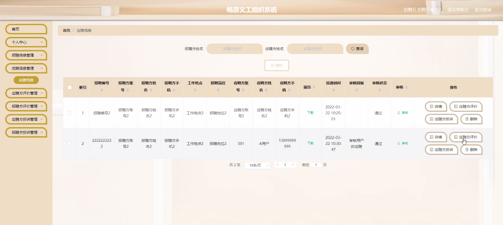
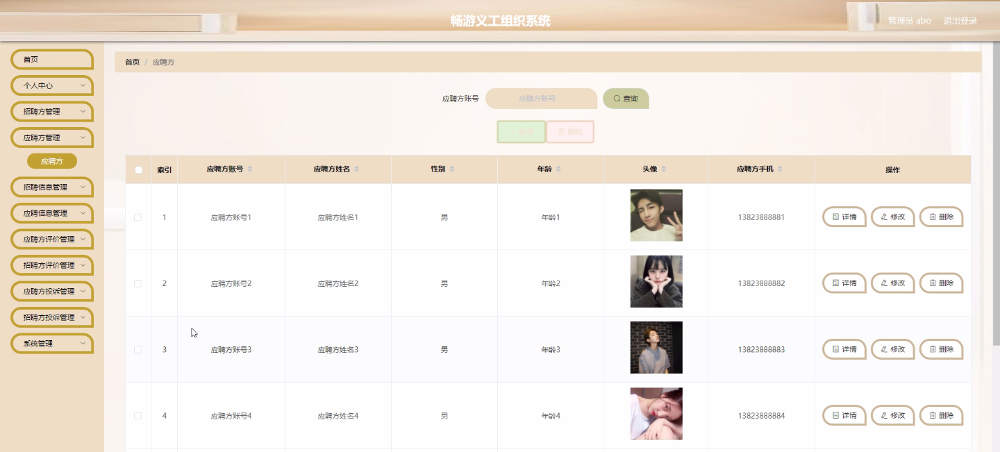

****本项目包含程序+源码+数据库+LW+调试部署环境，文末可获取一份本项目的java源码和数据库参考。****

## ******开题报告******

研究背景：
随着社会的发展和进步，义工活动在各个领域中起到了重要的作用。越来越多的人参与到义工活动中，志愿者组织也日益增多。然而，目前大部分义工组织仍然依赖传统的人工管理方式，存在信息不对称、效率低下等问题。因此，开发一个畅游义工组织系统具有重要的现实意义。

研究意义：
畅游义工组织系统的开发将为义工活动提供一个高效、便捷的管理平台，能够更好地满足招聘方和应聘方的需求。通过系统的建立和运行，可以提高义工活动的组织和管理效率，促进招聘方和应聘方之间的信息交流和沟通，推动义工活动的规范化和专业化发展。

研究目的：
本研究旨在开发一个畅游义工组织系统，以解决传统义工组织管理方式存在的问题。通过引入信息技术手段，提高义工活动的组织效率和管理水平，促进招聘方和应聘方之间的互动和合作，实现资源共享和优化利用，从而推动义工活动的可持续发展。

研究内容： 畅游义工组织系统的研究内容主要包括以下系统功能：

  1. 招聘方：招聘方可以发布招聘信息，包括岗位需求、工作时间、工作地点等，并进行招聘管理。
  2. 应聘方：应聘方可以浏览招聘信息，选择合适的义工岗位进行申请，并进行个人信息管理。
  3. 招聘信息：系统将收集和管理各个招聘方发布的招聘信息，提供给应聘方进行查看和选择。
  4. 应聘信息：系统将收集和管理应聘方的个人信息和申请记录，提供给招聘方进行筛选和评估。
  5. 应聘方评价：应聘方可以对参与的义工活动进行评价，为其他应聘方提供参考。
  6. 招聘方评价：招聘方可以对参与的义工人员进行评价，为其他招聘方提供参考。
  7. 应聘方投诉：应聘方可以向系统提交投诉，系统将及时处理并解决问题。
  8. 招聘方投诉：招聘方可以向系统提交投诉，系统将及时处理并解决问题。

拟解决的主要问题：
通过畅游义工组织系统的开发，可以解决传统义工组织管理方式存在的信息不对称、效率低下等问题。系统将提供一个集中管理和交流的平台，方便招聘方和应聘方之间的互动和合作，提高义工活动的组织效率和管理水平。

研究方案和预期成果：
本研究将采用软件开发方法，结合用户需求和功能设计，进行系统的开发和测试。预期成果包括畅游义工组织系统的设计与实现，能够满足招聘方和应聘方的需求，并提高义工活动的组织效率和管理水平。同时，预计该系统的推广和应用将促进义工活动的规范化和专业化发展，为社会公益事业的推进做出积极贡献。

进度安排：

2022年9月至10月：需求分析和规划，进行用户需求调研和分析，确定系统功能和目标。

2022年11月至2023年1月：系统设计和开发，完成系统架构设计和技术选型，并开始编写代码。

2023年2月至3月：测试和优化，进行单元测试和集成测试，修复问题并优化系统性能。

2023年4月至5月：文档编写和培训，编写用户手册和系统文档，并进行相关人员的培训。

2023年5月：上线部署和维护，将系统部署到生产环境中，并定期进行维护和升级。

参考文献：

[1]王振华.SpringBoot在教学效果评估系统中的应用[J].电子技术,2023,(05):67-69.

[2]王明泉.基于SpringBoot远程热部署的探索和应用[J].信息与电脑(理论版),2023,(07):1-4.

[3]王亚东,李晓霞,陈强强,剡美娜.基于SpringBoot的需求发布平台设计[J].信息与电脑(理论版),2023,(01):105-107.

[4]陈新府豪.基于SpringBoot和Vue框架的创新方法推理系统的设计与实现[D].导师：黄静.浙江理工大学,2022.

[5]霍福华,韩慧.基于SpringBoot微服务架构下前后端分离的MVVM模型[J].电子技术与软件工程,2022,(01):73-76.

[6]韩策,张娜,王松亭,张凯,何方,袁峰.SpringBoot OPC客户端设计与研究[J].电子世界,2021,(19):25-26.

****以上是本项目程序开发之前开题报告内容，最终成品以下面界面为准，大家可以酌情参考使用。要源码参考请在文末进行获取！！****

## ******本项目的界面展示******

