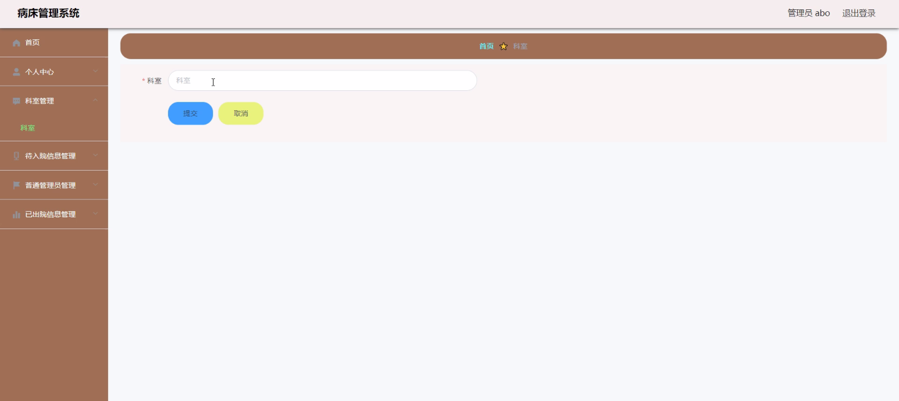

****本项目包含程序+源码+数据库+LW+调试部署环境，文末可获取一份本项目的java源码和数据库参考。****

## ******开题报告******

研究背景：
随着医疗技术的不断发展和人口老龄化趋势的加剧，病床管理成为了医院管理中一个重要而复杂的问题。传统的手工记录和人工安排病床的方式已经无法满足日益增长的患者需求和医院管理的高效性要求。因此，建立一个科学、智能的病床管理系统迫在眉睫。

研究意义：
病床管理系统的建立对于提高医院病床利用率、优化资源配置、提升医疗服务质量具有重要意义。通过引入信息化技术和智能算法，可以实现病床的动态调度和合理分配，减少患者等待时间，提高医疗资源的利用效率。同时，病床管理系统还可以提供全面的病床信息和患者入院出院情况，为医院管理者提供决策支持，帮助其更好地进行医院规划和资源配置。

研究目的：
本研究旨在设计和开发一套完善的病床管理系统，以解决传统病床管理方式存在的问题。通过引入信息化技术和智能算法，实现病床的动态调度和合理分配，提高医院病床利用率和医疗服务质量。同时，通过系统的数据分析和决策支持功能，帮助医院管理者进行科学决策，优化资源配置，提升医院管理水平。

研究内容： 本研究的主要内容包括以下几个方面：

  1. 已出院信息管理：建立患者出院信息的数据库，记录患者出院时间、床位号等相关信息，实现对已出院病床的及时释放和重新分配。

  2. 待入院信息管理：建立患者待入院信息的数据库，记录患者预约入院时间、病情等相关信息，实现对待入院患者的排队管理和床位预留。

  3. 普通管理员功能：为医院普通管理员提供操作界面，实现对病床信息的查询、录入、修改等功能，确保病床信息的准确性和及时更新。

  4. 科室功能：为各个科室提供病床申请和调度功能，根据患者病情和科室需求，自动分配合适的病床，并实时更新病床状态。

拟解决的主要问题： 本研究旨在解决传统病床管理方式存在的以下主要问题：

  1. 病床利用率低：传统的手工记录和人工安排容易出现信息不准确、床位滞留等问题，导致病床利用率低下。

  2. 患者等待时间长：缺乏科学的病床调度和分配机制，患者往往需要长时间等待才能入院，影响了医疗服务质量。

  3. 资源配置不均衡：传统的病床管理方式难以实现资源的合理配置，导致一些科室病床紧张，而其他科室病床闲置。

研究方案和预期成果：
本研究将采用信息化技术和智能算法相结合的方法，设计和开发一套完善的病床管理系统。通过数据的集中管理和智能算法的应用，实现病床的动态调度和合理分配，提高病床利用率和医疗服务质量。同时，系统将提供全面的病床信息和患者入院出院情况，为医院管理者提供决策支持，帮助其进行科学决策和资源配置。预期成果包括提高病床利用率、减少患者等待时间、优化资源配置、提升医院管理水平等。

进度安排：

2022年9月至10月：需求分析和规划，进行用户需求调研和分析，确定系统功能和目标。

2022年11月至2023年1月：系统设计和开发，完成系统架构设计和技术选型，并开始编写代码。

2023年2月至3月：测试和优化，进行单元测试和集成测试，修复问题并优化系统性能。

2023年4月至5月：文档编写和培训，编写用户手册和系统文档，并进行相关人员的培训。

2023年5月：上线部署和维护，将系统部署到生产环境中，并定期进行维护和升级。

参考文献：

[1]王振华.SpringBoot在教学效果评估系统中的应用[J].电子技术,2023,(05):67-69.

[2]王明泉.基于SpringBoot远程热部署的探索和应用[J].信息与电脑(理论版),2023,(07):1-4.

[3]王亚东,李晓霞,陈强强,剡美娜.基于SpringBoot的需求发布平台设计[J].信息与电脑(理论版),2023,(01):105-107.

[4]陈新府豪.基于SpringBoot和Vue框架的创新方法推理系统的设计与实现[D].导师：黄静.浙江理工大学,2022.

[5]霍福华,韩慧.基于SpringBoot微服务架构下前后端分离的MVVM模型[J].电子技术与软件工程,2022,(01):73-76.

[6]韩策,张娜,王松亭,张凯,何方,袁峰.SpringBoot OPC客户端设计与研究[J].电子世界,2021,(19):25-26.

****以上是本项目程序开发之前开题报告内容，最终成品以下面界面为准，大家可以酌情参考使用。要源码参考请在文末进行获取！！****

## ******本项目的界面展示******

