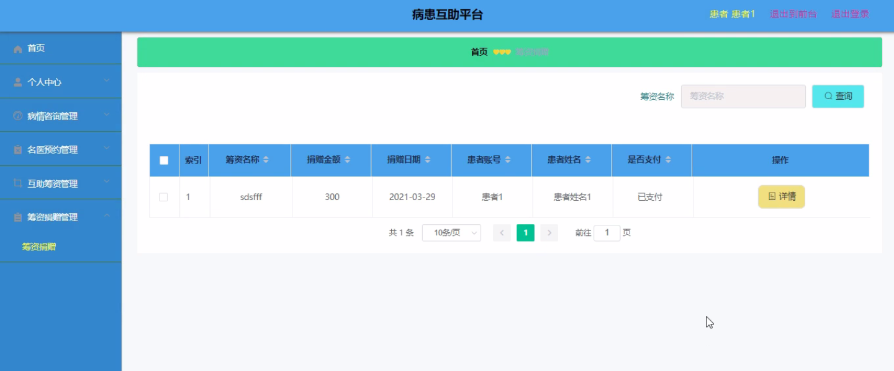

****本项目包含程序+源码+数据库+LW+调试部署环境，文末可获取一份本项目的java源码和数据库参考。****

## ******开题报告******

研究背景：
随着社会的发展和人们生活水平的提高，健康问题逐渐成为人们关注的焦点。然而，面对疾病的困扰，许多患者往往感到无助和孤立。传统的医疗体系存在诸多问题，如名医资源分布不均、信息不对称等，使得患者在求医过程中遇到了很多困难。因此，建立一个病患互助平台具有重要的现实意义。

研究意义：
病患互助平台的建立可以有效解决患者在求医过程中所面临的问题。通过整合患者、名医、公告信息、病情咨询、名医预约、互助筹资、筹资捐赠等系统功能，该平台能够提供全方位的医疗服务和支持，帮助患者更好地应对疾病挑战，增强他们的治疗信心和自我管理能力。同时，该平台也能够促进名医资源的合理利用和分配，提高医疗资源的利用效率，实现优质医疗资源的共享，推动医疗服务的公平化。

研究目的：
本研究旨在通过构建病患互助平台，提供一个全新的医疗服务模式，以改善患者的求医体验和治疗效果。具体目标包括：一是整合名医资源，为患者提供更便捷的名医预约服务；二是建立公告信息系统，及时发布医疗资讯和健康教育知识，提高患者的健康素养；三是设立病情咨询功能，为患者提供在线咨询服务，解答他们的疑问和困惑；四是开展互助筹资和筹资捐赠活动，帮助患者减轻经济负担，促进社会爱心的传递。

研究内容： 根据系统功能，研究内容主要包括以下几个方面：

  1. 患者系统：该系统将提供患者个人信息管理、病历记录、用药提醒等功能，帮助患者更好地管理自己的健康状况。

  2. 名医系统：该系统将整合名医资源，提供名医在线咨询、名医预约等服务，使患者能够更方便地获得专业医疗建议和治疗方案。

  3. 公告信息系统：该系统将发布医疗资讯、健康教育知识等公告信息，帮助患者及时了解最新的医疗动态，提高他们的健康意识和自我管理能力。

  4. 病情咨询系统：该系统将提供在线咨询服务，患者可以通过平台与医生进行沟通交流，解答他们的疑问和困惑。

  5. 名医预约系统：该系统将提供名医预约服务，患者可以根据自己的需求选择合适的名医进行就诊，避免排队等待和资源浪费。

  6. 互助筹资系统：该系统将开展互助筹资活动，为患者提供经济援助，减轻他们的经济负担，同时也促进社会爱心的传递。

  7. 筹资捐赠系统：该系统将设立筹资捐赠功能，吸引社会各界爱心人士参与，为患者筹集医疗费用，共同关爱患者的健康。

拟解决的主要问题：
通过病患互助平台的建立，本研究旨在解决以下主要问题：一是患者求医过程中遇到的信息不对称和名医资源分布不均等问题；二是患者在治疗过程中面临的经济困难和心理压力等问题；三是社会公众对于疾病知识和医疗服务的认知和参与度不高等问题。

研究方案和预期成果：
本研究将采用文献调研、问卷调查、数据分析等方法，构建病患互助平台，并进行系统功能的设计和开发。预期成果包括：一是建立一个完善的病患互助平台，提供全方位的医疗服务和支持；二是促进名医资源的合理利用和分配，提高医疗资源的利用效率；三是减轻患者的经济负担，增强他们的治疗信心和自我管理能力；四是推动社会爱心的传递，形成良好的医患关系和社会共识。

进度安排：

2022年9月至10月：开题报告编写和提交，完成开题报告的撰写并提交给指导教师进行审核。

2022年11月至2023年1月：系统设计和开发，根据开题报告的要求，进行系统设计和编码工作。

2023年2月至3月：论文撰写和初稿完成，开始撰写论文，并在这个阶段完成论文的初稿。

2023年4月至5月：论文修改和最终定稿，根据指导教师的意见对论文进行修改，并完成最终的定稿。

2023年5月：论文答辩和提交，参加论文答辩并根据答辩结果进行修改，最后将论文提交给学院或学校。

参考文献：

[1]喻佳,吴丹新.基于SpringBoot的Web快速开发框架[J].电脑编程技巧与维护,2021,(09):31-33.

[2]李鹏.基于SpringBoot快速开发平台的实现[J].电子技术与软件工程,2021,(12):36-37.

[3]叶开平,蔡维晟,陈家敏,邓斯妮.基于SpringBoot的综测可视化管理系统的研究与设计[J].电脑知识与技术,2021,(12):100-104.

[4]江健锋,徐振平.Springboot最小系统的设计与实现[J].电脑知识与技术,2021,(04):62-63.

[5]赵炯,司圣杰,周奇才,熊肖磊.通用信息获取系统设计与实现[J].起重运输机械,2020,(16):89-97.

[6]吴英宾.一种内外网数据交互系统的设计与实现[J].软件工程,2020,(08):25-27.

****以上是本项目程序开发之前开题报告内容，最终成品以下面界面为准，大家可以酌情参考使用。要源码参考请在文末进行获取！！****

## ******本项目的界面展示******

