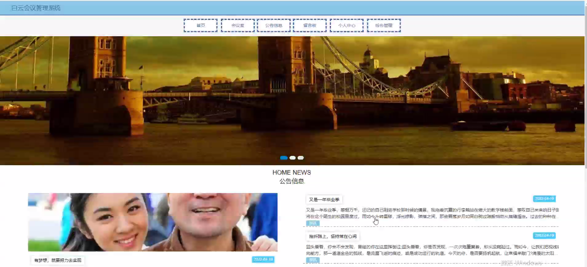

****本项目包含程序+源码+数据库+LW+调试部署环境，文末可获取一份本项目的java源码和数据库参考。****

## ******开题报告******

研究背景：
随着信息技术的快速发展和企业管理的不断提升，会议作为企业内部沟通和决策的重要方式，对于企业的运营和发展起着至关重要的作用。然而，在传统的会议管理中，存在着一些问题，如会议室资源的浪费、会议预约流程繁琐等，这些问题严重影响了会议效率和企业运营的顺畅性。因此，开发一个高效、智能的会议管理系统势在必行。

研究意义：
白云会议管理系统的研发与应用，将极大地提高企业会议管理的效率和质量，优化会议资源的利用，提升企业内部沟通和决策的效果。通过引入先进的信息技术手段，该系统可以实现会议室的智能预约、会议文件的集中管理、设备信息的维护和使用记录的追踪等功能，从而帮助企业实现会议管理的自动化、规范化和智能化。

研究目的：
本研究旨在开发一款功能完善、易用便捷的白云会议管理系统，通过深入分析企业内部会议管理的需求和痛点，设计出一套合理的系统架构和功能模块，并结合先进的信息技术手段，实现高效、智能的会议管理流程。通过该系统的应用，提升企业内部会议的效率和质量，为企业决策和运营提供有力的支持。

研究内容： 本研究的主要内容包括以下系统功能：部门管理、用户管理、会议室管理、会议室预约管理、会议文件管理、设备信息管理以及使用记录管理等。具体而言：

  1. 部门管理：建立企业内部部门的组织结构，实现部门间的协作和信息共享。
  2. 用户管理：对企业内部员工进行身份认证和权限管理，确保系统的安全性和可控性。
  3. 会议室管理：建立会议室的基本信息和资源情况，包括会议室的容量、设备配置等。
  4. 会议室预约管理：实现会议室的智能预约功能，包括预约时间、参会人员、会议主题等。
  5. 会议文件管理：集中管理会议相关的文件资料，方便会议参与者查阅和共享。
  6. 设备信息管理：记录会议室内各种设备的信息和状态，保障设备的正常运行和维护。
  7. 使用记录管理：追踪会议室的使用情况，包括会议开始时间、结束时间、参与人员等。

拟解决的主要问题：
通过白云会议管理系统的研发和应用，将解决传统会议管理中存在的一系列问题，如会议室资源浪费、会议预约流程繁琐、会议文件管理不便等。该系统将提供高效、智能的会议管理解决方案，优化会议资源的利用，简化会议预约流程，实现会议文件的集中管理，提升企业内部沟通和决策的效果。

研究方案和预期成果：
本研究将采用软件开发的方法，结合需求分析、系统设计和编码实现等步骤，开发出一款功能完善、易用便捷的白云会议管理系统。预期成果包括系统的设计文档、系统代码和可运行的软件系统。通过系统的实际应用和测试验证，预期可以提高企业会议管理的效率和质量，优化会议资源的利用，为企业内部沟通和决策提供更好的支持。

进度安排：

2022年9月至10月：需求分析和规划，明确系统功能和目标，制定项目计划。

2022年11月至2023年1月：系统设计和编码，完成详细的系统设计并开始编写代码。

2023年2月至3月：用户界面开发和数据库开发，开发用户友好的界面和设计数据库结构。

2023年4月至5月：功能测试、文档编写和上线部署，对系统进行全面的功能测试并编写用户手册。

2023年5月：维护和升级，定期对系统进行维护和升级，修复bug和添加新功能。

参考文献：

[1]邱小群,邓丽艳,陈海潮.基于B/S的信息管理系统设计和实现[J].信息与电脑(理论版),2022,(20):146-148.

[2]谢霜.基于Java技术的网络管理体系结构的应用[J].网络安全技术与应用,2022,(10):14-15.

[3]宋锦华.高职院校Java程序设计课程改革研究[J].科技视界,2022,(20):133-135.

[4]曹嵩彭,王鹏宇.浅析Java语言在软件开发中的应用[J].信息记录材料,2022,(03):114-116.

[5]朱澈,余俊达.武汉东湖学院.基于Java的软硬件信息管理系统V1.0[Z].项目立项编号.鉴定单位.鉴定日期:

****以上是本项目程序开发之前开题报告内容，最终成品以下面界面为准，大家可以酌情参考使用。要源码参考请在文末进行获取！！****

## ******本项目的界面展示******

