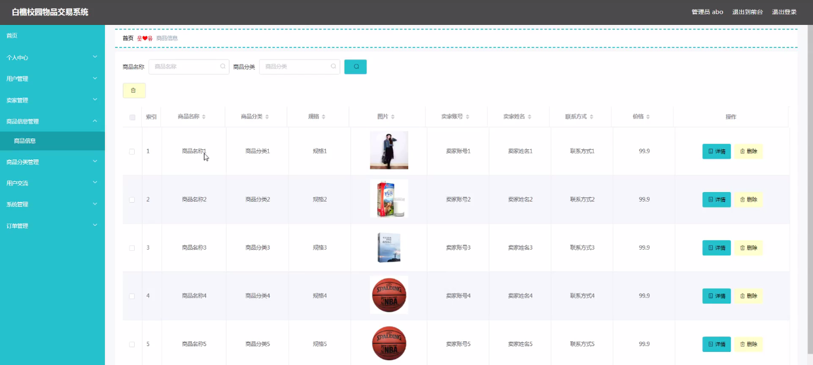
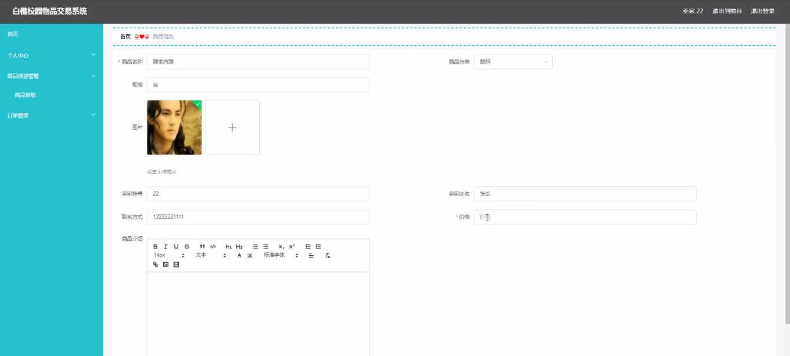

****本项目包含程序+源码+数据库+LW+调试部署环境，文末可获取一份本项目的java源码和数据库参考。****

## ******开题报告******

研究背景：
随着互联网的快速发展和普及，电子商务已经成为人们生活中不可或缺的一部分。然而，在校园内进行物品交易时，学生们仍然面临着一些问题和困扰。传统的线下交易方式存在信息不对称、安全风险高、交易效率低等诸多问题。因此，建立一个高效、安全、便捷的校园物品交易系统具有重要意义。

研究意义：
白樵校园物品交易系统的建立将为校园内的学生和卖家提供一个方便、可靠的交易平台。通过该系统，学生可以更轻松地找到自己需要的商品，并进行安全、快捷的交易。同时，卖家也能够更好地推广自己的商品，增加销售机会。这将促进校园内的物品流通，提升学生的购物体验，推动校园内的经济发展。

研究目的：
本研究旨在设计和开发一个基于白樵校园的物品交易系统，通过整合学生、卖家、商品信息和商品分类等系统功能，实现校园内物品交易的便捷化和安全化。通过该系统，学生可以方便地浏览、搜索和购买自己需要的商品，同时卖家也能够更好地管理和推广自己的商品。

研究内容： 本研究的主要内容包括以下几个方面：

  1. 学生功能：设计并实现学生用户的注册、登录、个人信息管理等功能，使学生能够方便地使用系统进行物品交易。

  2. 卖家功能：开发卖家用户的注册、登录、商品发布、订单管理等功能，提供给卖家一个简单易用的平台来管理自己的商品和交易信息。

  3. 商品信息功能：建立商品信息数据库，包括商品名称、描述、价格、库存等信息，为学生和卖家提供准确、详细的商品信息。

  4. 商品分类功能：设计合理的商品分类体系，使学生能够快速找到自己需要的商品，并提高交易效率。

拟解决的主要问题： 通过白樵校园物品交易系统的建立，我们将解决以下主要问题：

  1. 信息不对称问题：学生和卖家之间的信息不对称导致交易效率低下，我们将通过系统提供准确、详细的商品信息来解决这一问题。

  2. 安全风险问题：传统的线下交易存在安全风险，我们将通过系统提供的安全支付和交易评价机制来保障交易的安全性。

  3. 交易效率问题：传统的线下交易方式效率低下，我们将通过系统提供的快速搜索和分类功能来提高交易效率。

进度安排：

2022年9月至10月：开题报告编写和提交，完成开题报告的撰写并提交给指导教师进行审核。

2022年11月至2023年1月：系统设计和开发，根据开题报告的要求，进行系统设计和编码工作。

2023年2月至3月：论文撰写和初稿完成，开始撰写论文，并在这个阶段完成论文的初稿。

2023年4月至5月：论文修改和最终定稿，根据指导教师的意见对论文进行修改，并完成最终的定稿。

2023年5月：论文答辩和提交，参加论文答辩并根据答辩结果进行修改，最后将论文提交给学院或学校。

参考文献：

[1]喻佳,吴丹新.基于SpringBoot的Web快速开发框架[J].电脑编程技巧与维护,2021,(09):31-33.

[2]李鹏.基于SpringBoot快速开发平台的实现[J].电子技术与软件工程,2021,(12):36-37.

[3]叶开平,蔡维晟,陈家敏,邓斯妮.基于SpringBoot的综测可视化管理系统的研究与设计[J].电脑知识与技术,2021,(12):100-104.

[4]江健锋,徐振平.Springboot最小系统的设计与实现[J].电脑知识与技术,2021,(04):62-63.

[5]赵炯,司圣杰,周奇才,熊肖磊.通用信息获取系统设计与实现[J].起重运输机械,2020,(16):89-97.

[6]吴英宾.一种内外网数据交互系统的设计与实现[J].软件工程,2020,(08):25-27.

****以上是本项目程序开发之前开题报告内容，最终成品以下面界面为准，大家可以酌情参考使用。要源码参考请在文末进行获取！！****

## ******本项目的界面展示******

