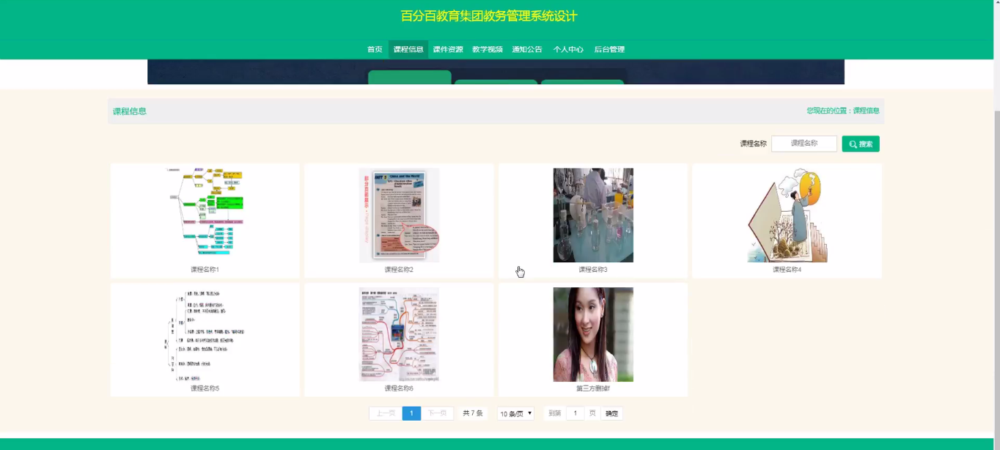

****本项目包含程序+源码+数据库+LW+调试部署环境，文末可获取一份本项目的java源码和数据库参考。****

## ******开题报告******

研究背景：
随着信息技术的不断发展和应用，教育行业也逐渐意识到信息化对于教学管理的重要性。传统的教务管理方式存在许多问题，如信息不及时、流程繁琐、数据难以统计等。因此，百分百教育集团决定设计一个教务管理系统，以提高教学管理的效率和质量。

研究意义：
百分百教育集团教务管理系统的设计具有重要的实践意义。首先，它可以优化教学管理流程，提高工作效率，减轻教师和学生的工作负担。其次，通过系统化的数据管理和统计分析，可以为教学决策提供科学依据，提升教学质量。此外，该系统还能够促进学校与家长之间的沟通和合作，形成良好的教育生态。

研究目的：
本研究旨在设计一个功能完善、易于操作的教务管理系统，以满足百分百教育集团的实际需求。通过该系统，教师可以方便地管理学生信息、布置作业、录入成绩等；学生可以及时获取课程信息、提交作业等；教育管理者可以实时监控教学进展、统计数据并进行分析。通过系统的应用，旨在提高教学管理效率和质量，为学生提供更好的教育服务。

研究内容：
本研究的主要内容包括以下系统功能：学生管理、教师管理、课件资源管理、教学视频管理、作业布置与提交、教师打卡管理、课程信息管理、学生成绩管理、团体成绩管理、报名课程管理等。通过对这些功能的设计和实现，实现教务管理的全面覆盖和集中化管理。

拟解决的主要问题：
本研究旨在解决传统教务管理方式存在的信息不及时、流程繁琐、数据难以统计等问题。通过引入教务管理系统，可以实现信息的实时更新和共享，简化管理流程，提高工作效率。同时，通过数据的集中管理和统计分析，可以为教学决策提供科学依据，提升教学质量。

研究方案和预期成果：
本研究将采用软件开发的方法，结合百分百教育集团的实际需求，设计并实现一个教务管理系统。通过需求分析、系统设计、编码实现和测试等步骤，最终完成一个功能完善、易于操作的教务管理系统。预期成果包括：提高教学管理效率和质量、优化教学流程、促进学校与家长之间的沟通和合作、为教学决策提供科学依据等。

进度安排：

2022年9月至10月：需求分析和规划，明确系统功能和目标，制定项目计划。

2022年11月至2023年1月：系统设计和编码，完成详细的系统设计并开始编写代码。

2023年2月至3月：用户界面开发和数据库开发，开发用户友好的界面和设计数据库结构。

2023年4月至5月：功能测试、文档编写和上线部署，对系统进行全面的功能测试并编写用户手册。

2023年5月：维护和升级，定期对系统进行维护和升级，修复bug和添加新功能。

参考文献：

[1]邱小群,邓丽艳,陈海潮.基于B/S的信息管理系统设计和实现[J].信息与电脑(理论版),2022,(20):146-148.

[2]谢霜.基于Java技术的网络管理体系结构的应用[J].网络安全技术与应用,2022,(10):14-15.

[3]宋锦华.高职院校Java程序设计课程改革研究[J].科技视界,2022,(20):133-135.

[4]曹嵩彭,王鹏宇.浅析Java语言在软件开发中的应用[J].信息记录材料,2022,(03):114-116.

[5]朱澈,余俊达.武汉东湖学院.基于Java的软硬件信息管理系统V1.0[Z].项目立项编号.鉴定单位.鉴定日期:

****以上是本项目程序开发之前开题报告内容，最终成品以下面界面为准，大家可以酌情参考使用。要源码参考请在文末进行获取！！****

## ******本项目的界面展示******

