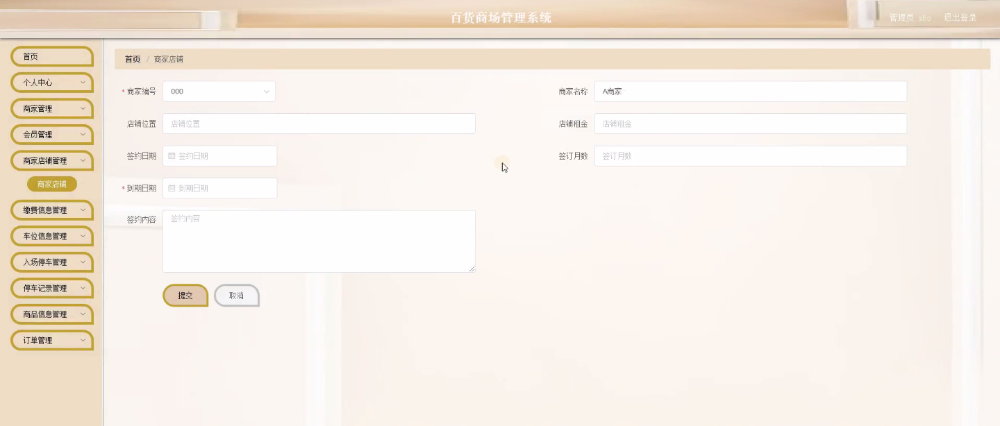
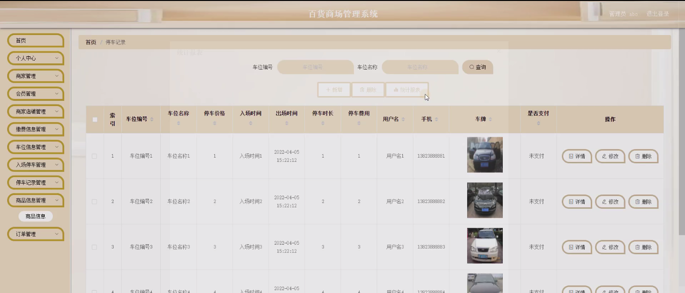
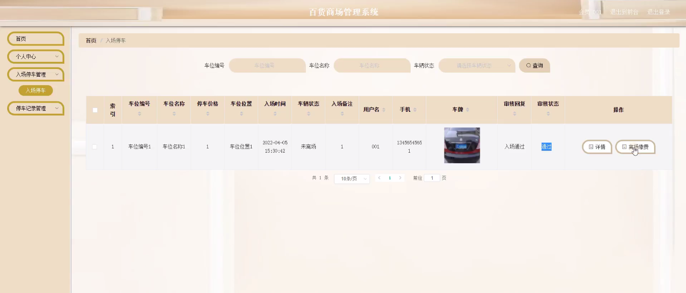

****本项目包含程序+源码+数据库+LW+调试部署环境，文末可获取一份本项目的java源码和数据库参考。****

## ******开题报告******

研究背景：
随着社会经济的快速发展和人们生活水平的提高，百货商场作为一种重要的购物场所，扮演着越来越重要的角色。然而，传统的百货商场管理方式已经无法满足现代消费者的需求，因此需要建立一个高效、智能化的百货商场管理系统来提升管理效率和服务质量。

研究意义：
百货商场管理系统的建立对于提升商场管理水平、优化资源配置、提高顾客满意度具有重要意义。通过引入先进的信息技术和管理方法，可以实现商家、会员、店铺、缴费信息、车位信息、停车记录、商品信息等多个功能的集成管理，从而提高运营效率，增加利润，促进商场的可持续发展。

研究目的：
本研究旨在设计和开发一套全面的百货商场管理系统，以满足现代商场管理的需求。通过该系统，商场管理者可以更好地掌握商家、会员、店铺、缴费信息、车位信息、停车记录、商品信息等相关数据，实现精确的资源调配和决策支持，提高商场的运营效率和竞争力。

研究内容：
本研究的主要内容包括商家管理、会员管理、商家店铺管理、缴费信息管理、车位信息管理、入场停车管理、停车记录管理、商品信息管理等系统功能。具体而言，商家管理模块将实现商家信息的录入、查询和统计分析；会员管理模块将实现会员信息的注册、积分管理和优惠活动推送；商家店铺管理模块将实现店铺租赁、装修和维护等功能；缴费信息管理模块将实现缴费记录的管理和统计；车位信息管理模块将实现车位预约和停车位管理；入场停车管理模块将实现车辆入场登记和停车场管理；停车记录管理模块将实现停车记录的查询和统计；商品信息管理模块将实现商品信息的录入、查询和促销管理等功能。

拟解决的主要问题：
通过建立百货商场管理系统，我们将解决传统商场管理方式中存在的一系列问题，如信息不透明、资源浪费、服务效率低下等。该系统将提供全面的数据管理和决策支持功能，帮助商场管理者更好地了解市场需求、优化资源配置、提高服务质量，从而实现商场的可持续发展。

研究方案和预期成果：
本研究将采用软件工程的方法，结合数据库技术、网络技术和人机交互技术，设计和开发一套全面的百货商场管理系统。预期成果包括一个功能完善、操作简便、性能稳定的系统原型，并通过实际应用验证其可行性和有效性。该系统的成功应用将为商场管理者提供科学决策依据，提高商场运营效率，增加利润，提升顾客满意度。

进度安排：

2022年9月至10月：需求分析和规划，进行用户需求调研和分析，确定系统功能和目标。

2022年11月至2023年1月：系统设计和开发，完成系统架构设计和技术选型，并开始编写代码。

2023年2月至3月：测试和优化，进行单元测试和集成测试，修复问题并优化系统性能。

2023年4月至5月：文档编写和培训，编写用户手册和系统文档，并进行相关人员的培训。

2023年5月：上线部署和维护，将系统部署到生产环境中，并定期进行维护和升级。

参考文献：

[1]王振华.SpringBoot在教学效果评估系统中的应用[J].电子技术,2023,(05):67-69.

[2]王明泉.基于SpringBoot远程热部署的探索和应用[J].信息与电脑(理论版),2023,(07):1-4.

[3]王亚东,李晓霞,陈强强,剡美娜.基于SpringBoot的需求发布平台设计[J].信息与电脑(理论版),2023,(01):105-107.

[4]陈新府豪.基于SpringBoot和Vue框架的创新方法推理系统的设计与实现[D].导师：黄静.浙江理工大学,2022.

[5]霍福华,韩慧.基于SpringBoot微服务架构下前后端分离的MVVM模型[J].电子技术与软件工程,2022,(01):73-76.

[6]韩策,张娜,王松亭,张凯,何方,袁峰.SpringBoot OPC客户端设计与研究[J].电子世界,2021,(19):25-26.

****以上是本项目程序开发之前开题报告内容，最终成品以下面界面为准，大家可以酌情参考使用。要源码参考请在文末进行获取！！****

## ******本项目的界面展示******

