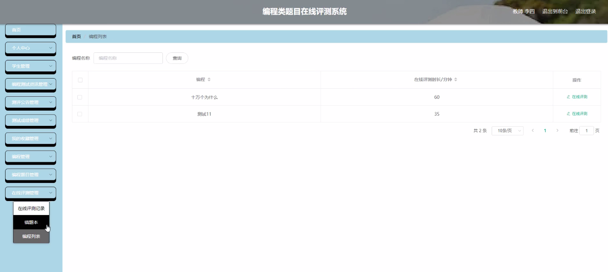

****本项目包含程序+源码+数据库+LW+调试部署环境，文末可获取一份本项目的java源码和数据库参考。****

## ******开题报告******

研究背景：
随着计算机科学的快速发展，编程技能在现代社会中变得越来越重要。编程能力不仅是培养创新思维和解决问题的关键，还是培养学生逻辑思维和分析能力的有效手段。然而，传统的编程教学方法往往存在一些问题，例如学生缺乏实践机会、教师评估困难等。因此，开发一个在线评测系统可以为编程学习提供更好的支持和指导。

研究意义：
在线评测系统的开发具有重要的实际意义。首先，它可以提供一个方便的平台，让学生能够随时随地进行编程练习和测试。其次，通过在线评测系统，教师可以及时了解学生的学习情况，对学生的编程能力进行准确评估，并针对性地给予指导和反馈。此外，该系统还可以提供编程测试资讯和测评公告，帮助学生和教师获取最新的编程知识和信息。

研究目的：
本研究旨在开发一个全面的编程类题目在线评测系统，以满足学生和教师的需求。具体目标包括提供学生进行编程练习和测试的功能，为教师提供学生编程能力评估的工具，以及提供编程测试资讯和测评公告等辅助功能。通过该系统，希望能够促进编程教学的有效性和学习者的编程技能提升。

研究内容： 本研究的主要内容包括以下几个方面：

  1. 学生功能：开发一个用户友好的界面，让学生能够进行编程练习和测试。学生可以选择不同的题目进行练习，并提交自己的代码进行评测。系统会根据预先设定的测试用例对学生的代码进行自动评测，并给出相应的反馈和成绩。

  2. 教师功能：提供教师管理学生的功能，教师可以创建班级和课程，并将学生添加到相应的班级中。教师还可以查看学生的编程成绩和练习情况，对学生的编程能力进行评估，并给予指导和反馈。

  3. 编程测试资讯：系统将提供最新的编程测试资讯，包括编程竞赛、编程培训等信息，帮助学生和教师获取更多的学习资源和机会。

  4. 测评公告：系统将发布测评公告，包括编程测试的时间、地点、注意事项等信息，以便学生和教师及时了解并参与相应的测试活动。

拟解决的主要问题：
本研究旨在解决传统编程教学中存在的一些问题，包括学生缺乏实践机会、教师评估困难等。通过开发一个全面的编程类题目在线评测系统，可以为学生提供更好的编程练习和测试平台，为教师提供准确评估学生编程能力的工具，从而提高编程教学的效果和学生的学习动力。

研究方案和预期成果：
本研究将采用软件开发的方法，结合用户需求分析和系统设计，开发一个功能完善的编程类题目在线评测系统。预期成果包括一个用户友好的界面，支持学生进行编程练习和测试的功能，支持教师管理学生和评估学生编程能力的功能，以及提供编程测试资讯和测评公告等辅助功能。通过该系统的使用，预期能够提高学生的编程能力和教师的教学效果，促进编程教育的发展。

进度安排：

2022年9月至10月：开题报告编写和提交，完成开题报告的撰写并提交给指导教师进行审核。

2022年11月至2023年1月：系统设计和开发，根据开题报告的要求，进行系统设计和编码工作。

2023年2月至3月：论文撰写和初稿完成，开始撰写论文，并在这个阶段完成论文的初稿。

2023年4月至5月：论文修改和最终定稿，根据指导教师的意见对论文进行修改，并完成最终的定稿。

2023年5月：论文答辩和提交，参加论文答辩并根据答辩结果进行修改，最后将论文提交给学院或学校。

参考文献：

[1]喻佳,吴丹新.基于SpringBoot的Web快速开发框架[J].电脑编程技巧与维护,2021,(09):31-33.

[2]李鹏.基于SpringBoot快速开发平台的实现[J].电子技术与软件工程,2021,(12):36-37.

[3]叶开平,蔡维晟,陈家敏,邓斯妮.基于SpringBoot的综测可视化管理系统的研究与设计[J].电脑知识与技术,2021,(12):100-104.

[4]江健锋,徐振平.Springboot最小系统的设计与实现[J].电脑知识与技术,2021,(04):62-63.

[5]赵炯,司圣杰,周奇才,熊肖磊.通用信息获取系统设计与实现[J].起重运输机械,2020,(16):89-97.

[6]吴英宾.一种内外网数据交互系统的设计与实现[J].软件工程,2020,(08):25-27.

****以上是本项目程序开发之前开题报告内容，最终成品以下面界面为准，大家可以酌情参考使用。要源码参考请在文末进行获取！！****

## ******本项目的界面展示******

